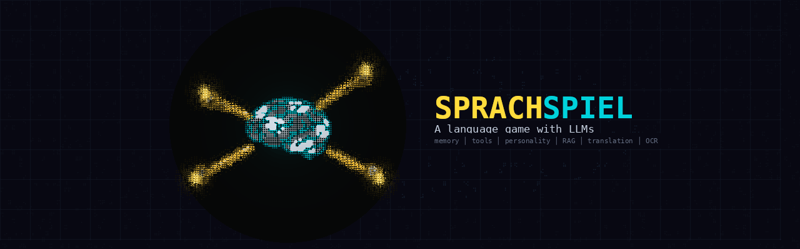

# Sprachspiel



A Rust CLI harness for research, interaction, and cognitive evolution with local and cloud LLMs.

## Overview

Sprachspiel is a cognitive interaction harness — not a code-specific tool — built for local and cloud LLMs via Ollama and compatible backends. It provides persistent memory (factual + semantic), adaptive personality (SOUL.md), 50+ extensible tools, and conversational agent capabilities. Designed for research, knowledge management, and open-ended cognitive interaction rather than narrowly scoped development workflows.

Key capabilities:
- **Persistent memory** — facts, notes, documents with semantic search and Ebbinghaus decay
- **Adaptive personality** — SOUL.md defines agent identity and behavior style
- **50+ tools** — file operations, web search, calculations, task management, and more
- **Context intelligence** — hybrid RAG (BM25 + vector + RRF), auto-compaction, context overflow protection
- **Translation, OCR, summarization** — specialized modes for different cognitive tasks

## Quick Start

```bash
# Install (one-liner)
curl -sL https://raw.githubusercontent.com/luksamuk/ask-ai-rs/main/scripts/install-sprach.sh | bash

# Basic query
sprach "What is Rust?"

# Interactive chat with semantic search
sprach chat

# Translate
sprach translate en:pt "Hello world"

# OCR
sprach ocr document.png

# Summarize
echo "Long text..." | sprach summarize

# List models
sprach --list
```

## Installation

### Option 1: One-Liner (Recommended)

Install directly from GitHub releases:

```bash
# Latest version
curl -sL https://raw.githubusercontent.com/luksamuk/ask-ai-rs/main/scripts/install-sprach.sh | bash

# Specific version
curl -sL https://raw.githubusercontent.com/luksamuk/ask-ai-rs/main/scripts/install-sprach.sh | bash -s -- --version 0.26.0

# With all tools
curl -sL https://raw.githubusercontent.com/luksamuk/ask-ai-rs/main/scripts/install-sprach.sh | bash -s -- --tools all

# System-wide (requires sudo)
curl -sL https://raw.githubusercontent.com/luksamuk/ask-ai-rs/main/scripts/install-sprach.sh | bash -s -- --prefix /usr
```

Installs to `~/.local/bin` by default. The manpage is installed to `~/.local/share/man/man1`.

### Option 2: Download Tarball

Download from [GitHub Releases](https://github.com/luksamuk/ask-ai-rs/releases):

```bash
# Download and extract
tar -xzf sprachspiel-0.26.0-linux-x86_64.tar.gz
cd sprachspiel-0.26.0-linux-x86_64

# Install
./install.sh

# Or install to custom location
./install.sh --prefix /usr    # System-wide (requires sudo)
./install.sh --bin ~/bin      # Custom binary location
./install.sh --man ~/man      # Custom manpage location

# Uninstall
./uninstall.sh
```

### Option 3: Build from Source

```bash
# Clone
git clone https://github.com/luksamuk/ask-ai-rs.git
cd sprachspiel

# Install required models first
cd modelfiles && make models-essential && cd ..

# Build and install
make install

# Or install to ~/.local (recommended for development)
make install-local
```

### Termux (Android)

Sprachspiel works on Termux! Download the Termux tarball from releases:

```bash
# In Termux
pkg install wget

# Download and install
wget https://github.com/luksamuk/ask-ai-rs/releases/download/v0.26.0/sprachspiel-0.26.0-termux-aarch64.tar.gz
tar -xzf sprachspiel-0.26.0-termux-aarch64.tar.gz
cd sprachspiel-0.26.0-termux-aarch64
./install.sh
```

**Note:** An LLM server (Ollama by default) must run on a separate machine. Configure in `~/.config/sprachspiel/config.toml`:

```toml
[ollama]
host = "192.168.1.100:11434"  # Your desktop/server IP
```

### Post-Installation

Add `~/.local/bin` to PATH if not already:

```bash
# Add to shell config (~/.bashrc, ~/.zshrc, etc.)
export PATH="$HOME/.local/bin:$PATH"

# For manpage access
export MANPATH="$HOME/.local/share/man:$MANPATH"

# Source the config
source ~/.bashrc  # or ~/.zshrc
```

## Documentation

**Complete documentation** is available at `doc/`:

- **User Guide**: `cd doc && mdbook serve`
- **Man Page**: `man sprach`
- **Online**: Build with `cd doc && mdbook build`

## Commands

### Query Mode (Default)

```bash
sprach "What is Rust?"           # Basic query
sprach -m qwen3.5:4b "Explain async"  # Specific model
sprach -c "Write a Python function"  # Code mode
sprach -t "Think step by step"   # Think mode
```

### Chat Mode

Interactive chat with persistent history and semantic search:

```bash
sprach chat                      # Start chat session
sprach chat -m glm-5:cloud       # Specific model
sprach chat -t                   # Chat with thinking
sprach chat --anonymous          # Anonymous session (no history)
```

**Chat Commands:**
- `/search <query>` - Search conversation history semantically
- `/context` - Show context usage and token count
- `/compact` - Compact old messages to free context
- `/model <name>` - Switch model mid-session
- `/clear` - Clear current session
- `/save [name]` / `/load <name>` - Save/load sessions
- `/ocr <file> [mode]` - Extract text from image
- `/vision <path> [prompt]` - Analyze image with vision model
- `/translate <src:dst> <text>` - Translate text
- `/summarize <text>` - Summarize text
- `/fact add|list|search|remove|prune` - Manage facts
- `/note add|list|show|edit|delete|search` - Manage notes
- `/doc import|list|show|delete` - Manage documents
- `/todo add|list|done|remove|update` - Manage tasks
- `/think` - Toggle think mode
- `/tools` - Toggle tools
- `/skill [name]` - List or activate skills

### Translate

```bash
sprach translate en:pt "Hello world"    # English to Portuguese
sprach translate :es "Bonjour"          # Auto-detect to Spanish
cat file.txt | sprach translate :pt     # Pipe input
```

### OCR

```bash
sprach ocr document.png                 # Extract text
sprach ocr --detailed image.jpg         # Detailed extraction
sprach ocr page1.png page2.png           # Multiple files
```

### Summarize

```bash
sprach summarize "Long text..."         # Summarize text
cat article.txt | sprach summarize      # Pipe input
sprach summarize --style bullets file.txt  # Bullet points
```

### Vision

```bash
sprach vision photo.jpg "What's in this image?"
sprach vision screenshot.png "Describe the UI"
```

## Examples

```bash
# OCR → Summarize → Translate
sprach ocr document.png | sprach summarize | sprach translate :pt

# Translate a file
cat article.txt | sprach translate :es

# Code with specific model
sprach -m qwen3-coder "Write a Python function"

# Interactive chat with semantic search
sprach chat
>>> /search "What did we discuss about databases?"
>>> /context
>>> /model glm-5:cloud

# Query with tools
sprach "What's the weather in Tokyo?"
sprach "Read the README.md and explain the project"
sprach "Calculate 15% of 847"

# Think mode for complex reasoning
sprach -m glm-5:cloud -t "Explain quantum computing step by step"
```

## Requirements

- [Ollama](https://ollama.ai) running locally (or a compatible backend; remote server for Termux)
- Required models: `qwen3.5:4b` (default, multimodal), `translategemma:4b`, `glm-ocr:bf16`
- Optional: `moondream:1.8b` (alternative vision), `llama3.1:8b` (alternative general)

## Installing Models

Sprachspiel uses **modelfiles** that must be **built** with custom parameters. Simply pulling models directly won't work.

```bash
cd modelfiles

# Install essential models (builds with custom config)
make models-essential

# Install optional recommended models
make models-optional
```

**Important:** Models must be built via the Makefile to apply custom configurations (context window, temperature, etc.). Direct `ollama pull` won't work correctly.

See `modelfiles/README.md` for details.

## Project Context (AGENTS.md)

Sprachspiel automatically loads `AGENTS.md` from the current directory to provide project-specific context:

```bash
# If AGENTS.md exists, context is automatically injected
sprach "Explain the project structure"

# Disable with --ignore-agents
sprach --ignore-agents "General question"
```

Content is sanitized for security (injection patterns, executable code blocks removed).

## Build Features

Tools are organized into compile-time features:

```bash
# Default build (includes: Pokémon, Weather, File, Calculator, Serper, System, Todo, LED, Remember)
make build

# With all tools (adds DuckDuckGo search, Finance)
make build-all-tools

# Install locally with all tools
make install-local-all-tools
```

| Feature | Tools | Default | Notes |
|---------|-------|---------|-------|
| `pokemon-tools` | 9 Pokémon data tools | ❌ No | Fetch Pokémon stats, types, abilities |
| `weather-tools` | 3 Weather tools | ✅ Yes | Current weather, forecast, air quality |
| `file-tools` | 5 File tools | ✅ Yes | Read files, search, list directories |
| `calc-tools` | 1 Calculator | ✅ Yes | Mathematical expressions |
| `serper-tools` | 2 Web search tools | ✅ Yes | Requires `SERPER_API_KEY` |
| `system-tools` | 2 System tools | ✅ Yes | System info, current directory |
| `todo-tools` | 5 Todo tools | ✅ Yes | Task tracking with priorities |
| `led-tools` | 4 LED control tools | ✅ Yes | Control GPIO LEDs (embedded) |
| `skill-tools` | 2 AI behavior tools | ✅ Yes | Dynamic skill activation |
| `document-tools` | 3 Document tools | ✅ Yes | Import, list, show documents |
| `subagent-tools` | 1 Subagent tool | ✅ Yes | LLM-initiated subagent delegation |
| `search-tools` | 3 DuckDuckGo tools | ❌ No | May fail due to CAPTCHA |
| `finance-tools` | 1 Stock quote tool | ❌ No | Planned |

## Configuration

Create `~/.config/sprachspiel/config.toml`:

```toml
[ollama]
host = "localhost:11434"        # LLM server address

[model]
default = "qwen3.5:4b"         # Default model (multimodal)

[model.code]
# model = "qwen2.5-coder:7b"   # Code mode default (qwen2.5-coder:7b if not set)
# tools = true                  # Tools enabled by default for code mode

[display]
skin = "dark"                   # Markdown theme: dark, light, mono

[retrieval]
enabled = true                  # Enable semantic search in chat
relevant_count = 5              # Number of messages to retrieve
```

## Distribution Tarballs

Create distribution tarballs for release:

```bash
# Linux x86_64
make tarball-linux
make tarball-linux-all-tools

# Termux (Android aarch64)
make tarball-termux
make tarball-termux-all-tools

# All tarballs
make all-tarballs
```

Tarballs include:
- Binary (`sprach`)
- Manpage (`sprach.1`)
- Installation scripts (`install.sh`, `uninstall.sh`)
- Documentation (`README.md`, `LICENSE.txt`)
- Platform-specific instructions (Termux includes `README-TERMUX.txt`)

## Semantic Search & RAG

Sprachspiel features intelligent context retrieval:

- **Chat Mode**: Automatically retrieves relevant past conversations
- **Query Mode**: Access to project-wide conversation history
- **`/search` Command**: Semantic search across all sessions
- **Remember Tool**: Let the LLM query conversation history

The system uses:
- **Hybrid Search**: BM25 (keyword) + Semantic (vector) + RRF fusion
- **Context Enrichment**: User questions are paired with assistant responses
- **Smart Positioning**: Retrieved context placed optimally (not "lost in middle")

## AI-Assisted Development

Developed with assistance from:
- **GLM 4.7 Flash** (Z.ai) — Project inception and initial scaffolding
- **GLM 5** (Z.ai) — Plan, research, and implementation
- **GLM 5.1** (Z.ai) — Ongoing development and refinement
- **Kimi K2.5** (Moonshot AI) — Architecture design
- **MiniMax M2.7** (MiniMax) — Code review and testing

Agent harnesses used:
- **OpenCode** — Primary development harness
- **Hermes Agent** — Orchestration, asset creation, and project management

Human oversight for architecture decisions and quality assurance.

## License

MIT License - see [LICENSE.txt](LICENSE.txt)

Copyright (c) 2026 Lucas S. Vieira

---

For complete documentation, see the `doc/` directory or run `man sprach`.