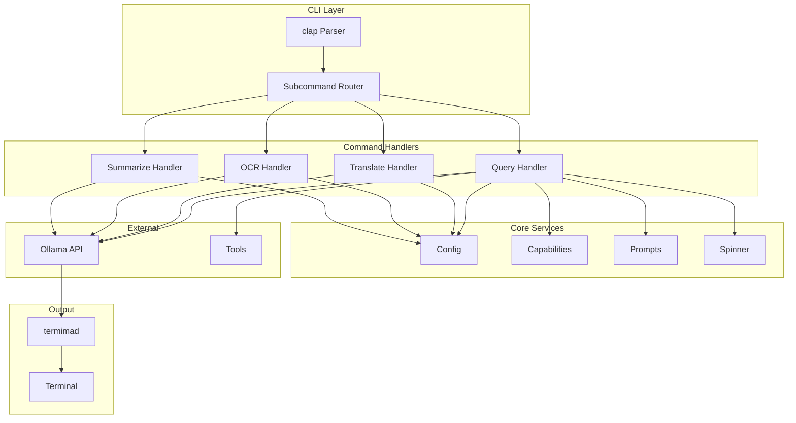
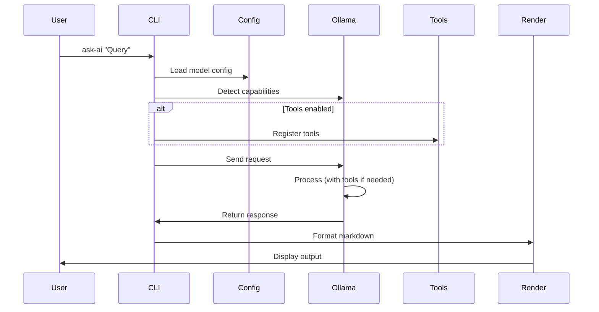
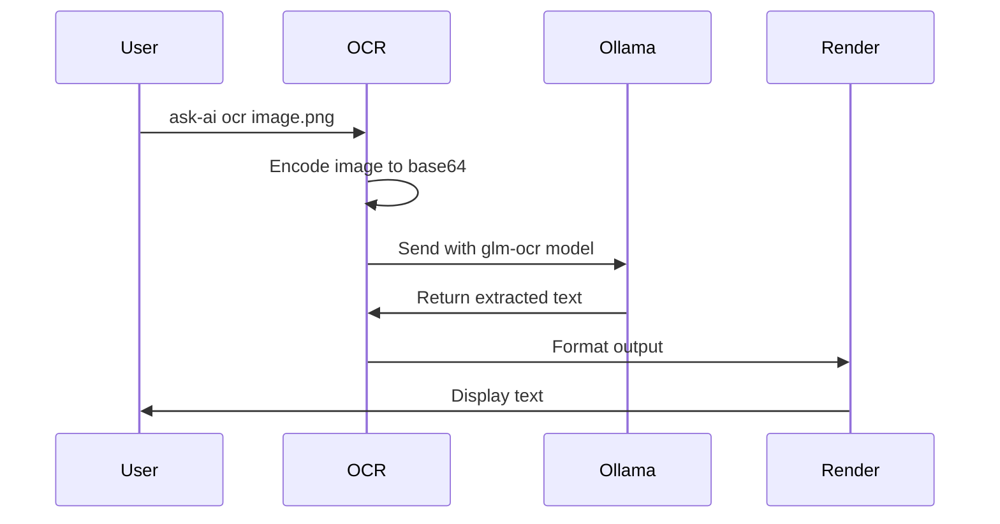

# Architecture

This document describes the architecture and design decisions of Ask-AI.

## Overview

Ask-AI is a Rust CLI tool that provides an interface to Ollama LLM models. It follows a modular architecture with clear separation of concerns.

## System Architecture



## Component Details

### 1. CLI Layer

Uses `clap` with derive macros for type-safe argument parsing.

**File:** `src/main.rs`

```rust
#[derive(Parser)]
#[command(name = "ask-ai")]
struct Cli {
    #[command(subcommand)]
    command: Option<Commands>,
    // ... global options
}
```

### 2. Command Handlers

Each subcommand has its own module:

- **Query**: `src/main.rs` (default mode)
- **Translate**: `src/translate/`
- **OCR**: `src/ocr/`
- **Summarize**: `src/summarize/`

### 3. Core Services

#### Config (`src/config.rs`)

Model configuration management:

```rust
pub struct ModelConfig {
    pub model_id: String,
    pub temperature: f32,
    pub top_k: i32,
    pub top_p: f32,
    pub num_ctx: i32,
    pub repeat_penalty: f32,
}
```

#### Capabilities (`src/capabilities.rs`)

Runtime model capability detection:

```rust
pub struct ModelCapabilities {
    pub tools: bool,
    pub vision: bool,
    pub completion: bool,
    pub thinking: bool,
}
```

#### Prompts (`src/prompts.rs`)

System prompt definitions for different modes.

#### Spinner (`src/spinner.rs`)

UX feedback during requests.

### 4. Tools (`src/tools/`)

Tool implementations using the `ollama-rs` macro:

```rust
#[ollama_rs::function]
pub async fn fetch_pokemon(name: String) -> Result<String, Error> {
    // Implementation
}
```

### 5. External Integration

#### Ollama API (`ollama-rs`)

Uses the Coordinator pattern for chat sessions:

```rust
let coordinator = Coordinator::new(ollama, model_id, vec![])
    .options(model_options)
    .think(use_think);
```

## Design Decisions

### 1. Markdown Rendering Strategy

**Decision:** Batch rendering (not streaming)

**Rationale:**
- Markdown is contextually dependent
- Tables, code blocks need complete content
- `termimad` requires full documents

**Trade-offs:**
- ✅ Perfect formatting
- ✅ Simple implementation
- ❌ No live token feedback

### 2. Capability Detection

**Decision:** Runtime detection via Ollama API

**Rationale:**
- `ollama.show_model_info()` provides capability data
- More accurate than hardcoding
- Handles custom models

### 3. Tool Enablement

**Decision:** Auto-enable for capable models, with `--tools` override

**Rationale:**
- Seamless UX for capable models
- `--tools` allows forcing tools
- No overhead for non-tool models

### 4. Modular Architecture

Each command is self-contained:

```
src/
├── main.rs           # Entry + query command
├── translate/        # Translation module
├── ocr/             # OCR module
├── summarize/       # Summarize module
└── tools/           # Shared tools
```

### 5. Error Handling

Uses `AppResult<T>` type alias:

```rust
type AppResult<T> = Result<T, Box<dyn std::error::Error + Sync + Send>>;
```

## Data Flow

### Query Flow



### OCR Flow



## Async Architecture

Uses Tokio for async runtime:

```rust
#[tokio::main]
async fn main() -> AppResult<()> {
    // Async code
}
```

All I/O operations are async:
- Ollama API calls
- Tool HTTP requests
- File operations

## Dependencies

| Crate | Purpose |
|-------|---------|
| `ollama-rs` | Ollama API client |
| `clap` | CLI parsing |
| `termimad` | Markdown rendering |
| `indicatif` | Progress spinners |
| `tokio` | Async runtime |
| `reqwest` | HTTP client |
| `serde` | Serialization |
| `base64` | Image encoding |
| `regex` | Pattern matching |

## Testing Strategy

### Unit Tests

```rust
#[cfg(test)]
mod tests {
    #[test]
    fn test_something() {
        // Test code
    }
}
```

### Integration Tests

```bash
# Run specific test
cargo test --test test_name

# Run all tests
cargo test
```

## Performance Considerations

### Model Loading

- Models are loaded by Ollama
- First request after pull may be slow
- Subsequent requests use cached model

### Memory Usage

- Large models (30B+) need significant RAM
- Use smaller models (3B-8B) for constrained systems
- Consider `smollm3` or `llama3.2` for edge

### Network

- Cloud models require internet
- Local models work offline
- Tools may need HTTP requests

## Security

### Input Validation

- CLI args validated by clap
- File paths checked for existence
- Language codes validated

### Tool Safety

- Tools use external APIs (PokéAPI, Open-Meteo)
- No local file system access from tools
- Web search blocked (CAPTCHA protection)

## Future Architecture

### Planned Improvements

1. **Configuration file support**
   - `~/.config/ask-ai/config.toml`
   - User-defined models
   - Default preferences

2. **Plugin system**
   - Custom tools
   - User extensions

3. **Streaming output**
   - Line-buffered rendering
   - Progressive display

4. **Caching**
   - Response caching
   - Tool result caching

## See Also

- [Roadmap](./roadmap.md) - Future plans
- [Contributing](./contributing.md) - How to contribute
- AGENTS.md - Development guidelines
- IMPLEMENTATION.md - Implementation details
