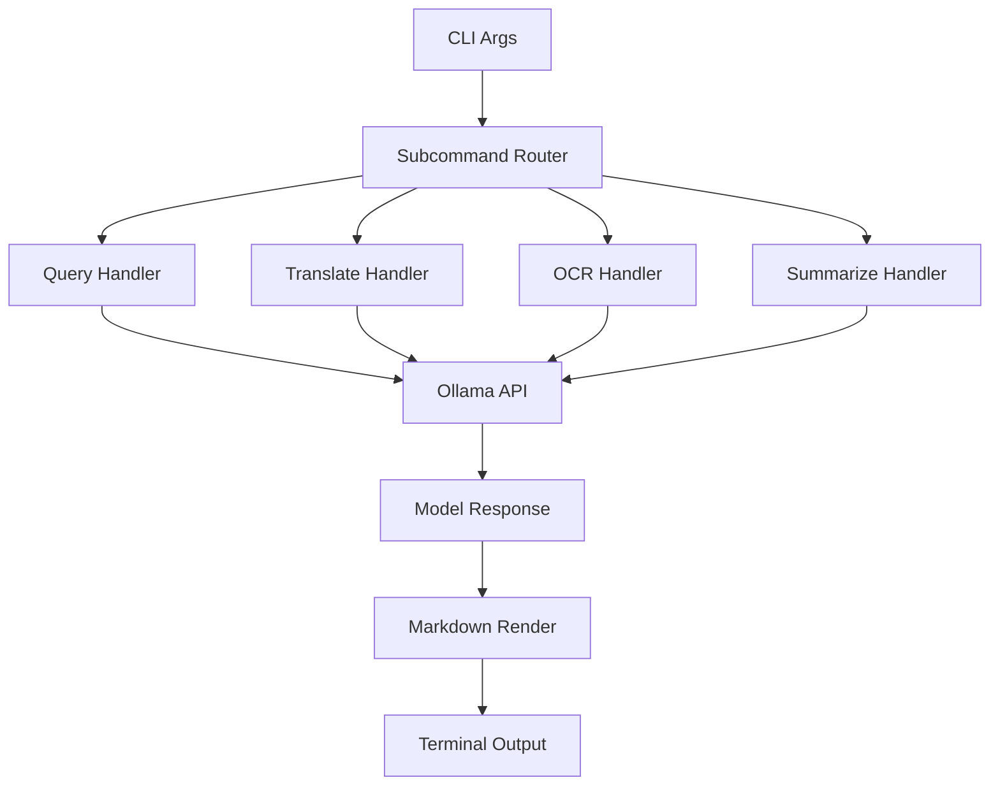

# Development Documentation

Welcome to the Ask-AI development documentation. This section contains technical information for contributors and developers.

## Contents

- [Architecture](./architecture.md) - Design decisions and patterns
- [Roadmap](./roadmap.md) - Future plans and roadmap
- [Contributing](./contributing.md) - How to contribute

## Project Structure

```
ask-ai/
├── Cargo.toml              # Dependencies
├── Makefile                # Build automation
├── man/
│   └── ask-ai.1           # Man page
├── doc/
│   ├── book.toml          # mdBook configuration
│   └── src/               # Documentation source
│       ├── README.md
│       ├── introduction.md
│       ├── installation.md
│       └── ...
├── src/
│   ├── main.rs            # Entry point
│   ├── config.rs          # Model configurations
│   ├── prompts.rs         # System prompts
│   ├── capabilities.rs    # Model capability detection
│   ├── spinner.rs         # Progress spinners
│   ├── debug_tools.rs     # Debug utilities
│   ├── tools/
│   │   ├── mod.rs
│   │   ├── pokemon.rs
│   │   ├── weather.rs
│   │   └── search.rs
│   ├── ocr/
│   │   ├── cli.rs
│   │   ├── processor.rs
│   │   └── ...
│   ├── summarize/
│   │   ├── cli.rs
│   │   ├── processor.rs
│   │   └── ...
│   └── translate/
│       ├── cli.rs
│       └── ...
├── AGENTS.md              # Development guidelines
├── IMPLEMENTATION.md        # Implementation details
├── README.md               # Project readme
└── LICENSE.txt            # MIT License
```

## Architecture Overview

Ask-AI is built with:

- **Rust** - Systems programming language
- **Tokio** - Async runtime
- **ollama-rs** - Ollama API client
- **clap** - CLI argument parsing
- **termimad** - Markdown terminal rendering



## Development Setup

```bash
# Clone repository
git clone <repo-url>
cd ask-ai

# Install dependencies
cargo build

# Run tests
cargo test

# Run with debug
cargo run -- "Query"
```

## Build Commands

See [AGENTS.md](../../AGENTS.md) for detailed build commands.

Quick reference:

```bash
# Build
cargo build

# Build release
cargo build --release

# Run
cargo run -- "Query"

# Test
cargo test

# Format
cargo fmt

# Lint
cargo clippy -- -D warnings
```

## Documentation

Build documentation:

```bash
cd doc
mdbook serve          # Development server
mdbook build          # Build static site
mdbook-mermaid install # Install mermaid support
```

## Contributing

See [Contributing Guide](./contributing.md).

## License

MIT License - See [LICENSE](../../LICENSE.txt)
