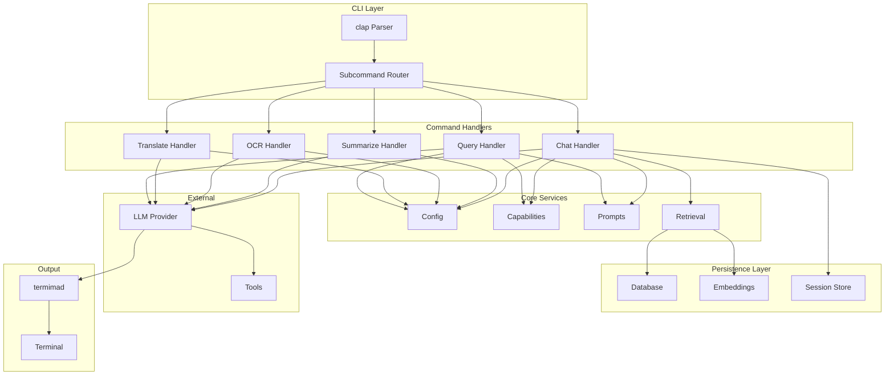
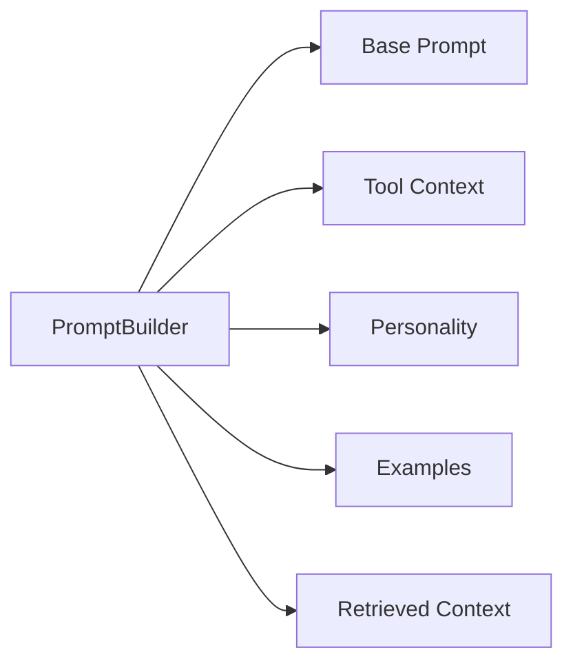
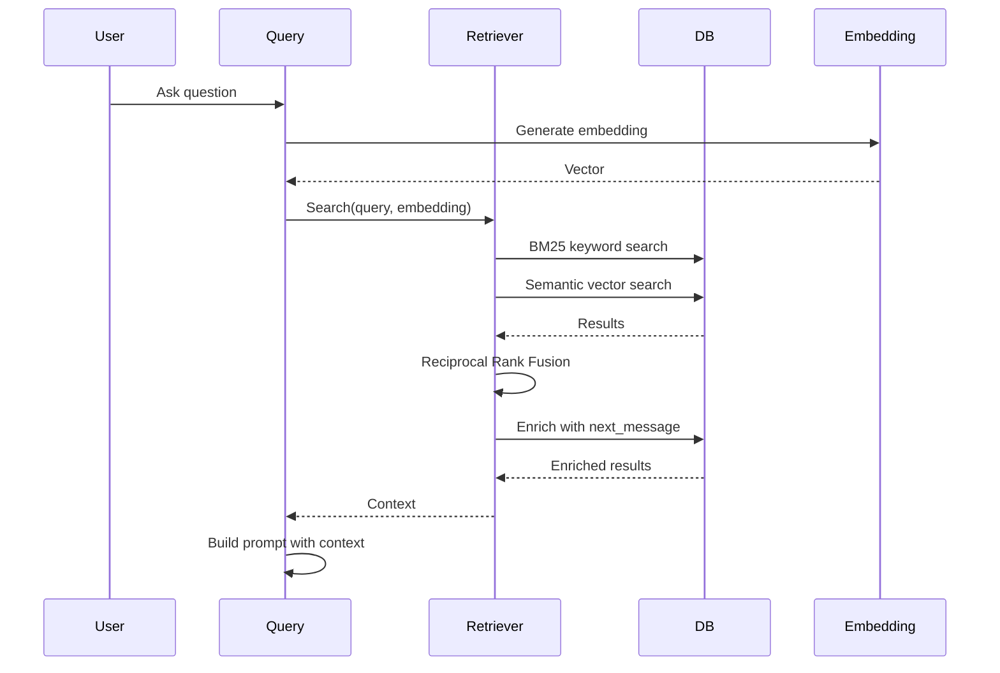
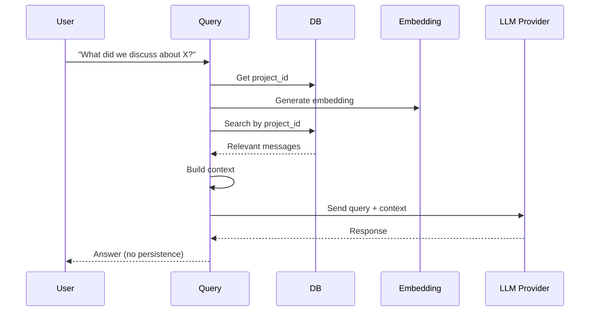
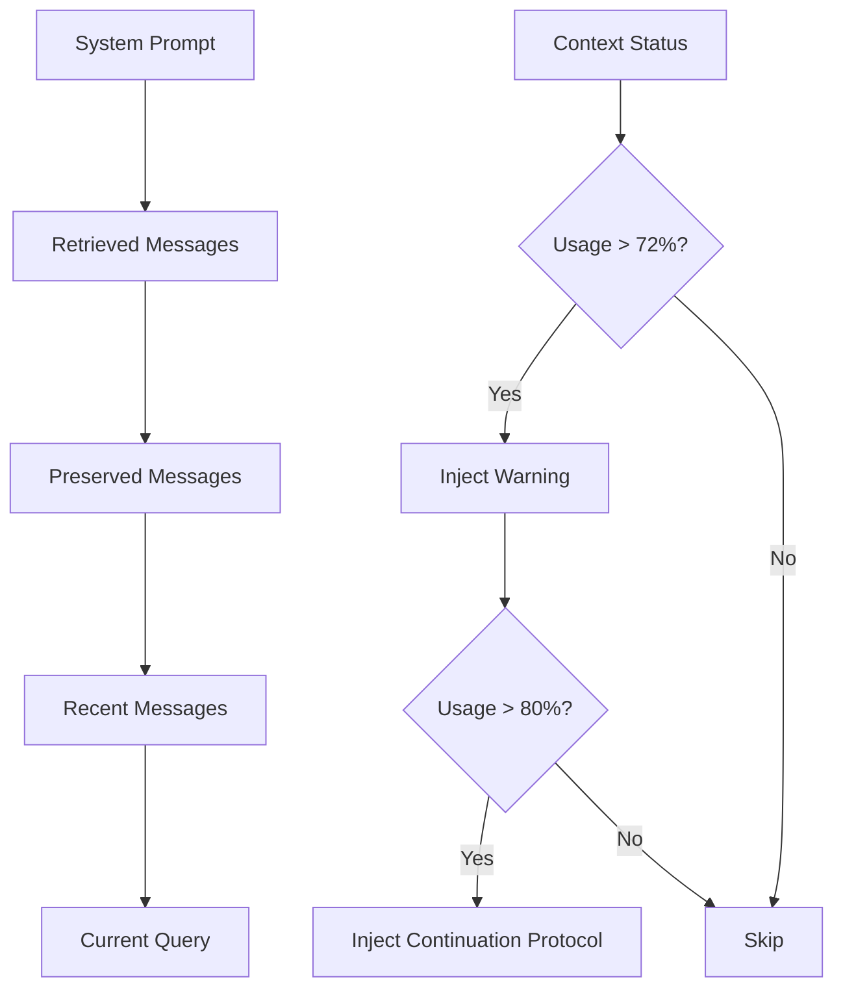
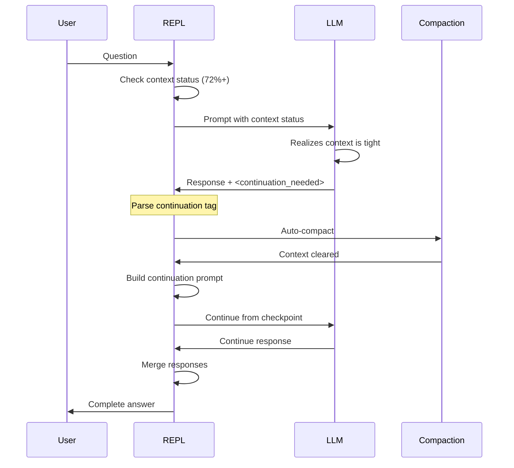
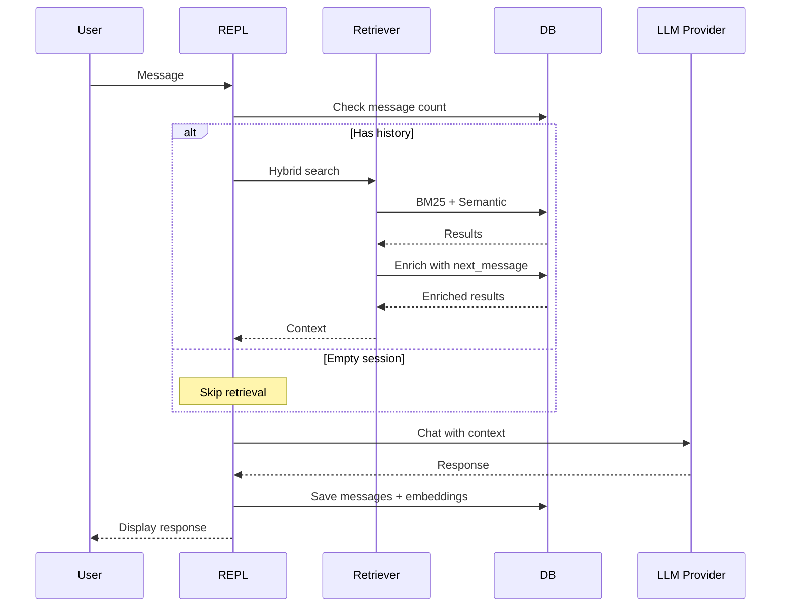

# Architecture

This document describes the architecture and design decisions of Sprachspiel.

## Overview

Sprachspiel is a Rust CLI tool that provides an interface to LLM models via OpenAI-compatible backends. It follows a modular architecture with clear separation of concerns, featuring conversation persistence, semantic retrieval, and tool integration.

## System Architecture



## Component Details

### 1. CLI Layer

Uses `clap` with derive macros for type-safe argument parsing.

**File:** `src/main.rs`

```rust
#[derive(Parser)]
#[command(name = "sprachspiel")]
struct Cli {
    #[command(subcommand)]
    command: Option<Commands>,
    // ... global options
}
```

### 2. Command Handlers

Each subcommand has its own module:

| Command | Module | Purpose |
|---------|--------|---------|
| query | `src/query.rs` | One-shot queries (default mode) |
| chat | `src/chat/` | Interactive conversations with history |
| translate | `src/translate/` | Text translation |
| ocr | `src/ocr/` | Image text extraction |
| summarize | `src/summarize/` | Text summarization |
| vision | `src/vision/` | Image analysis |

### 3. Core Services

#### Config (`src/config.rs` + `src/settings.rs`)

Model configuration with per-subcommand overrides:

```rust
pub struct ModelConfig {
    pub model_id: String,
    pub temperature: f32,
    pub num_ctx: u32,
    pub thinking: bool,
}
```

#### Capabilities (`src/capabilities.rs`)

Runtime model capability detection:

```rust
pub struct ModelCapabilities {
    pub tools: bool,      // Tool calling support
    pub vision: bool,     // Image input support
    pub completion: bool, // Completion API support
    pub thinking: bool,   // Reasoning support
}
```

#### Prompts (`src/prompts/`)

Modular prompt building system:



### 4. Persistence Layer

#### Database (`src/db/`)

SQLite database for conversation history, content, facts, and embeddings:

- **Content Items**: Messages, notes, and documents (unified in v4)
- **Content Chunks**: Long message segments for retrieval
- **Facts**: User preferences and project facts with 6-layer dedup
- **Feedback Signals**: Per-message quality tracking
- **Conversations**: Session metadata with project tracking
- **Embeddings**: Vector embeddings (cosine distance, v12)
- **Thinking Content** *(planned, v14)*: Preserved thinking traces with `thinking_content` column (`t3_status` deferred to Phase 1)

```mermaid
erDiagram
    CONVERSATIONS ||--o{ CONTENT_ITEMS : contains
    CONTENT_ITEMS ||--o{ CONTENT_CHUNKS : has
    CONTENT_ITEMS ||--o| CONTENT_EMBEDDINGS : has
    CONTENT_CHUNKS ||--o| CHUNK_EMBEDDINGS : has
    CONTENT_ITEMS ||--o{ FEEDBACK_SIGNALS : receives
    FACTS ||--o| FACT_EMBEDDINGS : has

    CONVERSATIONS {
        string id PK
        string project_id
        datetime created_at
        string model_id
    }

    CONTENT_ITEMS {
        int id PK
        string conversation_id FK
        string content_type
        string role
        string content
        string thinking_content NULL
        string t3_status DEFAULT none
        datetime timestamp
        float importance
        float decay_score
        int has_embedding
    }

    FACTS {
        int id PK
        string scope
        string category
        string content
        float importance
        float decay_score
        int has_embedding
        datetime invalidated_at
    }

    FEEDBACK_SIGNALS {
        int id PK
        int item_id FK
        string signal_type
        datetime created_at
    }

    EMBEDDINGS {
        int id PK
        float distance
        string vec0_cosine_distance_metric
    }
```

#### Embeddings (`src/embeddings/`)

Embedding generation via LlmProvider trait: generation:

```rust
pub struct EmbeddingClient {
    provider: OpenAICompatibleProvider,
    model: String,
    semaphore: Semaphore,  // Serializes embedding requests (Semaphore(1))
}

impl EmbeddingClient {
    pub async fn embed(&self, text: &str) -> Result<Vec<f32>>;  // 30s timeout, serialized
}
```

### 5. Retrieval System

#### Context Building (`src/retrieval/context_builder.rs`)

Hybrid search (BM25 + Semantic + RRF):



#### Message Enrichment

Retrieved user messages include their assistant responses:

```rust
pub struct SearchResult {
    pub message_id: i64,
    pub conversation_id: String,
    pub role: String,
    pub content: String,
    pub score: f32,
    pub search_type: SearchType,
    pub next_message: Option<EnrichedResponse>,
}
```

### 5.5. Thinking Content Preservation (Planned — T3 Phase 0, #149)

**Background:** Research shows that thinking traces (intermediate reasoning from LLMs) are the most valuable RAG corpus for reasoning tasks, superior to conventional documents (+56.3% accuracy on AIME, Arabzadeh et al. 2026, arXiv:2605.03344). Currently, `strip_thinking_tags()` permanently deletes thinking content before storage, losing ~80% of traces.

**Architecture Bug (Current):**

```
Current Storage Path:
┌─────────────────────┐    strip_thinking     ┌─────────────┐
│ Normal Assistant      │ ─────────────────→    │ LOST        │
│ <thinking>content    │     (removed)         │ FOREVER     │
│ </thinking>response  │                        └─────────────┘
└─────────────────────┘

┌─────────────────────┐   concat inline   ┌──────────────┐   search by     ┌─────────┐
│ Pre-Tool             │ ───────────────→  │ content field │ ──────────────→  │ Found   │
│ <thinking>content   │   (incidental)    │ (mixed XML)  │   accident       │ (luck)  │
│ </thinking>response │                   └──────────────┘                  └─────────┘
└─────────────────────┘
```

**Fixed Architecture (Planned — v14):**

```
Planned Storage Path:
┌─────────────────────┐   process_thinking   ┌──────────────┐
│ Any Assistant msg    │ ─────────────────→   │ content field │ ← clean response text
│ with <thinking>      │                      └──────────────┘
└─────────────────────┘                      ┌──────────────────┐
                                               │ thinking_content │ ← preserved reasoning
                                               └──────────────────┘

(Phase 1 adds thinking_trace_status INTEGER: 0=none, 1=raw, 2=pending, 3=done)
```

**5 Data Loss Paths Identified (Phase 0 fixes 4):**

| # | Path | Fix | Status |
|---|------|-----|--------|
| 1 | Streaming response — `strip_thinking_tags()` before `SendMessageResult.response` | `process_thinking()` → store `thinking` in `SendMessageResult` | Phase 0 |
| 2 | Non-streaming response — same pattern | Same fix | Phase 0 |
| 3 | Pre-tool messages — thinking concatenated inline in `content` field | Separate `thinking` into `thinking_content` column | Phase 0 |
| 4 | Continuation turns — `ContinuationResult` drops all thinking fields | Add `thinking` + `pre_tool_thinking` to `ContinuationResult`; accumulate in `handle_continuation()` | Phase 0 |
| 5 | Compaction summary — thinking stripped before storage | **No fix (by design)** — summary is generated content, not original trace. See D-08. | N/A |

**Key Design Decisions:**

1. **`thinking_content` column in `content_items`** — Thinking is an attribute of a message, not a separate content type. No `ContentType::ThinkingTrace` variant needed.
2. **`thinking_trace_status` deferred to Phase 1** — In Phase 0, `thinking_content IS NOT NULL` ≡ "has thinking." Phase 1 adds `ThinkingTraceStatus` enum (`None=0, Raw=1, Pending=2, Done=3`) stored as `thinking_trace_status INTEGER DEFAULT 0`. See D-09.
3. **`process_thinking()` replaces `strip_thinking_tags()` for storage** — `strip_thinking_tags()` remains for display (views, query output).
4. **`[thinking_trace] enabled = false` feature flag** — Default off; controls whether the Thinking Trace Transform pipeline processes traces. Thinking content is always preserved regardless of this flag.
5. **No joint migration with #136** — #151 migration is `ALTER TABLE content_items ADD COLUMN thinking_content TEXT` only. No vec0 changes. #136 is decoupled and depends on #106/#135. See D-10, D-11.
6. **Continuation thinking uses original `previous_message_id`** — All pre-tool messages from continuation turns reference the same user message as the initial turn. Multiple pre-tool messages with the same parent are semantically correct.

**Reference:** Arabzadeh et al. 2026, arXiv:2605.03344 — "RAG over Thinking Traces Can Improve Reasoning Tasks"

### 6. Chat Mode

#### Architecture (Layers)

The chat REPL follows a layered architecture for maintainability and future TUI compatibility:

```
Layer 5: repl.rs           - Entry point, coordinator
Layer 4: core.rs           - Business logic (send_message, compact)
Layer 3: repl_state.rs     - State management (ReplState)
Layer 2: input/rustyline.rs, view/terminal.rs - I/O implementations
Layer 1: session.rs, cli.rs - Session and CLI handling
Layer 0: input/mod.rs, view/mod.rs - Traits (abstractions)
```

This separation enables:
- **Testing**: Each layer can be tested in isolation
- **TUI Migration**: Swap rustyline for ratatui input/output (Responsive Chat Rebuild, M1 W6)
- **Maintainability**: 200-400 line modules vs 1100+ line function

**Planned Layer 2 migration (W6):**
```
Current:  input/rustyline.rs,   view/terminal.rs    - println + ANSI
Rebuild:  input/crossterm_input.rs, view/ratatui_view.rs  - ratatui + crossterm
Layer 2 also gains: app.rs (event loop), tui/ (components)
```

#### Session Management (`src/chat/session.rs`)

```rust
pub struct ChatSession {
    pub id: String,
    pub model: String,
    pub project_id: Option<String>,
    pub messages: Vec<Message>,
    pub anonymous: bool,
    pub think: bool,
    pub tools: bool,
    // ...
}
```

#### REPL (`src/chat/repl.rs`)

Interactive command loop with:

- Model switching (`/model`)
- Tool toggling (`/tools`)
- History search (`/search`)
- Context compaction (`/compact`)
- Session management (`/save`, `/load`)

#### Context Overflow Management (`src/context_overflow.rs`)

Percentage-based thresholds that scale with context window size:

```rust
// Percentage thresholds (v0.37.0+)
MODERATE_USAGE_PERCENT = 0.75  // Warning at 75% (25% remaining)
CRITICAL_USAGE_PERCENT = 0.88  // Auto-compact at 88% (12% remaining)
INTER_TOOL_USAGE_PERCENT = 0.94 // Inter-tool warning at 94% (6% remaining)
EMERGENCY_USAGE_PERCENT = 0.97  // Emergency truncation at 97% (3% remaining)

// Absolute minimums (ensure safety for small contexts)
PRE_TOOL_MIN = 2_000 tokens
COMPACTION_MIN = 1_000 tokens
INTER_TOOL_MIN = 512 tokens
EMERGENCY_MIN = 256 tokens
MAX_SUMMARY_TOKENS = 3_000 // Hard limit on summaries
```

**Why percentage-based thresholds?**

| Context | 75% warning | 88% compaction | 94% inter-tool |
|---------|-------------|----------------|----------------|
| 32K | Warn at 24K (8K remaining) | Compact at 28K (4K remaining) | Warn at 30K (2K remaining) |
| 128K | Warn at 96K (32K remaining) | Compact at 113K (15K remaining) | Warn at 120K (8K remaining) |
| 200K | Warn at 150K (50K remaining) | Compact at 176K (24K remaining) | Warn at 188K (12K remaining) |

Percentage-based triggers **scale proportionally** with larger context windows, while absolute minimums ensure safety for small contexts.

**Compaction Flow:**

```
1. Pre-tool (75% usage) → Warn user
2. Auto-compact (88% usage) → Summarize history
3. Inter-tool (94% usage) → Warn during execution
4. Emergency (97% usage) → Truncate results
```

**3-Layer Compaction Strategy** (for `/compact` and auto-compaction):

The compaction flow implements defense in depth — prevention and recovery:

1. **Layer 1 (Pre-pruning):** Strip long tool outputs (>500 chars) before constructing the compaction prompt
2. **Layer 1.5 (Error-retry):** If `fits_in_context()` underestimates and the LLM rejects the prompt as "too long", detect the error with `is_prompt_too_long_error()` and fall through to Layer 2
3. **Layer 2 (Chunked recursive summarization):** Split into chunks that each fit within 60% of the context window, summarize each independently, combine summaries
4. **Layer 3 (Fallback truncation):** Hard-truncate oldest middle messages to 50% of the context window. If even this fails with "prompt too long", return a detailed diagnostic error

Token estimation uses a 20% safety margin (`ESTIMATION_SAFETY_MARGIN`) and higher per-message overhead (`COMPACT_MSG_OVERHEAD = 10` vs. `MESSAGE_OVERHEAD = 4`) to reduce the likelihood of underestimation.

**Key Files:**
- `src/context_overflow.rs` - Percentage thresholds, compaction functions
- `src/tokens.rs` - Token calculation with the backend's `prompt_eval_count`
- `src/chat/core.rs` - `auto_compact_if_needed()`, `compact_conversation()`
- `src/chat/continuation.rs` - Pre-tool compaction check
- `src/chat/custom_coordinator.rs` - Inter-tool overflow detection

### 7. Tools (`src/tools/`)

Tool implementations using the `#[sprachspiel::tool]` macro:

```rust
#[sprachspiel::tool]
pub async fn my_tool(param: String) -> Result<String, Box<dyn Error + Send + Sync>> {
    // Always return Ok(String), even on error
    Ok(result)
}
```

Tool categories (feature-flags):

| Category | Tools | Default |
|----------|-------|---------|
| `pokemon-tools` | 9 | ✅ |
| `weather-tools` | 3 | ✅ |
| `file-tools` | 5 | ✅ |
| `calc-tools` | 1 | ✅ |
| `serper-tools` | 2 | ✅ |
| `system-tools` | 2 | ✅ |
| `search-tools` | 3 | ❌ |
| `led-tools` | 5 | ❌ |

### 8. Skills System (`src/skills/`)

**Status:** Planned (see [Skills System Design](./skills-system-design.md))

Skills are Markdown files that define AI behavior and tool usage patterns:

```
~/.config/sprachspiel/skills/
├── document-processing.md
├── ocr-images.md
└── custom-skill.md
```

Skills are **instructions for the model**, not executable code:

```markdown
# document-processing.md

When asked to process PDF or ePub files:
1. Check tool availability with `check_tool_availability`
2. Use `run_command` to execute `pdftotext` or `ebook-convert` if available
...
```

### 9. External Tools (`src/external/`)

**Status:** Planned

External CLI tools integration for PDF processing, OCR, and image manipulation:

```rust
// Detection
pub fn check_tool_availability(tool: String) -> Result<String, ...>

// Execution
pub fn run_command(
    command: String,
    args: Vec<String>,
    timeout: Option<u32>,
) -> Result<String, ...>
```

Configuration via `~/.config/sprachspiel/tools.toml`:

```toml
[pdftotext]
enabled = true
timeout = 30

[tesseract]
enabled = true
timeout = 120
```

See [CLI Tools Research](./cli-tools-research.md) for supported tools.

### 8. Query Mode

Two modes supported:

#### Legacy Query
Simple one-shot queries without history.

#### Enhanced Query (v0.25.0+)
Retrieves context from project history:



## Design Decisions

### 1. Retrieval Architecture

**Decision:** Hybrid search (BM25 + Semantic + RRF)

**Rationale:**
- BM25 excels at keyword matching
- Semantic search captures meaning
- RRF combines scores effectively
- Context enrichment adds conversation flow

**Trade-offs:**
- ✅ Better recall than either alone
- ✅ Handles different query types
- ❌ Requires embedding model
- ❌ Database size grows with history

### 2. Context Window Management

**Decision:** "Lost in the middle" mitigation + Graceful Interruption

**Rationale:**
Research shows LLMs perform better when important information is at the **beginning** or **end** of context. When context fills during complex multi-step tasks, the LLM should be able to pause and resume.

**Implementation:**


**Context Continuity (v0.31.0):**

When approaching context limits, the LLM is instructed to pause gracefully:



**Components:**

| Component | Purpose |
|-----------|---------|
| `ContextStatus` | Tracks usage % and thresholds |
| `CONTEXT_MANAGEMENT_INSTRUCTION` | Teaches LLM to pause |
| `ContinuationTag` | Checkpoint info from LLM |
| `ephemeral_messages` | Non-persisted continuation prompts |
| `build_continuation_prompt()` | Creates resume instructions |

**Behavior by Threshold:**

| Usage | Behavior |
|-------|----------|
| < 72% | Normal operation |
| 72-80% | Context status warning in prompt |
| > 80% | Continuation protocol active |

### 3. Conversation Persistence

**Decision:** Per-project sessions with optional anonymous mode

**Rationale:**
- Projects benefit from shared context
- Anonymous mode for one-off queries
- SQLite for portability and reliability

**Schema:**
```sql
-- Project-based organization
CREATE TABLE conversations (
    id TEXT PRIMARY KEY,
    project_id TEXT,
    model_id TEXT
);

-- Message-level embeddings
CREATE TABLE message_embeddings (
    message_id INTEGER PRIMARY KEY,
    embedding BLOB
);
```

### 4. Markdown Rendering Strategy

**Decision:** Batch rendering (not streaming)

**Rationale:**
- Markdown is contextually dependent
- Tables, code blocks need complete content
- `termimad` requires full documents

**Trade-offs:**
- ✅ Perfect formatting
- ✅ Simple implementation
- ❌ No live token feedback

### 5. Error Handling in Tools

**Decision:** Always return `Ok(String)`

**Rationale:**
- Tools should never crash the application
- Model sees error and can react/retry
- Error classification for recovery

```rust
// ✅ CORRECT - Returns error message to LLM
let result = match operation() {
    Ok(data) => format_success(data),
    Err(e) => format!("Error: {}. Suggestion: try...",
        e),
};
Ok(result)

// ❌ WRONG - Crashes tool execution
let result = operation()?;  // Never use ? in tools
```

## Data Flow

### Chat Flow with Retrieval



## Project Structure

```
sprachspiel/
├── src/
│   ├── main.rs              # Entry point + CLI
│   ├── query.rs             # Query execution (shared logic)
│   ├── config.rs            # Built-in model configs
│   ├── user_models.rs       # User model definitions
│   ├── settings.rs          # Configuration management
│   ├── capabilities.rs      # Model capability detection
│   ├── platform.rs          # Platform detection
│   ├── prompts/             # Prompt building system
│   │   ├── mod.rs
│   │   ├── builder.rs
│   │   ├── base.rs
│   │   ├── tools.rs
│   │   ├── examples.rs
│   │   └── personality.rs
│   ├── chat/                # Chat mode
│   │   ├── mod.rs
│   │   ├── repl.rs          # Interactive loop (coordinator)
│   │   ├── core.rs          # Core business logic
│   │   ├── session.rs       # Session state
│   │   ├── repl_state.rs    # ReplState struct (state management)
│   │   ├── input/           # Input abstraction layer
│   │   │   ├── mod.rs       # InputBackend trait
│   │   │   └── rustyline.rs # RustylineInput implementation
│   │   ├── view/            # Output abstraction layer
│   │   │   ├── mod.rs       # ChatView trait
│   │   │   └── terminal.rs  # TerminalView implementation
│   │   ├── history.rs       # Legacy JSON storage (for /restore)
│   │   ├── model_switch.rs  # Centralized switching
│   │   ├── custom_coordinator.rs  # Pre-tool content + ephemeral messages
│   │   ├── thinking.rs           # Thinking tag processing + display
│   │   ├── thinking_preserve.rs  # (planned) Thinking preservation for storage
│   │   └── compaction.rs    # Context management
│   ├── project.rs           # Project identification
│   ├── db/                  # Database operations
│   │   ├── connection.rs
│   │   ├── operations.rs
│   │   ├── schema.rs
│   │   └── migrations.rs
│   ├── embeddings/          # Vector operations
│   │   ├── client.rs        # EmbeddingClient with Semaphore(1) serialization
│   │   ├── chunker.rs
│   │   └── fallback.rs
│   ├── facts/               # Factual memory system
│   │   ├── mod.rs
│   │   ├── types.rs         # Category, Scope, Fact structs
│   │   ├── db.rs            # CRUD operations, FTS5 + semantic search
│   │   ├── classify.rs     # Heuristic classification (preference/fact)
│   │   ├── conflict.rs     # ConflictKind, ConflictResolution
│   │   ├── prompt.rs        # System prompt injection, ADR-E4 rendering
│   │   ├── extract.rs       # Auto-extraction (P6.1), 6-layer dedup
│   │   ├── lang.rs          # EN/PT patterns, normalize_to_storage_format()
│   │   ├── embedding.rs    # Fact embedding generation
│   │   ├── recovery.rs     # Startup recovery + post-recovery verification
│   │   ├── verify.rs       # O(n²) semantic dedup on startup
│   │   └── decay.rs         # Ebbinghaus decay calculations
│   ├── retrieval/          # Search system
│   │   ├── search.rs
│   │   └── context_builder.rs
│   ├── tools/               # Tool implementations
│   │   ├── mod.rs
│   │   ├── registry.rs
│   │   ├── pokemon.rs
│   │   ├── weather.rs
│   │   ├── tool_check.rs    # (planned) External tool detection
│   │   ├── run_command.rs   # (planned) Command execution
│   │   └── ...
│   ├── external/             # (planned) External tools
│   │   ├── mod.rs
│   │   ├── registry.rs      # Tool detection
│   │   ├── executor.rs      # Command execution
│   │   ├── config.rs        # tools.toml parser
│   │   └── sandbox.rs       # Security (future)
│   ├── skills/               # (planned) Skills system
│   │   ├── mod.rs
│   │   ├── loader.rs        # File loading
│   │   ├── types.rs         # Skill structs
│   │   └── builtin/         # Embedded skills
│   │       ├── document-processing.md
│   │       └── ocr-images.md
│   ├── translate/           # Translation
│   ├── ocr/                 # OCR processing
│   ├── summarize/          # Summarization
│   ├── vision/              # Image analysis
│   └── utils.rs             # Shared utilities
├── doc/                     # mdBook documentation
├── man/                     # Man page
└── tests/                   # Integration tests
```

## Dependencies

| Crate | Purpose |
|-------|---------|
| `OpenAICompatibleProvider` | LLM provider (OpenAI-compat) |
| `clap` | CLI parsing |
| `termimad` | Markdown rendering |
| `indicatif` | Progress spinners |
| `tokio` | Async runtime |
| `reqwest` | HTTP client |
| `rusqlite` + `sqlite-vec` | Database + embeddings |
| `serde` | Serialization |
| `chrono` | DateTime handling |
| `which` | (Planned) Command detection |
| `shell-words` | (Planned) Safe argument parsing |

## Performance Considerations

### Embedding Generation

- Embeddings generated asynchronously
- Chunked for messages > 1000 chars
- Cached in database for retrieval
- Missing embeddings recovered on next startup via background pipeline

### Compaction and Embedding Independence

Compaction and embeddings are **completely independent** systems:

- **Compaction does not delete `content_items`, `content_chunks`, or embeddings from the database.** It only modifies in-memory session state (`compacted_summary`, `compacted_range`, `messages_sent_to_llm`) and persists the summary text in `conversations.compacted_summary`.
- **All original messages remain searchable via RAG** after compaction. Their embeddings in `vec0` tables and `content_items` rows are untouched — `has_embedding` flags are not modified.
- **The compacted summary does not have its own embedding.** It serves as context for the LLM, not as a searchable document. Since the summary is a condensation of the original messages, RAG can find the originals directly.
- After compaction, `clear_conversation_prompt_tokens()` resets stale token counts in the database, but does not touch embedding data.

This design ensures that compaction is purely a **context window optimization** — it reduces what's sent to the LLM while preserving all historical data for semantic search.

### Database Operations

- Connection pooling via `RwLock`
- Write transactions batched
- Read operations use indexes
- Embedding queries use KNN index

### Memory Usage

- Large models (30B+) need significant RAM
- Embedding model loaded on demand
- Database kept in memory-mapped file
- Context window limits prevent unbounded growth

## Security

### Input Validation

- CLI args validated by clap
- File paths sandboxed to CWD
- Language codes validated
- SQL parameters escaped

### Tool Safety

- Tools use external APIs only
- File operations sandboxed
- Blacklist for sensitive tools
- Error messages sanitized

## Testing Strategy

### Unit Tests

```rust
#[cfg(test)]
mod tests {
    #[test]
    fn test_something() {
        // Test code
    }
}
```

### Integration Tests

```bash
# Run specific test
cargo test --test test_name

# Run all tests
cargo test
```

## See Also

- [Roadmap](./roadmap.md) - Future plans
- [Contributing](./contributing.md) - How to contribute
- [Changelog](../CHANGELOG.md) - Version history
- AGENTS.md - Development guidelines