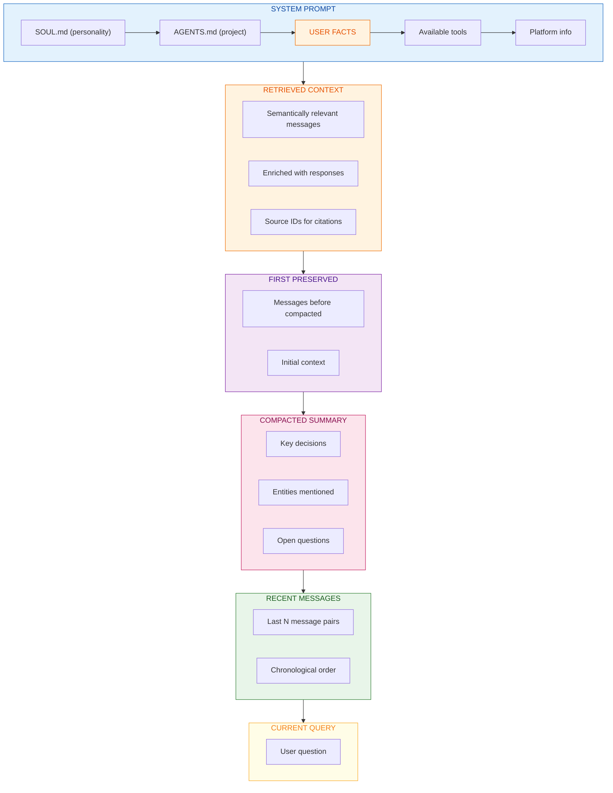
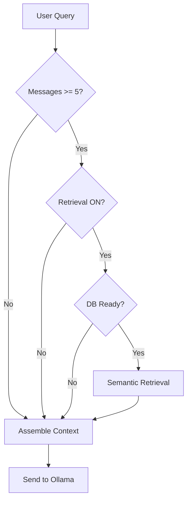
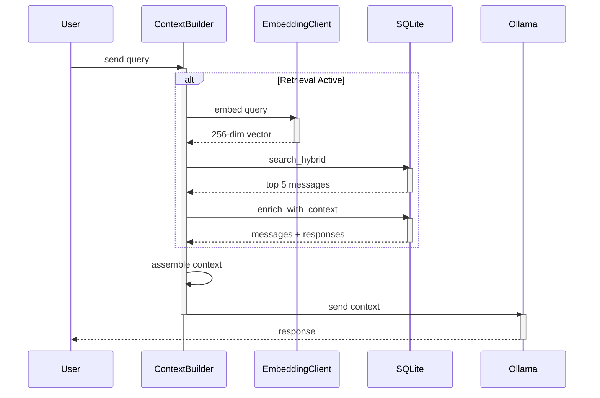
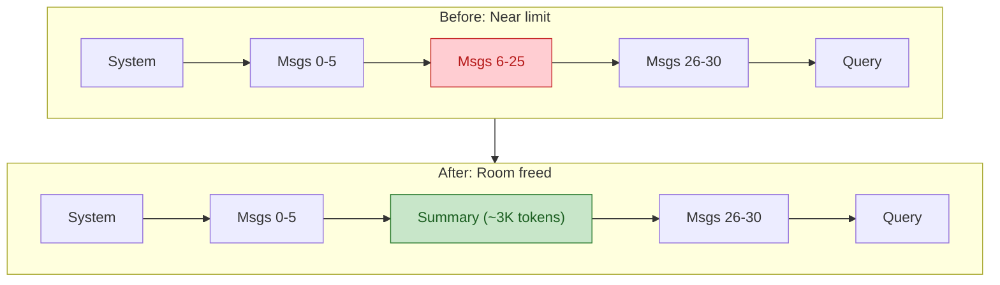
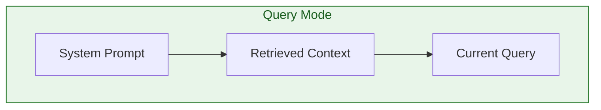

# Anatomy of Context

**Status:** Implemented  
**Version:** v0.33.0+  
**File:** `src/retrieval/context_builder.rs`
**See also:** [Memory Architecture](./memory-architecture.md) — Unified overview of all memory systems

This document explains how ask-ai composes the LLM context window, following research-based principles to avoid "lost in the middle" issues.

---

## The Problem: Lost in the Middle

Research from Liu et al. (2023) shows that language models perform significantly worse when relevant information is placed in the **middle** of context windows.

**Key findings:**
- **Beginning**: Up to 30% better performance (Anthropic research)
- **End**: Critical for current query understanding
- **Middle**: Information gets "lost" or poorly recalled

For more details, see the ["Lost in the Middle" paper](https://arxiv.org/abs/2307.03172).

---

## Context Composition

The context window has 7 sections assembled in order:



### Token Budget per Section

| Section | Tokens | Priority |
|---------|--------|----------|
| System Prompt | 500-2000 | Critical |
| User Facts | ~2200 max | High |
| Retrieved Context | 1000-5000 | High |
| First Preserved | Variable | Medium |
| Compacted Summary | 500-1000 | Medium |
| Recent Messages | 2000-5000 | High |
| Current Query | Variable | Critical |

### Section Details

**System Prompt** — Always first. Contains SOUL.md (personality), AGENTS.md (project), **USER FACTS**, tools, platform info.

**User Facts** — Injected after AGENTS.md. Contains user preferences and project facts from the Factual Memory system. Limited to 2200 characters total.

**Retrieved Context** — Semantically relevant messages from history. Active when session has 5+ messages and retrieval is enabled.

**First Preserved** — Messages before compacted range. Only present after middle compaction.

**Compacted Summary** — LLM-generated summary with key decisions, entities, open questions. After `/compact`.

**Recent Messages** — Last 10 message pairs. Always included, chronological order.

**Current Query** — User's question. Always at very end for best comprehension.

---

## User Facts Section

When the Factual Memory system is active, facts are injected after AGENTS.md:

**Order (by priority):**
1. Global preferences (e.g., "User prefers Portuguese")
2. Project preferences
3. Global facts (e.g., "API uses port 8080")
4. Project facts (e.g., "Database is SQLite")

**Format:**
```markdown
## User Facts

### Preferences
- prefiro respostas em português
- gosto de respostas curtas

### Facts
- o projeto usa SQLite para armazenamento
- a API está na porta 8080
```

**Limits:**
- Hard limit: 500 characters per fact (rejected at insert)
- Soft limit: 2200 characters total (truncated with Unicode-safe function)

For more details, see [Factual Memory System](./factual-memory-system.md).

---

## Flow Diagram



---

## Retrieval Sequence



---

## Middle Compaction

When context reaches the compaction buffer (15K tokens remaining):



**Key invariant:** Messages are NEVER deleted from SQLite. Compaction only affects what's sent to the LLM.

### Percentage-Based Triggers (v0.37.0+)

Compaction uses **percentage-based thresholds** that scale with context window size:

| Trigger | Usage | Action |
|---------|-------|--------|
| Pre-tool warning | 75% | Warn user before tool execution |
| Auto-compact | 88% | Compact conversation history |
| Inter-tool check | 94% | Warn during multi-tool execution |
| Emergency truncate | 97% | Truncate tool results to fit |

**Why percentages?** They scale proportionally with larger context windows:

| Context | 75% warning | 88% compaction | 94% inter-tool |
|---------|-------------|----------------|----------------|
| 32K | 24K used (8K remaining) | 28K used (4K remaining) | 30K used (2K remaining) |
| 128K | 96K used (32K remaining) | 113K used (15K remaining) | 120K used (8K remaining) |
| 200K | 150K used (50K remaining) | 176K used (24K remaining) | 188K used (12K remaining) |

**Safety minimums** ensure protection even for small contexts:
- `PRE_TOOL_MIN = 2,000` tokens
- `COMPACTION_MIN = 1,000` tokens
- `INTER_TOOL_MIN = 512` tokens
- `EMERGENCY_MIN = 256` tokens

---

## Summary Token Limit

Compacted summaries are limited to **3,000 tokens** to prevent infinite compaction loops:

- Previous issue: Summaries could grow to 18K+ tokens
- Solution: Hard limit with automatic truncation
- Template: Structured format (Goal, Instructions, Progress, Discoveries, Files)

---

## Token Budget Example

For a 32K context window:

| Stage | Usage | Remaining | Action |
|-------|-------|-----------|--------|
| Normal | 0-75% | 8K+ | Normal operation |
| Warning | 75-88% | 4-8K | Show warning |
| Compaction | 88-94% | 2-4K | Auto-compact |
| Inter-tool | 94-97% | 1-2K | Warn during tools |
| Emergency | 97%+ | <1K | Truncate results |

**Key insight:** Percentage triggers scale naturally with context size while minimums protect small contexts.

---

## Anti-Patterns

| Anti-Pattern | Problem | Solution |
|--------------|---------|----------|
| Retrieval in middle | Lost info | Place after system |
| Query in middle | Model confused | Query at very end |
| Context 100% full | Overflow | Target 60-80% |
| No structure tags | Confusion | Use XML tags |
| Generic summary | Lost details | Preserve entities |
| Delete from SQLite | Lost data | Never delete |

---

## Configuration

Default values in `src/retrieval/context_builder.rs`:

```rust
pub const MIN_MESSAGES_FOR_RETRIEVAL: usize = 5;
pub const RELEVANT_MESSAGES_COUNT: usize = 5;
pub const RECENT_MESSAGES_COUNT: usize = 10;
pub const MIN_RETRIEVAL_INTERVAL_SECS: u64 = 5;
pub const KEYWORD_WEIGHT: f32 = 0.4;
pub const SEMANTIC_WEIGHT: f32 = 0.6;
```

### Activation Conditions

Retrieval activates when ALL are true:
- `config.enabled == true`
- `session.messages.len() >= 5`
- `db.is_some()`
- `embedding_client.is_some()`
- Throttle passed (5 seconds)

---

## Query Mode

For `ask-ai query` (no persistence):



**Differences from Chat Mode:** No recent messages, no summary, searches all projects, no persistence.

---

## See Also

- [Context Composition Design](./context_composition_design.md) — Design decisions
- [Retrieval Design](./retrieval_design.md) — Hybrid search implementation
- [Architecture](./architecture.md) — Overall system architecture