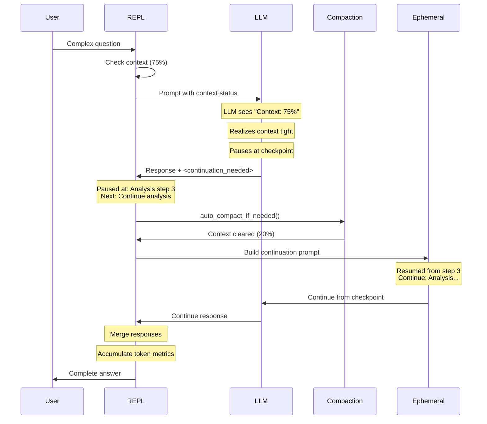

# Context Continuity with Graceful Interruption

**Status:** ✅ Implemented (v0.31.0)

## Overview

Context Continuity enables the LLM to gracefully pause reasoning when context fills up during complex multi-step tasks, then automatically continue after compaction.

## Problem

When performing lengthy operations (complex analysis, multi-tool chains, extended reasoning), the LLM can run out of context mid-task. Previous behavior:

- Auto-compaction happened **after** response completion
- No mechanism for LLM to signal "I need to pause"
- Work lost when context overflow occurred during tool execution
- User had to manually continue or retry

## Solution

Tag-based continuation protocol:

1. LLM receives context percentage in prompt (e.g., "Context: 78%")
2. When approaching limits, LLM is instructed to pause gracefully
3. LLM emits `<continuation_needed>` tag with checkpoint info
4. System detects tag, compacts context, injects continuation prompt
5. LLM resumes without user intervention

## Architecture



## Implementation Details

### 1. Context Status Injection

When context usage exceeds 72%, status is injected into the system prompt:

```rust
// In prompts/builder.rs
if let Some(ref status) = config.context_status && status.needs_compaction() {
    prompt.push_str("\n### CONTEXT STATUS\n\n");
    prompt.push_str(&format!(
        "Context usage: {}% ({:.1}K / {:.0}K tokens)\n\n",
        status.usage_percent(),
        status.total_tokens() as f64 / 1000.0,
        status.max_tokens() as f64 / 1000.0
    ));
    
    if status.is_overflow() {
        prompt.push_str("⚠️ CRITICAL: Context window is nearly full.\n");
    }
}
```

### 2. Continuation Protocol Instruction

When context exceeds 80%, the LLM receives continuation instructions:

```markdown
### CONTEXT MANAGEMENT

If context reaches critical levels during your response:
1. PAUSE your reasoning at a logical checkpoint
2. Add this tag before stopping:

<continuation_needed>
Reasoning paused: [brief description of where you stopped]
Next step: [what you were about to do]
</continuation_needed>

3. STOP generating and wait for continuation
```

### 3. Tag Parsing

The `parse_continuation_tag()` function extracts checkpoint info:

```rust
pub struct ContinuationTag {
    pub paused_at: String,   // Where reasoning stopped
    pub next_step: String,   // What was about to be done
}

// Returns (cleaned_content, Option<ContinuationTag>)
// - Tags inside code blocks are ignored
// - Only first tag is parsed
// - Empty tags return None
```

### 4. Ephemeral Messages

Continuation prompts are **ephemeral** - never persisted to session:

```rust
// In CustomCoordinator
pub fn push_ephemeral(&mut self, message: ChatMessage) {
    self.ephemeral_messages.push(message);
}

// Prepended to requests in build_request()
fn build_request(&self) -> ChatMessageRequest {
    let mut messages = Vec::new();
    messages.extend(self.ephemeral_messages.iter().cloned());  // First
    messages.extend(self.history.messages().iter().cloned()); // Then history
    // ...
}
```

### 5. Continuation Loop

The REPL handles continuation detection:

```rust
// In chat/repl.rs
if let Some(ref continuation_tag) = result.continuation_needed {
    // 1. Display cleaned response (tag stripped)
    
    // 2. Compact context
    auto_compact_if_needed(...).await;
    
    // 3. Send continuation (empty user_input, continuation via ephemeral)
    let continuation_result = send_message(
        ...,
        "",  // empty user_input
        Some(continuation_tag),  // continuation via ephemeral
    ).await;
    
    // 4. Merge responses
    final_response.push_str(&continuation_result.response);
    final_metrics.response_tokens += continuation_result.metrics.response_tokens;
}
```

### 6. Nested Continuations

Supports up to 3 nested continuations for extreme context pressure:

```rust
while let Some(ref next_tag) = cont_result.continuation_needed {
    if continuation_count >= 3 {
        eprintln!("Maximum continuations reached. Please continue manually.");
        break;
    }
    continuation_count += 1;
    // ... compact and continue
}
```

## Threshold Behavior

| Context Usage | Behavior |
|--------------|----------|
| < 72% | Normal operation, no warnings |
| 72-80% | Context status warning injected |
| > 80% | Continuation protocol enabled |
| Continuation | Auto-compact, resume, merge |

## Files Changed

| File | Changes |
|------|---------|
| `src/chat/repl.rs` | Continuation loop, `build_continuation_prompt()` |
| `src/chat/custom_coordinator.rs` | `ContinuationTag`, `parse_continuation_tag()`, `ephemeral_messages` |
| `src/prompts/builder.rs` | `context_status` field, status injection |
| `src/prompts/base.rs` | `CONTEXT_MANAGEMENT_INSTRUCTION` |
| `src/context_overflow.rs` | `ContextStatus.max_tokens()` |
| `doc/src/CHANGELOG.md` | v0.31.0 entry |
| `IMPLEMENTATION.md` | Updated Priority 0 |

## Testing

### Unit Tests

Located in `src/chat/custom_coordinator.rs`:

```rust
#[test]
fn test_parse_continuation_tag_basic() { ... }  // Normal tag
#[test]
fn test_parse_continuation_tag_no_tag() { ... }  // No tag present
#[test]
fn test_parse_continuation_tag_in_code_block() { ... }  // Ignored in code
#[test]
fn test_parse_continuation_tag_partial_fields() { ... }  // Only one field
#[test]
fn test_parse_continuation_tag_empty_fields() { ... }  // Empty values
#[test]
fn test_parse_continuation_tag_multiline() { ... }  // Multi-line content
#[test]
fn test_parse_continuation_tag_nested_tags() { ... }  // Multiple tags
```

### Manual Testing

Force context pressure by using a small context window:

```bash
# Small context for testing
ask-ai chat --model llama3.2:1b --context 4096

# Engage in long conversation until context fills
# LLM should pause and continue automatically
```

## Future Improvements

1. **Proactive continuation** - Pause before hitting 100% based on task complexity estimation
2. **Smart checkpointing** - Let LLM decide optimal pause points based on reasoning structure
3. **Continuation summary** - Show user what was compacted during pause
4. **Manual override** - Let user force continuation or abort

## References

- [Architecture - Context Window Management](./architecture.md#2-context-window-management)
- [Context Composition Design](./context_composition_design.md)
- [Context Management Research](./context_management_research.md)