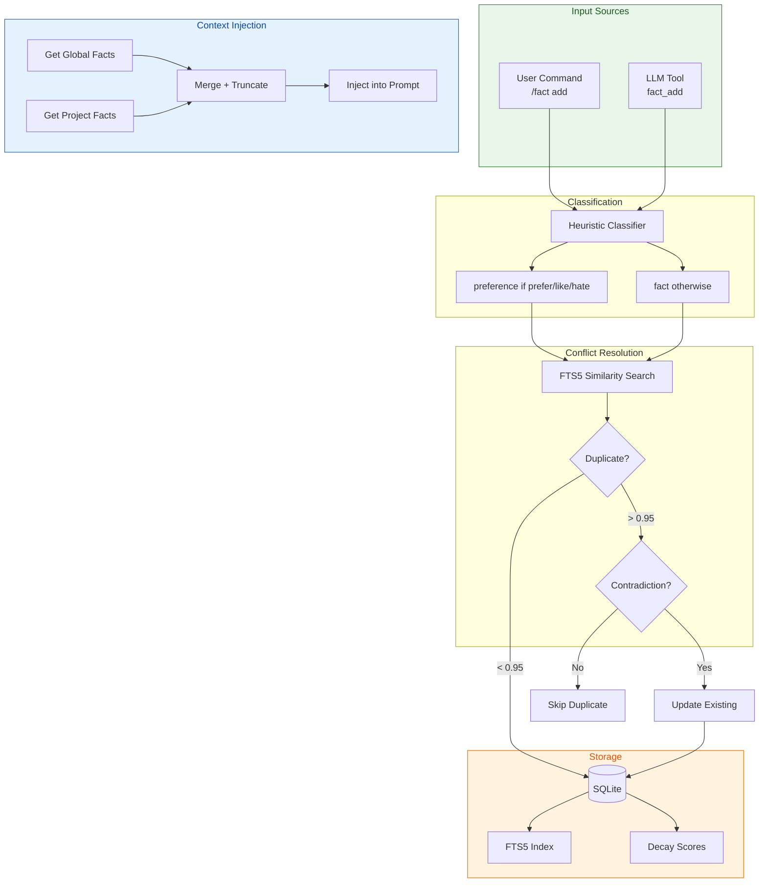
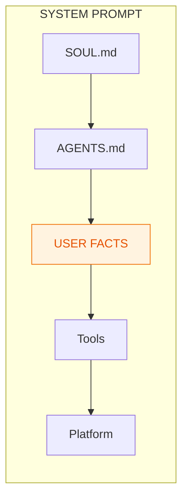
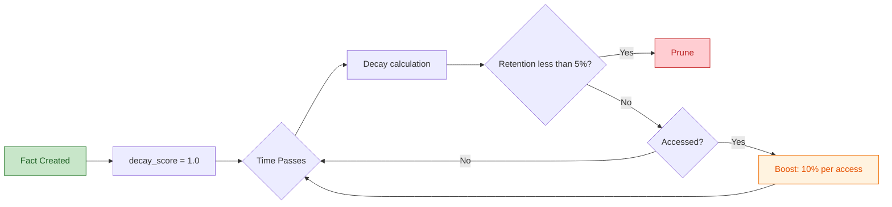

# Factual Memory System Design

**Status:** ✅ COMPLETED  
**Priority:** P0 (before Feedback System)  
**Created:** 2026-03-14  
**Updated:** 2026-03-15  
**Depends on:** None (standalone feature)
**See also:** [Memory Architecture](./memory-architecture.md) — Unified overview of all memory systems

---

## Executive Summary

This document defines the implementation plan for a **Factual Memory System** that enables ask-ai to remember user preferences and project facts across sessions.

**Problem:** Users currently need to repeat contextual information (e.g., "my docs are in ~/docs") in every session.

**Solution:** A persistent fact storage system with automatic decay, heuristic classification, and keyword search (FTS5).

---

## Architecture



---

## Design Decisions (Simplified)

| Decision | Choice | Rationale |
|----------|--------|-----------|
| Categories | **2: `preference`, `fact`** | `context` is redundant (handled by RAG) |
| Classification | **Heuristic only** | 90%+ accuracy, no LLM tokens |
| Search | **FTS5 + Semantic (Layer 3.5)** | FTS5 for keywords, embeddings for semantic similarity |
| Storage | **Same DB (`embeddings.db`)** | No separate database |
| Per-fact limit | **500 chars (hard limit)** | Rejected at DB insert |
| Total prompt limit | **2200 chars (soft limit)** | Truncated with Unicode-safe `truncate_chars` |
| Conflict resolution | **6-layer dedup** | Exact → Normalized → Semantic (0.70, triple + polarity) → FTS5 (0.75) → Startup verification (0.90) → Global-wins-project |
| Decay | **Startup synchronous** | Background optional later |
| Embeddings | **Eager with Semaphore(1)** | Serialized embedding generation with 30s timeout |
| Language | **All content stored in English** | PT→EN prefix translation via `lang::translate_pt_to_en()` (ADR-L1) |
| Normalization | **Third-person at storage time** | `normalize_to_storage_format()` ensures all facts stored as "User prefers X" (ADR-E4) |

---

## Categories (Simplified to 2)

| Category | Description | Half-Life | Examples |
|----------|-------------|-----------|----------|
| `preference` | User preferences, likes/dislikes | 180 days | "User prefers Portuguese", "User likes concise responses" |
| `fact` | Objective facts about environment/project | 30 days | "User's name is Lucas", "Database is SQLite" |

> **ADR-E4:** All facts are stored in third person ("User prefers X", "User's name is X"), never first person ("I prefer X", "My name is X"). This is applied by `normalize_to_storage_format()` in `src/facts/lang.rs` at storage time. The `normalize_to_third_person()` function in prompt rendering remains as defense-in-depth for legacy data.

> **Bug #2 (DEFERRED to issue #106):** PT noun translation after the prefix is not handled by heuristic mode. "Eu prefiro respostas curtas" → "User prefers respostas curtas" (noun "respostas curtas" remains in PT). Full noun translation requires LLM-mode (M2).

---

## Scopes

| Scope | Description | Storage |
|-------|-------------|---------|
| `project` | Facts specific to current project | `project_id` column in facts table |
| `global` | Facts that apply to all projects | `project_id = NULL` |

**Note:** Both use the same database (`embeddings.db`), not separate files.

---

## Context Injection

Facts are injected into the system prompt after AGENTS.md:



**Order (by priority):**
1. Global preferences (e.g., "User prefers Portuguese")
2. Project preferences
3. Global facts (e.g., "API uses port 8080")
4. Project facts (e.g., "Database is SQLite")

**Format:**
```markdown
## User Facts

### Global Preferences
- User prefers Portuguese
- User likes concise responses

### Global Facts
- User's name is Lucas
- API uses port 8080

### Project Facts
- Database is SQLite
```

**Limits:**
- Hard limit: 500 characters per fact
- Soft limit: 2200 characters total (truncated with Unicode-safe function)

---

## Database Schema

### 3.1 Facts Table

```sql
-- Facts table (schema v11)
CREATE TABLE IF NOT EXISTS facts (
    id INTEGER PRIMARY KEY,
    
    -- Classification
    scope TEXT NOT NULL CHECK(scope IN ('project', 'global')),
    category TEXT NOT NULL CHECK(category IN ('preference', 'fact')),
    
    -- Content (application validates <= 500 chars)
    -- Stored in third person per ADR-E4: "User prefers X", never "I prefer X"
    content TEXT NOT NULL,
    
    -- Decay parameters
    importance REAL DEFAULT 0.5 CHECK(importance BETWEEN 0 AND 1),
    access_count INTEGER DEFAULT 0,
    decay_score REAL DEFAULT 1.0,
    
    -- Timestamps
    created_at REAL NOT NULL,
    last_accessed REAL NOT NULL,
    
    -- Source tracking
    source TEXT DEFAULT 'user' CHECK(source IN ('user', 'llm', 'auto')),
    
    -- Conflict resolution (soft delete)
    invalidated_at REAL,
    
    -- Project association (NULL for global facts)
    project_id TEXT,
    
    -- Embedding status (v11)
    has_embedding INTEGER DEFAULT 0
);

-- Full-text search for keyword matching (BM25)
CREATE VIRTUAL TABLE IF NOT EXISTS facts_fts USING fts5(
    content,
    content='facts',
    content_rowid='id'
);

-- Semantic search for fact dedup (v11)
CREATE VIRTUAL TABLE IF NOT EXISTS fact_embeddings USING vec0(
    fact_id INTEGER PRIMARY KEY,
    embedding FLOAT[256]
);

-- Partial index for facts missing embeddings (v11)
CREATE INDEX IF NOT EXISTS idx_facts_embedding
    ON facts(has_embedding) WHERE has_embedding = 0 AND invalidated_at IS NULL;

-- Indexes
CREATE INDEX IF NOT EXISTS idx_facts_scope_category ON facts(scope, category);
CREATE INDEX IF NOT EXISTS idx_facts_decay ON facts(decay_score) WHERE invalidated_at IS NULL;
CREATE INDEX IF NOT EXISTS idx_facts_project ON facts(project_id) WHERE scope = 'project';
CREATE INDEX IF NOT EXISTS idx_facts_access ON facts(last_accessed DESC);
```

### 3.2 Storage Location

- **All facts**: Same database as embeddings (`~/.local/share/ask-ai/embeddings.db`)
- **Project facts**: Filtered by `project_id` column
- **Global facts**: `project_id = NULL`

No separate database files needed.

---

## 4. Classification System

### 4.1 Heuristic Classification (Primary - No LLM)

```rust
enum Category {
    Preference,  // Half-life: 180 days
    Fact,        // Half-life: 30 days
}

fn classify_fact(content: &str) -> Category {
    let lower = content.to_lowercase();
    
    // Heuristic for preferences
    if lower.contains("prefiro") || lower.contains("prefer") 
       || lower.contains("gosto") || lower.contains("like")
       || lower.contains("odeio") || lower.contains("hate")
       || lower.contains("quero") || lower.contains("want")
       || lower.contains("não gosto") || lower.contains("don't like") {
        Category::Preference
    } else {
        Category::Fact  // Default
    }
}
```

**Why no LLM classification:**
- Heuristic covers 90%+ of cases
- Simple patterns work well for preference detection
- LLM tokens cost money
- "Fact" is a safe default

---

## 5. Decay System

Based on the [Ebbinghaus forgetting curve](https://en.wikipedia.org/wiki/Forgetting_curve) with access reinforcement:



### 5.1 Decay Formula

```rust
const HALF_LIFE_PREFERENCE: f32 = 180.0;  // days
const HALF_LIFE_FACT: f32 = 30.0;        // days
const ACCESS_BOOST: f32 = 0.1;           // 10% per access
const MIN_RETENTION: f32 = 0.05;          // 5% threshold for pruning

fn compute_retention(fact: &Fact, now: DateTime<Utc>) -> f32 {
    let half_life = match fact.category {
        Category::Preference => HALF_LIFE_PREFERENCE,
        Category::Fact => HALF_LIFE_FACT,
    };
    
    let days_since_access = (now - fact.last_accessed).num_days() as f32;
    
    // Exponential decay: R = 2^(-t / half_life)
    let decay = 2f32.powf(-days_since_access / half_life);
    
    // Importance multiplier (important facts retain longer)
    let importance_mult = 1.0 + fact.importance * 0.5;
    
    // Access boost (frequently accessed facts retain longer)
    let access_mult = 1.0 + ACCESS_BOOST * (fact.access_count as f32).log2().max(0.0);
    
    (decay * importance_mult * access_mult).min(1.0)
}

fn should_prune(fact: &Fact, now: DateTime<Utc>) -> bool {
    // Never prune high-importance preferences
    if fact.category == Category::Preference && fact.importance >= 0.8 {
        return false;
    }
    
    compute_retention(fact, now) < MIN_RETENTION
}
```

### 5.2 Access Reinforcement

```rust
fn on_fact_access(fact: &mut Fact) {
    fact.access_count += 1;
    fact.last_accessed = Utc::now();
    
    // Optionally boost importance on access
    fact.importance = (fact.importance + 0.05).min(1.0);
}
```

### 5.3 Decay Schedule

- **On startup:** Run once synchronously (blocks until complete)
- **Background (optional):** Every 24 hours, spawn tokio task
- **Manual:** `/fact prune` command

```rust
fn run_decay_cycle(db: &Database) -> Result<DecayStats, Error> {
    let now = Utc::now();
    
    // Find facts below retention threshold
    let facts_to_prune: Vec<Fact> = db.list_facts_below_threshold(MIN_RETENTION, now)?;
    
    // Delete (no archive)
    let pruned = facts_to_prune.len();
    for fact in &facts_to_prune {
        db.delete_fact(fact.id)?;
    }
    
    // Update decay scores for remaining facts
    db.update_decay_scores(now)?;
    
    Ok(DecayStats { pruned, remaining: db.count_facts()? })
}
```

---

## 6. Conflict Resolution (6-Layer Dedup Pipeline)

Facts are deduplicated through a 6-layer pipeline that catches duplicates and contradictions at increasingly sophisticated levels:

### 6.1 Layer 1: Exact Match

Case-insensitive, trimmed comparison via `find_exact_fact()`. Catches identical facts regardless of capitalization or whitespace.

### 6.2 Layer 2: Normalized Match

`normalize_for_comparison()` strips pronouns and subjects, then **lemmatizes verbs** (third-person → base form), then exact match. Catches "I prefer dark mode" ≈ "User prefers dark mode" ≈ "prefers dark mode" → all normalize to "prefer dark mode".

**Limitation:** Contradictory facts with same predicate but different objects (e.g., "prefer dark mode" vs "prefer light mode") have different normalized strings, so Layer 2 returns empty. This is handled by Layer 3.5 (semantic) which runs after Layer 2.

### 6.3 Layer 3: FTS5 BM25 Keyword Search

`search_facts_by_content(query, 0.75)` catches facts with similar keywords. Lowered threshold from 0.85 to 0.75 to catch more near-duplicates.

### 6.4 Layer 3.5: Semantic Embedding (Insert-Time)

**Categories covered:** `Category::Preference` (which includes identity facts — "name is", "lives in", etc. are all classified as Preference by the heuristic classifier). See §6.4.1 for rationale.

**Pipeline position:** AFTER Layer 2, BEFORE Layer 3 (FTS5). The current code has Layer 3.5 after Layer 3, which prevents contradiction detection from reaching preferences with different normalized strings (e.g., "prefers dark mode" has a different normalized form than "prefers light mode", so Layer 2 returns empty and the block is skipped).

Steps:
1. Generate embedding via `EmbeddingClient::embed()` (serialized with `Semaphore(1)`, 30s timeout)
2. Search `fact_embeddings` via `search_facts_semantic()` (cosine similarity ≥ **0.70** — see `SEMANTIC_SEARCH_THRESHOLD` in conflict.rs)
3. For each result ≥ 0.70:
   a. Extract triples via `extract_fact_triple()` for both candidate and existing fact
   b. If triples **contradict** (same predicate, different object) → **Update** (delete old, insert new)
   c. If triples are **identical** (same predicate, same object) → **Skip** (semantic duplicate)
   d. If `is_contradiction()` fallback fires (polarity opposition: like/hate, negation) → **Update**
   e. Neither → continue to next result
4. If no semantic result triggered an action → fall through to Layer 3 (FTS5 BM25)

This layer catches contradictions that keyword search misses because the words are different but the meaning conflicts. The triple extraction step deterministically distinguishes "contradiction" (same predicate, different object) from "duplicate" (same predicate, same object) or "related" (different predicate).

**Key threshold difference from startup verification:**
- `SEMANTIC_SEARCH_THRESHOLD = 0.70` (extract.rs) — for insert-time candidate retrieval, intentionally broad
- `SEMANTIC_DEDUP_THRESHOLD = 0.90` (verify.rs) — for startup O(n²) pairwise dedup, intentionally strict

**Dead code removed:** The former Layer 2.5 contradiction check inside the Layer 2 `if !matches.is_empty()` block has been removed — it was dead code because contradictory facts always have different normalized strings, making the block unreachable. The reordered Layer 3.5 supersedes it.

**`command_handlers.rs` sync:** The same dedup/contradiction pipeline changes must be applied to `command_handlers.rs` if it has its own insertion path (avoid logic divergence).

### 6.4.1 Decision: Layer 3.5 Already Covers Identity (via Classification)

**Decision: NO new `Category::Identity` needed — identity facts are already `Category::Preference`.**

**Decision date:** 2026-04-26  
**Proposed by:** OpenCode (code review of extract.rs line 491)  
**Validated by:** Hermes Agent

#### Why

1. **The data proves it works.** Cosine("name is Lucas", "name is Maria") = 0.875 — well above the 0.70 threshold. The signal is even stronger than preference pairs (0.775).

2. **Identity facts are classified as `Category::Preference`.** The heuristic classifier (`classify_fact()`) in `classify.rs` treats all personal facts (name, location, language, workplace) as `Preference` because they share the same "one active value per predicate" semantics. Therefore, `Category::Preference` already covers identity.

3. **`TRIPLE_IDENTITY_PREFIXES` covers identity triple extraction.** `extract_fact_triple()` handles "name is", "lives in", "works at", etc. No code change needed beyond having the semantic block run for `Category::Preference`.

4. **Not covering identity would leave S42.4 partially broken.** Smoke test S42.4 explicitly documents "name is Lucas" + "name is Maria" coexisting as a bug. Since identity facts are `Category::Preference`, they're automatically covered.

5. **`is_contradiction()` is category-agnostic.** The polarity fallback works for all content regardless of category.

#### Why NOT all categories

Factual facts like "The project uses SQLite" vs "The project uses PostgreSQL" have different semantics:
- These may be **temporal transitions** ("migrated from SQLite to PostgreSQL") — not contradictions, chronological updates
- The system has no timestamp or versioning concept for facts, so it can't distinguish "changed" from "contradicts"
- This would require archival/history semantics, a significantly more complex design
- **Criterion for scope:** Only categories where facts are **substitutive by nature** (only one active value per predicate makes sense) should use semantic contradiction detection. Preference and Identity meet this; Factual does not.

#### Edge cases acknowledged

| Case | Behavior | Acceptable? |
|------|----------|-------------|
| "I live in Diamantina" → "I live in BH" | UPDATE (city change, correct) | ✅ |
| "My name is Lucas" → "My name is Lucas Samuk" | UPDATE (refinement, loses "Lucas" → "Lucas Samuk") | ✅ Correct — user gave more specific info |
| "I live in Diamantina" → "I live in Minas Gerais" | May or may not trigger — cosine("Diamantina", "MG") likely <0.70 | ✅ If it triggers, UPDATE is acceptable (rare, reversible via `/fact remove`) |
| "I live in BH" → "I live in Belo Horizonte" | Same triple (lives in, BH ≅ Belo Horizonte)? Depends on normalization | ⚠️ If different objects → UPDATE (acceptable, refinement). If same → SKIP. |

### 6.5 Layer 4: Global-Wins-Project Rule

When a new Global-scope fact conflicts with an existing Project-scope fact, the Global fact wins and the Project fact is removed.

### 6.6 Startup Verification

On startup, `verify_and_dedup_facts()` performs O(n²) pairwise cosine comparison on all facts with embeddings, catching any duplicates that slipped through insert-time checks.

### 6.7 Resolution Actions

```rust
enum ConflictKind {
    ExactDuplicate,       // Layer 1: identical content
    NormalizedDuplicate, // Layer 2: normalized content match
    SemanticDuplicate,   // Layer 3.5: cosine ≥ 0.70, same triple (no contradiction)
    SemanticContradiction, // Layer 3.5: cosine ≥ 0.70, triple contradicts OR is_contradiction() fires
    FtsDuplicate,        // Layer 3: BM25 similarity ≥ 0.75 (fallback for non-semantic matches)
}

enum ConflictResolution {
    Skip,              // Duplicate — don't add
    Update,            // Contradiction — replace old with new
    RemoveOld,         // Global-wins-project — remove project duplicate
    Add,               // No conflict — add new fact
}
```

### 6.8 Conflict Thresholds

Two distinct semantic thresholds serve different purposes:

| Constant | Value | Location | Purpose |
|----------|-------|----------|---------|
| `SEMANTIC_SEARCH_THRESHOLD` | 0.70 | conflict.rs | Insert-time candidate retrieval (intentionally broad — catches contradictions at 0.77+) |
| `SEMANTIC_DEDUP_THRESHOLD` | 0.90 | verify.rs | Startup O(n²) pairwise dedup (intentionally strict — only near-identical) |
| `CONFLICT_THRESHOLD` | 0.75 | conflict.rs | FTS5 BM25 keyword similarity (unchanged) |

### 6.9 ADR-E4: Third-Person Normalization at Storage Time

All facts are normalized to third person ("User prefers X") at storage time via `normalize_to_storage_format()` in `src/facts/lang.rs`. This ensures:
- EN first-person input: "I prefer dark mode" → "User prefers dark mode"
- EN first-person identity: "My name is Lucas" → "User's name is Lucas"
- PT→EN translated input: "Eu prefiro respostas curtas" → "User prefers respostas curtas" (prefix translated, noun preserved — Bug #2 DEFERRED)
- PT→EN identity: "Meu nome é Ana" → "User's name is Ana" (fixed — was "My name is Ana" before ADR-E4 fix)

The `normalize_to_third_person()` function in `src/facts/prompt.rs` remains as defense-in-depth for any legacy facts that might have been stored before ADR-E4.

---

## 7. Character Limits

### 7.1 Per-Fact Limit (Hard)

```rust
const MAX_FACT_CONTENT_SIZE: usize = 500;  // characters

fn validate_fact_content(content: &str) -> Result<(), String> {
    if content.len() > MAX_FACT_CONTENT_SIZE {
        return Err(format!(
            "Fact content exceeds {} characters (got {})",
            MAX_FACT_CONTENT_SIZE,
            content.len()
        ));
    }
    
    // Must end on valid char boundary
    if !content.is_char_boundary(content.len()) {
        return Err("Fact content has invalid unicode".to_string());
    }
    
    Ok(())
}
```

### 7.2 Total Prompt Limit (Soft)

```rust
const MAX_TOTAL_FACTS_CHARS: usize = 2200;  // characters

fn build_facts_section(facts: &[Fact]) -> String {
    use crate::utils::truncate_chars;
    
    if facts.is_empty() {
        return String::new();
    }
    
    let mut section = String::from("\n## User Facts\n\n");
    
    // Group by category (preferences first)
    let preferences: Vec<_> = facts.iter()
        .filter(|f| f.category == Category::Preference)
        .collect();
    let facts_list: Vec<_> = facts.iter()
        .filter(|f| f.category == Category::Fact)
        .collect();
    
    if !preferences.is_empty() {
        section.push_str("### Preferences\n");
        for fact in preferences {
            section.push_str(&format!("- {}\n", fact.content));
        }
    }
    
    if !facts_list.is_empty() {
        section.push_str("### Facts\n");
        for fact in facts_list {
            section.push_str(&format!("- {}\n", fact.content));
        }
    }
    
    // Truncate if over limit (Unicode-safe)
    if section.len() > MAX_TOTAL_FACTS_CHARS {
        section = truncate_chars(&section, MAX_TOTAL_FACTS_CHARS);
    }
    
    section
}
```

**Important:** The `truncate_chars` function from `src/utils.rs` is Unicode-safe and won't split multibyte characters.

---

## 8. LLM Tools

### 8.1 Tool Definitions

```rust
/// Add a fact to memory. Use proactively when you learn something 
/// important about the user or their environment.
///
/// Maximum content length: 500 characters.
/// Classification is automatic (preference vs fact).
///
/// # Arguments
/// * `content` - The fact to remember (max 500 chars)
/// * `scope` - Optional: "project" (default) or "global"
#[ollama_rs::function]
pub async fn fact_add(
    content: String,
    scope: Option<String>,  // "project" or "global"
) -> Result<String, Box<dyn std::error::Error + Send + Sync>> {
    // 1. Validate content length (500 chars)
    // 2. Auto-classify (preference vs fact)
    // 3. Check for conflicts (FTS5)
    // 4. Insert into DB
}

/// Search for facts in memory using keywords.
#[ollama_rs::function]
pub async fn fact_search(
    query: String,
    scope: Option<String>,  // "project", "global", or null (both)
) -> Result<String, Box<dyn std::error::Error + Send + Sync>> {
    // FTS5 search
}

/// Remove a fact by ID.
#[ollama_rs::function]
pub async fn fact_remove(
    id: String,  // String for LLM compatibility
) -> Result<String, Box<dyn std::error::Error + Send + Sync>> {
    // Delete from DB
}
```

**Note:** No `category` parameter - classification is automatic.

### 8.2 System Prompt Integration

The facts section is injected into the system prompt during session initialization:

```rust
// In prompt builder
pub fn with_facts(mut self, facts: Vec<Fact>) -> Self {
    self.facts = Some(facts);
    self
}

// In system prompt
if let Some(facts) = &self.facts {
    let section = build_facts_section(facts);
    prompt.push_str(&section);
}
```

---

## 9. User Commands

### 9.1 Command Definitions

```
/fact add <text>              # Add project fact (auto-classified, 6-layer dedup + normalization + embedding)
/fact add --global <text>     # Add global fact (6-layer dedup + normalization + embedding)
/fact list                    # List all facts
/fact list --global           # List global facts only
/fact remove <id>             # Remove a fact
/fact search <query>          # Search facts
/fact prune                   # Manual decay run
```

**Note:** No `--category` flag - classification is automatic.

### 9.2 User Experience Rationale

| Command | Purpose | Why User-facing? |
|---------|---------|------------------|
| `/fact add` | Explicitly add what user knows | Bootstrap, override LLM |
| `/fact list` | See what's stored | Inspection, debugging |
| `/fact remove` | Remove incorrect facts | Correction, privacy |
| `/fact search` | Find specific facts | Debugging |
| `/fact prune` | Force decay run | Manual cleanup |

**NOT user-facing:**
- `/fact set-category` - Auto-classified
- `/fact set-importance` - Too complex for MVP

---

## 10. Implementation Phases

### Phase 0.1: Schema (0.5 day) ✅ DONE

- Update `SCHEMA_VERSION` to 6
- Add `facts` table and `facts_fts` virtual table
- Add indexes
- Migration v5→v6 in `connection.rs`

**Commit:** `6042394 feat(facts): add core module for factual memory system (Phase 0.2)`

### Phase 0.2: Core Module (1 day) ✅ DONE

- `src/facts/mod.rs`, `types.rs`, `db.rs`, `decay.rs`
- `Fact` struct, `Category` enum, `Scope` enum
- CRUD operations: `insert_fact`, `search_facts`, `list_facts`, `delete_fact`
- Decay calculations and `run_decay_cycle`

**Commit:** `6042394 feat(facts): add core module for factual memory system (Phase 0.2)`

### Phase 0.3: LLM Tools (1 day) ✅ DONE

- `src/tools/fact_tools.rs`
- `fact_add()`, `fact_search()`, `fact_remove()`
- Tool registration (no feature flag - always enabled)
- Integration tests

**Implementation Notes:**
- Tools use `get_db()` from `tools::context` for database access
- Scope defaults to `global`, LLM must specify `scope="project"` for project facts
- Hard delete (no soft delete with `invalidated_at`)

### Phase 0.4: Prompt Injection (0.5 day) ✅ DONE

- `src/facts/prompt.rs`
- `build_facts_section()` with Unicode-safe truncation
- `Database::get_facts_for_prompt()` loads facts for current project
- Inject into system prompt via `PromptConfig::with_facts_section()`

**Implementation Notes:**
- Facts loaded in `send_message()` from `db.get_facts_for_prompt(project_id)`
- Facts merged: global facts + project facts (if project_id exists)
- Ordering: preferences first, then facts, by creation date
- Truncated to MAX_TOTAL_FACTS_CHARS (2200) with Unicode-safe truncation

### Phase 0.5: Decay & Prune (0.5 day) ✅ DONE

- Startup decay run in `src/chat/repl.rs` after database initialization
- `/fact prune` command (shortcut `/fp`) for manual decay trigger
- Decay statistics logged in debug mode
- `CommandResult::FactPrune` and `ChatCommand::FactPrune` added
- `handle_fact_prune()` handler in `command_handlers.rs`

### Phase 0.6: User Commands (0.5 day) ✅ DONE

- `/fact add <content> [--global]` - Add fact (shortcut `/fa`)
- `/fact list [--global]` - List facts (shortcut `/fl`)
- `/fact remove <id>` - Remove fact (shortcut `/fr`)
- `/fact search <query> [--global] [limit]` - Search facts (shortcut `/fs`)
- Handlers in `command_handlers.rs`
- Command routing in `repl.rs`

### Phase 0.7: Conflict Resolution (0.5 day) ✅ DONE

- Conflict detection via FTS5 similarity search (`detect_conflicts`)
- Heuristic resolution: Skip (duplicate) or Update (contradiction)
- Integration in `fact_add` LLM tool and `/fact add` user command
- Contradiction patterns: "like" vs "hate", negation detection
- Configured threshold: 0.85 similarity for conflict detection (BM25 scores normalized to [0,1))

### Phase 0.8: Testing & Documentation (0.5 day) ✅ DONE

- Integration tests for db operations (list_facts, decay_cycle, get_facts_for_prompt)
- Integration tests for conflict detection (contradiction, no_conflict)
- User documentation updated (doc/src/commands/chat.md)
- CHANGELOG.md updated
- All 41 facts module tests passing

**Total Estimate:** 5 days **(5 days completed)**

---

## 11. Files to Create/Modify

### New Files

| File | Purpose |
|------|---------|
| `src/facts/mod.rs` | Module exports |
| `src/facts/types.rs` | Category, Scope, Source, Fact structs |
| `src/facts/db.rs` | CRUD operations |
| `src/facts/classify.rs` | Heuristic classification |
| `src/facts/decay.rs` | Ebbinghaus decay calculations |
| `src/facts/conflict.rs` | Conflict detection and resolution |
| `src/facts/prompt.rs` | Build "## User Facts" section |
| `src/tools/facts.rs` | LLM tools |

### Modified Files

| File | Changes |
|------|---------|
| `src/db/schema.rs` | Add facts table (v6) |
| `src/db/connection.rs` | Migration v5→v6 |
| `src/prompts/builder.rs` | Add `with_facts()` |
| `src/prompts/base.rs` | Add `FACT_CONFLICT_RESOLUTION_PROMPT` |
| `src/chat/core.rs` | Load facts on session start |
| `src/chat/repl.rs` | Add /fact command parsing |
| `src/chat/command_handlers.rs` | Add /fact handlers |
| `Cargo.toml` | Add `fact-tools` feature |

---

## 12. Success Metrics

| Metric | Baseline | Target (1 month) | Target (3 months) |
|--------|----------|------------------|-------------------|
| Facts stored per session | 0 | 2-3 facts | 5-10 facts |
| Fact retrieval accuracy | N/A | 80% | 90% |
| User corrections (fact_remove) | N/A | < 5% | < 2% |
| Decay pruning rate | N/A | 10-20% | 15-25% |
| Classification accuracy | N/A | > 90% | > 95% |
| Prompt token overhead | 0 | +150 tokens | +150 tokens |

---

## 13. Research References

### Existing Systems

#### Hermes Agent
- Storage: Plain text Markdown files (`MEMORY.md`, `USER.md`)
- Character limits: 2200 chars (memory), 1375 chars (user)
- No decay mechanism
- No categorization (just target: memory vs user)
- LLM tool with `add/replace/remove` actions

#### Mem0
- Storage: Vector DB + graph DB
- Four operations: ADD, UPDATE, DELETE, NOOP
- Conflict detection via semantic similarity
- Feedback as ranking weight

#### Letta/MemGPT
- LLM-based `core_memory_replace` for memory updates
- No local contradiction detection — every memory op requires LLM API call
- Not applicable to ask-ai's offline/local-first design

#### synapse-ai-memory (PyPI)
- Triple extraction: SPO + polarity + tense
- Contradiction types: polarity flip, preference override, identity change
- Pure Python, zero LLM, MIT license
- **Our `extract_fact_triple()` design is adapted from this approach** — prefix-based triple extraction with `TRIPLE_PREFERENCE_PREFIXES` and `TRIPLE_IDENTITY_PREFIXES` as the source of truth

### Academic Papers

#### Li, Qin & Liu (2017) — Contradiction Detection with Contradiction-Specific Word Embedding
- **Venue:** Information, 10(2), 59 — [DOI: 10.3390/info10020059](https://www.mdpi.com/1999-4893/10/2/59)
- **Key finding:** Standard word embeddings (Word2Vec, GloVe) map antonyms to *close* vectors — "overfull" and "empty" become near-neighbors
- **Relevance:** Explains why `cosine("User prefers dark mode", "User prefers light mode") = 0.78` — embeddings cannot distinguish contradictions from similarities
- **Our response:** We don't rely on embedding polarity for contradiction detection. Instead, semantic search (cosine ≥ 0.70) retrieves candidates, then triple extraction deterministically distinguishes contradiction from duplicate

#### Gokul, Tenneti & Nakkiran (2025) — Contradiction Detection in RAG Systems
- **Venue:** arXiv:2504.00180 — [PDF](https://arxiv.org/pdf/2504.00180)
- **Key finding:** LLMs (Claude-3 Sonnet, Llama-70B) achieve at most 71% F1 on contradiction detection. High precision but low recall — they miss >30% of actual contradictions
- **Defines 3 contradiction types:** Self-contradiction (within doc), Pair contradiction (between docs), Conditional contradiction (triplet)
- **Scaling problem:** Evaluating all pairs is O(n²) — infeasible with 20+ documents (190 pairs)
- **Relevance:** Validates our decision to NOT use LLM API calls for contradiction detection. Confirms that pair contradictions (our use case: "prefer dark" vs "prefer light") are the easiest type, yet still missed by LLMs

### ML Models Evaluated and Rejected

| Model | Approach | Result | Why Rejected |
|-------|----------|--------|---------------|
| `onnx-community/deberta-base-long-nli` | Zero-shot NLI via ONNX Runtime | **Benchmarked: FAILED** — "prefer dark" vs "prefer light" → neutral; identical sentences → contradiction | Trained on SNLI/MultiNLI (scene descriptions), lacks preference patterns. ~115ms/pair. +30MB binary weight. |
| `cross-encoder/nli-deberta-v3-small` | True cross-encoder NLI | Not tested (Python 3.14 incompatibility) but projected to fail for same reasons | SNLI/MultiNLI training data has no "same predicate, different object" preference patterns |
| `fastembed-rs` + ONNX reranking | Rust-native ONNX embedding + NLI | Not tested | Available if future need, but benchmark of similar models shows fundamental limitation |

**Full research index and paper notes:** `~/testfiles/research/contradiction-detection/README.md`

### Key Learnings Applied
1. **Two categories is enough** - Hermes proves categorization isn't strictly necessary
2. **Character limits force prioritization** - No need for complex decay if limits are enforced
3. **Heuristic classification is sufficient** - Simple patterns cover 90%+ of cases
4. **Standard embeddings can't detect contradictions** - Li et al. (2017) proved antonyms map to similar vectors. Our measured data confirms.
5. **LLMs are unreliable for contradiction detection** - Gokul et al. (2025) showed SOTA LLMs miss >30% of contradictions
6. **Triple extraction + semantic search is the viable path** - synapse-ai-memory's approach adapted for Rust + SQLite

---

## 14. Security Considerations

1. **Content validation** - Reject facts > 500 chars or with invalid unicode
2. **UTF-8 boundary check** - Use `is_char_boundary()` before insert
3. **No SQL injection** - Use parameterized queries
4. **Scope isolation** - Project facts can't leak to other projects

---

**Document Status:** CANONICAL - Implementation should follow this design.

**Last Updated:** 2026-03-15