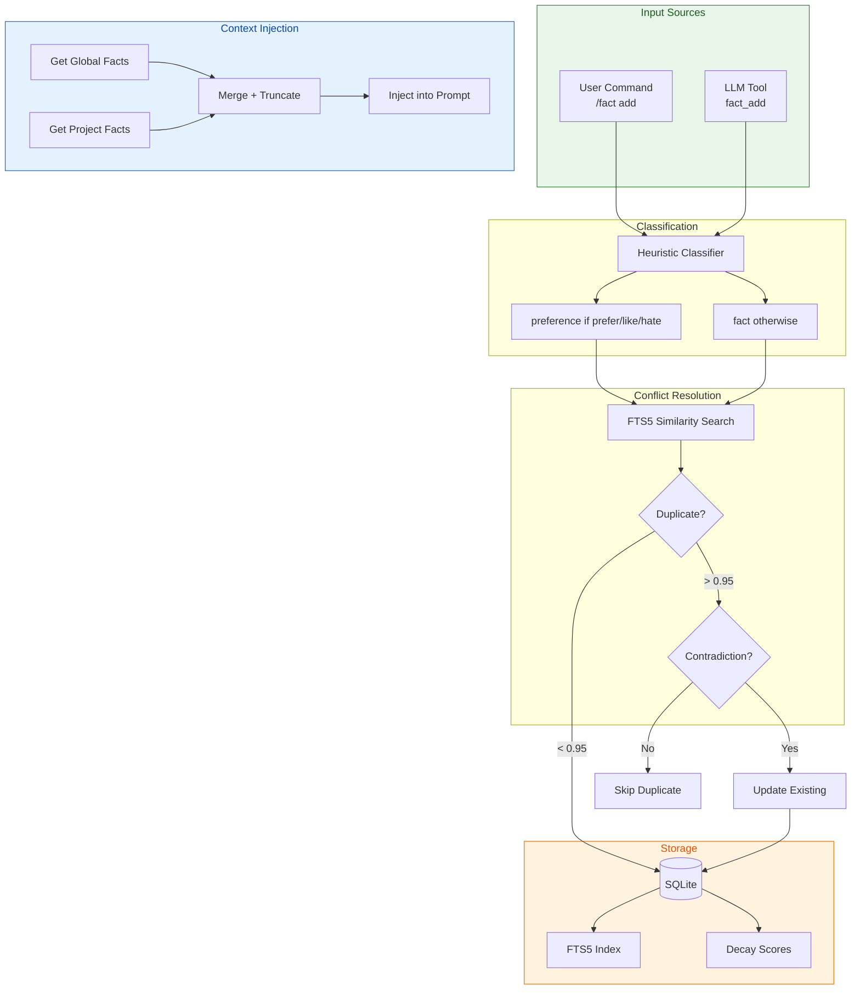
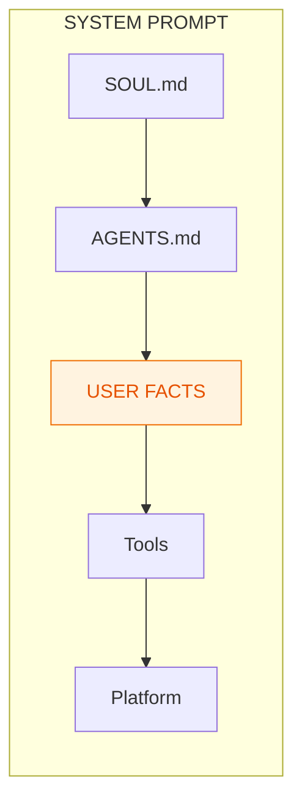
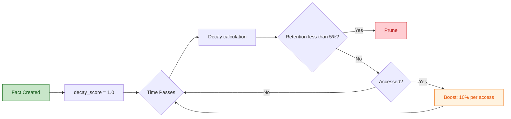

# Factual Memory System Design

**Status:** ✅ COMPLETED  
**Priority:** P0 (before Feedback System)  
**Created:** 2026-03-14  
**Updated:** 2026-04-26  
**Depends on:** None (standalone feature)
**See also:** [Memory Architecture](./memory-architecture.md) — Unified overview of all memory systems

---

## Executive Summary

This document defines the implementation plan for a **Factual Memory System** that enables sprachspiel to remember user preferences and project facts across sessions.

**Problem:** Users currently need to repeat contextual information (e.g., "my docs are in ~/docs") in every session.

**Solution:** A persistent fact storage system with automatic decay, heuristic classification, and keyword search (FTS5).

---

## Architecture



---

## Design Decisions (Simplified)

| Decision | Choice | Rationale |
|----------|--------|-----------|
| Categories | **2: `preference`, `fact`** | `context` is redundant (handled by RAG) |
| Classification | **Heuristic only** | 90%+ accuracy, no LLM tokens |
| Search | **FTS5 + Semantic (Layer 3.5)** | FTS5 for keywords, embeddings for semantic similarity |
| Storage | **Same DB (`sprachspiel.db`)** | No separate database |
| Per-fact limit | **500 chars (hard limit)** | Rejected at DB insert |
| Total prompt limit | **2200 chars (soft limit)** | Truncated with Unicode-safe `truncate_chars` |
| Conflict resolution | **6-layer dedup** | Exact → Normalized → Semantic (0.70, triple + polarity) → FTS5 (0.75) → Startup verification (0.90) → Global-wins-project |
| Decay | **Startup synchronous** | Background optional later |
| Embeddings | **Synchronous (await) with Semaphore(1)** | Serialized embedding generation with 30s timeout; synchronous (not fire-and-forget) to guarantee availability for subsequent Layer 3.5 searches |
| Language | **All content stored in English** | PT→EN prefix translation via `lang::translate_pt_to_en()` (ADR-L1) |
| Normalization | **Third-person at storage time** | `normalize_to_storage_format()` ensures all facts stored as "User prefers X" (ADR-E4) |
| Predicate classification | **4 categories: exclusive, positive, negative, neutral** | `EXCLUSIVE_PREDICATES`, `POSITIVE_PREDICATES`, `NEGATIVE_PREDICATES` in `lang.rs` as source of truth; `test_all_predicates_classified` enforcement test guarantees completeness |
| Contradiction logic | **Two-tier: exclusive vs accumulative** | Exclusive predicates (prefers, name is) → any different object = contradiction; Accumulative predicates (likes, hates) → only if object word overlap > 0.3 |

---

## Categories (Simplified to 2)

| Category | Description | Half-Life | Examples |
|----------|-------------|-----------|----------|
| `preference` | User preferences, likes/dislikes | 180 days | "User prefers Portuguese", "User likes concise responses" |
| `fact` | Objective facts about environment/project | 30 days | "User's name is Lucas", "Database is SQLite" |

> **ADR-E4:** All facts are stored in third person ("User prefers X", "User's name is X"), never first person ("I prefer X", "My name is X"). This is applied by `normalize_to_storage_format()` in `src/facts/lang.rs` at storage time. The `normalize_to_third_person()` function in prompt rendering remains as defense-in-depth for legacy data.

> **Bug #2 (DEFERRED to issue #106):** PT noun translation after the prefix is not handled by heuristic mode. "Eu prefiro respostas curtas" → "User prefers respostas curtas" (noun "respostas curtas" remains in PT). Full noun translation requires LLM-mode (M2).

---

## Scopes

| Scope | Description | Storage |
|-------|-------------|---------|
| `project` | Facts specific to current project | `project_id` column in facts table |
| `global` | Facts that apply to all projects | `project_id = NULL` |

**Note:** Both use the same database (`sprachspiel.db`), not separate files.

---

## Context Injection

Facts are injected into the system prompt after AGENTS.md:



**Order (by priority):**
1. Global preferences (e.g., "User prefers Portuguese")
2. Project preferences
3. Global facts (e.g., "API uses port 8080")
4. Project facts (e.g., "Database is SQLite")

**Format:**
```markdown
## User Facts

### Global Preferences
- User prefers Portuguese
- User likes concise responses

### Global Facts
- User's name is Lucas
- API uses port 8080

### Project Facts
- Database is SQLite
```

**Limits:**
- Hard limit: 500 characters per fact
- Soft limit: 2200 characters total (truncated with Unicode-safe function)

---

## Database Schema

### 3.1 Facts Table

```sql
-- Facts table (schema v12; table structure unchanged since v11, v12 only changed vec0 tables)
CREATE TABLE IF NOT EXISTS facts (
    id INTEGER PRIMARY KEY,
    
    -- Classification
    scope TEXT NOT NULL CHECK(scope IN ('project', 'global')),
    category TEXT NOT NULL CHECK(category IN ('preference', 'fact')),
    
    -- Content (application validates <= 500 chars)
    -- Stored in third person per ADR-E4: "User prefers X", never "I prefer X"
    content TEXT NOT NULL,
    
    -- Decay parameters
    importance REAL DEFAULT 0.5 CHECK(importance BETWEEN 0 AND 1),
    access_count INTEGER DEFAULT 0,
    decay_score REAL DEFAULT 1.0,
    
    -- Timestamps
    created_at REAL NOT NULL,
    last_accessed REAL NOT NULL,
    
    -- Source tracking
    source TEXT DEFAULT 'user' CHECK(source IN ('user', 'llm', 'auto')),
    
    -- Conflict resolution (soft delete)
    invalidated_at REAL,
    
    -- Project association (NULL for global facts)
    project_id TEXT,
    
    -- Embedding status (v11)
    has_embedding INTEGER DEFAULT 0
);

-- Full-text search for keyword matching (BM25)
CREATE VIRTUAL TABLE IF NOT EXISTS facts_fts USING fts5(
    content,
    content='facts',
    content_rowid='id'
);

-- Semantic search for fact dedup (v12, distance_metric=cosine)
-- sqlite-vec returns cosine distance; similarity = 1.0 - distance.
CREATE VIRTUAL TABLE IF NOT EXISTS fact_embeddings USING vec0(
    fact_id INTEGER PRIMARY KEY,
    embedding FLOAT[256] distance_metric=cosine
);

-- Partial index for facts missing embeddings (v11)
CREATE INDEX IF NOT EXISTS idx_facts_embedding
    ON facts(has_embedding) WHERE has_embedding = 0 AND invalidated_at IS NULL;

-- Indexes
CREATE INDEX IF NOT EXISTS idx_facts_scope_category ON facts(scope, category);
CREATE INDEX IF NOT EXISTS idx_facts_decay ON facts(decay_score) WHERE invalidated_at IS NULL;
CREATE INDEX IF NOT EXISTS idx_facts_project ON facts(project_id) WHERE scope = 'project';
CREATE INDEX IF NOT EXISTS idx_facts_access ON facts(last_accessed DESC);
```

### 3.2 Storage Location

- **All facts**: Same database as embeddings (`~/.local/share/sprachspiel/sprachspiel.db`)
- **Project facts**: Filtered by `project_id` column
- **Global facts**: `project_id = NULL`

No separate database files needed.

---

## 4. Classification System

### 4.1 Heuristic Classification (Primary - No LLM)

```rust
enum Category {
    Preference,  // Half-life: 180 days
    Fact,        // Half-life: 30 days
}

fn classify_fact(content: &str) -> Category {
    let lower = content.to_lowercase();
    
    // Heuristic for preferences
    if lower.contains("prefiro") || lower.contains("prefer") 
       || lower.contains("gosto") || lower.contains("like")
       || lower.contains("odeio") || lower.contains("hate")
       || lower.contains("quero") || lower.contains("want")
       || lower.contains("não gosto") || lower.contains("don't like") {
        Category::Preference
    } else {
        Category::Fact  // Default
    }
}
```

**Why no LLM classification:**
- Heuristic covers 90%+ of cases
- Simple patterns work well for preference detection
- LLM tokens cost money
- "Fact" is a safe default

---

## 5. Decay System

Based on the [Ebbinghaus forgetting curve](https://en.wikipedia.org/wiki/Forgetting_curve) with access reinforcement:



### 5.1 Decay Formula

```rust
const HALF_LIFE_PREFERENCE: f32 = 180.0;  // days
const HALF_LIFE_FACT: f32 = 30.0;        // days
const ACCESS_BOOST: f32 = 0.1;           // 10% per access
const MIN_RETENTION: f32 = 0.05;          // 5% threshold for pruning

fn compute_retention(fact: &Fact, now: DateTime<Utc>) -> f32 {
    let half_life = match fact.category {
        Category::Preference => HALF_LIFE_PREFERENCE,
        Category::Fact => HALF_LIFE_FACT,
    };
    
    let days_since_access = (now - fact.last_accessed).num_days() as f32;
    
    // Exponential decay: R = 2^(-t / half_life)
    let decay = 2f32.powf(-days_since_access / half_life);
    
    // Importance multiplier (important facts retain longer)
    let importance_mult = 1.0 + fact.importance * 0.5;
    
    // Access boost (frequently accessed facts retain longer)
    let access_mult = 1.0 + ACCESS_BOOST * (fact.access_count as f32).log2().max(0.0);
    
    (decay * importance_mult * access_mult).min(1.0)
}

fn should_prune(fact: &Fact, now: DateTime<Utc>) -> bool {
    // Never prune high-importance preferences
    if fact.category == Category::Preference && fact.importance >= 0.8 {
        return false;
    }
    
    compute_retention(fact, now) < MIN_RETENTION
}
```

### 5.2 Access Reinforcement

```rust
fn on_fact_access(fact: &mut Fact) {
    fact.access_count += 1;
    fact.last_accessed = Utc::now();
    
    // Optionally boost importance on access
    fact.importance = (fact.importance + 0.05).min(1.0);
}
```

### 5.3 Decay Schedule

- **On startup:** Run once synchronously (blocks until complete)
- **Background (optional):** Every 24 hours, spawn tokio task
- **Manual:** `/fact prune` command

```rust
fn run_decay_cycle(db: &Database) -> Result<DecayStats, Error> {
    let now = Utc::now();
    
    // Find facts below retention threshold
    let facts_to_prune: Vec<Fact> = db.list_facts_below_threshold(MIN_RETENTION, now)?;
    
    // Delete (no archive)
    let pruned = facts_to_prune.len();
    for fact in &facts_to_prune {
        db.delete_fact(fact.id)?;
    }
    
    // Update decay scores for remaining facts
    db.update_decay_scores(now)?;
    
    Ok(DecayStats { pruned, remaining: db.count_facts()? })
}
```

---

## 6. Conflict Resolution (6-Layer Dedup Pipeline)

Facts are deduplicated through a 6-layer pipeline that catches duplicates and contradictions at increasingly sophisticated levels:

**Architecture:** All three insertion paths (`/fact add` CLI, `fact_add` LLM tool, auto-extraction `insert_fact_with_dedup`) delegate to a single centralized function: [`dedup::deduplicate_and_insert()`](src/facts/dedup.rs). Each caller is a thin wrapper that formats the `DedupResult` for its UI (CLI colors, LLM tool text, extraction counts). This eliminates the previous ~65-75% code duplication across the three callers and fixes 4 behavioral bugs that had diverged in the LLM tool path (see §6.5).

### 6.1 Layer 1: Exact Match

Case-insensitive, trimmed comparison via `find_exact_fact()`. Catches identical facts regardless of capitalization or whitespace.

### 6.2 Layer 2: Normalized Match

`normalize_for_comparison()` strips pronouns and subjects, then **lemmatizes verbs** (third-person → base form), then exact match. Catches "I prefer dark mode" ≈ "User prefers dark mode" ≈ "prefers dark mode" → all normalize to "prefer dark mode".

**Limitation:** Contradictory facts with same predicate but different objects (e.g., "prefer dark mode" vs "prefer light mode") have different normalized strings, so Layer 2 returns empty. This is handled by Layer 3.5 (semantic) which runs after Layer 2.

### 6.3 Layer 3: FTS5 BM25 Keyword Search

`search_facts_by_content(query, 0.75)` catches facts with similar keywords. Lowered threshold from 0.85 to 0.75 to catch more near-duplicates.

### 6.4 Layer 3.5: Semantic Embedding (Insert-Time)

**Activation gate:** `extract_fact_triple(candidate_content).is_some()` — when an embedding client is available AND the candidate has an extractable triple (preference or identity). This replaces the previous `Category::Preference` gate, which was insufficient because `Category::Identity` does not exist in the enum (only `Preference` and `Fact`). Identity facts are classified as `Category::Preference` by the heuristic classifier, but the triple gate is more precise and covers both preference and identity triples automatically via `TRIPLE_PREFERENCE_PREFIXES` + `TRIPLE_IDENTITY_PREFIXES`.

**Pipeline position:** AFTER Layer 2, BEFORE Layer 3 (FTS5). Contradictory facts always have different normalized strings (e.g., "prefer dark mode" ≠ "prefer light mode"), so Layer 2 returns empty. Layer 3.5 must come next to catch these before the less-effective FTS5 BM25.

**Embedding generation:** Synchronous (await, not fire-and-forget). After inserting a fact, the embedding is generated and stored before returning. This guarantees that when fact #2's Layer 3.5 search runs, fact #1's embedding is already in `fact_embeddings`. Previously, async `tokio::spawn` fire-and-forget meant fact #2's `search_facts_semantic()` could return no results for fact #1, missing the contradiction.

Steps:
1. Generate embedding via `EmbeddingClient::embed()` (serialized with `Semaphore(1)`, 30s timeout)
2. Search `fact_embeddings` via `search_facts_semantic()` (cosine similarity ≥ **0.70** — see `SEMANTIC_SEARCH_THRESHOLD` in conflict.rs)
3. For each result ≥ 0.70:
   a. Extract triples via `extract_fact_triple()` for both candidate and existing fact
   b. If triples **contradict** → **Update** (delete old, insert new + sync embedding). Contradiction logic is two-tier:
      - **Polarity flip** (like vs hate on same object) → always contradiction
      - **Exclusive predicate** (`prefers`, `name is`, `lives in`) → any different object = contradiction
      - **Accumulative predicate** (`likes`, `loves`, `hates`, `uses`) → only contradiction if objects share content words (`object_word_overlap()` > 0.3). "likes dark mode" vs "likes light mode" shares "mode" → contradiction. "likes Python" vs "likes Rust" shares nothing → can coexist.
   c. If triples are **identical** (same predicate, same object) → **Skip** (semantic duplicate)
   d. If `is_contradiction()` fallback fires (polarity opposition: like/hate, negation) → **Update** (delete old, insert new + sync embedding)
   e. Neither → continue to next result
4. If no semantic result triggered an action → fall through to Layer 3 (FTS5 BM25)

This layer catches contradictions that keyword search misses because the words are different but the meaning conflicts. The triple extraction step deterministically distinguishes "contradiction" (same predicate, different object) from "duplicate" (same predicate, same object) or "related" (different predicate).

**Key threshold difference from startup verification:**
- `SEMANTIC_SEARCH_THRESHOLD = 0.70` (conflict.rs) — for insert-time candidate retrieval, intentionally broad
- `SEMANTIC_DEDUP_THRESHOLD = 0.90` (verify.rs) — for startup O(n²) pairwise dedup, intentionally strict

**Dead code removed:** The former Layer 2.5 contradiction check inside the Layer 2 `if !matches.is_empty()` block has been removed — it was dead code because contradictory facts always have different normalized strings, making the block unreachable. The reordered Layer 3.5 supersedes it.

**`command_handlers.rs` sync:** ✅ RESOLVED — All three callers (CLI `/fact add`, LLM `fact_add`, auto-extraction `insert_fact_with_dedup`) now delegate to the centralized `dedup::deduplicate_and_insert()` pipeline. No logic divergence is possible since there is a single source of truth.

#### 6.4.0 sqlite-vec L2 → Cosine Metric Bug (Critical, Fixed)

**Bug discovered by:** Hermes Agent (empirical benchmark + documentation research)
**Status:** ✅ FIXED — application-level workaround in code, then schema v12 migration

sqlite-vec's `vec0` virtual table uses **L2 (Euclidean) distance** by default when `distance_metric=cosine` is not specified in the CREATE TABLE statement. All 3 vec0 tables in `schema.rs` lacked `distance_metric=cosine`:

- `fact_embeddings`
- `content_embeddings`
- `chunk_embeddings_v2`

The code originally computed: `similarity = 1.0 - distance`, which is only correct for **cosine distance**. For L2-normalized (unit) vectors, the correct conversion is:

```
cosine_similarity = 1.0 - (L2_distance² / 2.0)
```

This derives from `‖a−b‖² = 2(1 − cos(a,b))` for unit vectors, so `cos = 1 − (L2²/2)`.

**Impact of the bug:** All fact similarity scores were ~0.25–0.35 too low.

| Threshold | Intended Meaning | Actual Meaning (with L2 bug) |
|-----------|------------------|-------------------------------|
| 0.70 (SEMANTIC_SEARCH_THRESHOLD) | cosine > 0.70 | L2 < 0.30 → cosine > 0.955 |
| 0.90 (SEMANTIC_DEDUP_THRESHOLD) | cosine > 0.90 | L2 < 0.10 → cosine > 0.995 |

The effective thresholds were so strict that Layer 3.5 **never fired** during insert-time — no pair ever exceeded 0.70 in the broken metric. The startup verification (`verify_and_dedup_facts`) also never removed semantic duplicates. The irony: **the pipeline design was correct all along — the metric bug killed the entire pipeline.**

**Fix applied in two phases:**

**Phase 1 (Bug #3 fix):** Application-level L2→cosine conversion in code:

| File | Line | Change |
|------|------|--------|
| `src/facts/db.rs` | 446 | `1.0 - distance` → `1.0 - (distance * distance / 2.0)` |
| `src/content/db.rs` | 706 | `score: distance` → `score: 1.0 - (distance * distance / 2.0)` |
| `src/content/db.rs` | 774 | Same fix for chunk search |
| `src/content/db.rs` | 790 | `result.score < e.get().score` → `result.score > e.get().score` (highest cosine wins, not lowest L2) |
| `src/content/types.rs` | 235 | Docstring: "BM25 or vector distance" → "BM25 or cosine similarity" |

**Phase 2 (Schema v12 migration):** Added `distance_metric=cosine` to all 3 vec0 tables. This eliminates the application-level conversion entirely — with cosine distance, `similarity = 1.0 - distance` (no squaring needed). The v12 migration drops and recreates vec0 tables, resets `has_embedding` flags, and startup recovery regenerates all embeddings.

### 6.4.1 Decision: Layer 3.5 Already Covers Identity (via Classification)

**Decision: NO new `Category::Identity` needed — identity facts are already `Category::Preference`.**

**Decision date:** 2026-04-26  
**Proposed by:** OpenCode (code review of extract.rs line 491)  
**Validated by:** Hermes Agent

#### Why

1. **The data proves it works.** With the correct cosine metric (Bug #3 fixed), Cosine("name is Lucas", "name is Maria") = **0.8895** — well above the 0.70 threshold. The signal is even stronger than preference pairs (0.7753).

2. **Identity facts are classified as `Category::Preference`.** The heuristic classifier (`classify_fact()`) in `classify.rs` treats all personal facts (name, location, language, workplace) as `Preference` because they share the same "one active value per predicate" semantics. Therefore, `Category::Preference` already covers identity.

3. **`TRIPLE_IDENTITY_PREFIXES` covers identity triple extraction.** `extract_fact_triple()` handles "name is", "lives in", "works at", etc. The current gate uses `extract_fact_triple().is_some()` which naturally covers both preference and identity triples — no category guard needed.

4. **`Category::Identity` does NOT exist** in the `Category` enum (only `Preference` and `Fact`). An earlier attempt to use `matches!(candidate.category, Category::Preference | Category::Identity)` caused a build break. The `extract_fact_triple().is_some()` gate avoids this entirely.

5. **Not covering identity would leave S42.4 partially broken.** Smoke test S42.4 explicitly documents "name is Lucas" + "name is Maria" coexisting as a bug. Since identity triples are covered by `extract_fact_triple()`, they're automatically handled.

6. **`is_contradiction()` is category-agnostic.** The polarity fallback works for all content regardless of category.

#### Why NOT all categories

Factual facts like "The project uses SQLite" vs "The project uses PostgreSQL" have different semantics:
- These may be **temporal transitions** ("migrated from SQLite to PostgreSQL") — not contradictions, chronological updates
- The system has no timestamp or versioning concept for facts, so it can't distinguish "changed" from "contradicts"
- This would require archival/history semantics, a significantly more complex design
- **Criterion for scope:** Only categories where facts are **substitutive by nature** (only one active value per predicate makes sense) should use semantic contradiction detection. Preference and Identity meet this; Factual does not.

#### Edge cases acknowledged

| Case | Behavior | Acceptable? |
|------|----------|-------------|
| "I live in Diamantina" → "I live in BH" | UPDATE (city change, correct) | ✅ |
| "My name is Lucas" → "My name is Lucas Samuk" | UPDATE (refinement, loses "Lucas" → "Lucas Samuk") | ✅ Correct — user gave more specific info |
| "I live in Diamantina" → "I live in Minas Gerais" | May or may not trigger — cosine("Diamantina", "MG") likely <0.70 | ✅ If it triggers, UPDATE is acceptable (rare, reversible via `/fact remove`) |
| "I live in BH" → "I live in Belo Horizonte" | Same triple (lives in, BH ≅ Belo Horizonte)? Depends on normalization | ⚠️ If different objects → UPDATE (acceptable, refinement). If same → SKIP. |

#### 6.4.2 Centralized Pipeline (P6.7 Refactoring)

**Status:** ✅ IMPLEMENTED — commit b5f0ba1

The dedup pipeline was previously duplicated across three callers (`command_handlers.rs`, `fact_tools.rs`, `extract.rs`) with ~65-75% code overlap. This caused 4 behavioral bugs in the LLM tool path (see below) and made maintenance error-prone.

**Solution:** All three callers now delegate to `dedup::deduplicate_and_insert()` in `src/facts/dedup.rs`. Each caller is a thin wrapper that:

1. Validates input (LLM tool: empty, length, filler, command; CLI: anonymous mode, length; auto-extract: pattern matching)
2. Normalizes content to storage format
3. Calls `deduplicate_and_insert()` with a `DedupConfig` (source: User/Llm, generate_embedding: bool)
4. Formats the `DedupResult` for its UI (CLI: ANSI colors; LLM tool: text message; auto-extract: `InsertAction` enum)

**`DedupResult` variants:**

| Variant | Meaning |
|---------|---------|
| `Inserted { id, category, scope }` | New fact created |
| `ExactDuplicate { existing_id, existing_content }` | Layer 1 match |
| `NormalizedDuplicate { existing_id, existing_content }` | Layer 2 match |
| `SemanticDuplicate { existing_id, existing_content, score }` | Layer 3.5 duplicate |
| `Updated { id, old_content, reason, category, scope }` | Contradiction replaced |
| `Fts5Conflict { existing_id, existing_content, is_contradiction }` | Layer 3 conflict |
| `Error(String)` | Validation/DB error |

**`UpdateReason` variants:**

| Variant | Meaning |
|---------|---------|
| `PreferenceOverride` | Same predicate, different object (triple) |
| `PolarityContradiction` | Like/hate or negation (polarity fallback) |
| `Fts5Contradiction` | FTS5 detected contradiction (temporal: newer wins) |

**4 bugs fixed by unification:**

| Bug | Location | Before | After |
|-----|----------|--------|-------|
| Wrong threshold | `fact_tools.rs` | `0.90` (SEMANTIC_DEDUP_THRESHOLD) | `0.70` (SEMANTIC_SEARCH_THRESHOLD) |
| Missing triple disambiguation | `fact_tools.rs` | Only `is_contradiction()` | Full cascade: triple → polarity → FTS5 |
| Wrong layer order | `fact_tools.rs` | Layer 3.5 AFTER Layer 3 | Layer 3.5 BEFORE Layer 3 |
| Fire-and-forget embedding | `fact_tools.rs` | `tokio::spawn` | Synchronous `await` |

**Line counts:**

| Caller | Before | After | Reduction |
|--------|--------|-------|-----------|
| `handle_fact_add` (CLI) | 555 lines | ~170 lines | -69% |
| `fact_add` (LLM tool) | 317 lines | ~170 lines | -46% |
| `insert_fact_with_dedup` (auto-extract) | 334 lines | ~30 lines | -91% |
| `dedup.rs` (new central) | — | 798 lines | — |
| **Net** | 1206 lines | ~1168 lines | **-1229** |

### 6.5 Layer 4: Global-Wins-Project Rule

When a new Global-scope fact conflicts with an existing Project-scope fact, the Global fact wins and the Project fact is removed.

### 6.6 Startup Verification

On startup, `verify_and_dedup_facts()` performs O(n²) pairwise cosine comparison on all facts with embeddings, catching any duplicates that slipped through insert-time checks.

### 6.7 Resolution Actions

```rust
enum ConflictKind {
    ExactDuplicate,       // Layer 1: identical content
    NormalizedDuplicate, // Layer 2: normalized content match
    SemanticDuplicate,   // Layer 3.5: cosine ≥ 0.70, same triple (no contradiction)
    SemanticContradiction, // Layer 3.5: cosine ≥ 0.70, triple contradicts OR is_contradiction() fires
    FtsDuplicate,        // Layer 3: BM25 similarity ≥ 0.75 (fallback for non-semantic matches)
}

enum ConflictResolution {
    Skip,              // Duplicate — don't add
    Update,            // Contradiction — replace old with new
    RemoveOld,         // Global-wins-project — remove project duplicate
    Add,               // No conflict — add new fact
}
```

### 6.8 Conflict Thresholds

Three distinct thresholds serve different purposes:

| Constant | Value | Location | Purpose |
|----------|-------|----------|---------|
| `SEMANTIC_SEARCH_THRESHOLD` | 0.70 | conflict.rs | Insert-time candidate retrieval (intentionally broad — catches contradictions at 0.77+) |
| `SEMANTIC_DEDUP_THRESHOLD` | 0.90 | verify.rs | Startup O(n²) pairwise dedup (intentionally strict — only near-identical) |
| `CONFLICT_THRESHOLD` | 0.75 | conflict.rs | FTS5 BM25 keyword similarity (unchanged) |

#### Empirical Cosine Similarity Data (nomic-embed-text-v2-moe, 2026-04-26)

These measurements validate the 0.70 threshold — there is a **natural gap between 0.60 and 0.70**: everything "same topic" sits ≥0.77; different topics sit ≤0.60. With the L2→cosine metric bug fixed (§6.4.0), antonym pairs score 0.88–0.93 (well above 0.70). Under the broken metric (`1.0 - L2`), these same pairs scored 0.53–0.63 (below 0.70), which is why Layer 3.5 never fired.

| Pair | cos256 (true) | L2 dist | 1-L2 (bug) | 1-L2²/2 (correct) | Category |
|------|---------------|---------|------------|-------------------|----------|
| "prefers dark mode" vs "prefers light mode" | **0.9317** | 0.3696 | 0.6304 | 0.9317 | Contradiction (same predicate, diff object) |
| "name is Lucas" vs "name is Maria" | **0.8895** | 0.4701 | 0.5299 | 0.8895 | Identity contradiction |
| "lives in Brazil" vs "lives in Argentina" | **0.9321** | 0.3685 | 0.6315 | 0.9321 | Same predicate, diff place |
| "likes dark mode" vs "prefers dark mode" | **0.9714** | 0.2392 | 0.7608 | 0.9714 | Near-duplicate (synonym verb, same object) |
| "likes Python" vs "prefers Python" | **0.9716** | 0.2382 | 0.7618 | 0.9716 | Semantic duplicate (verb variant) |
| "prefers dark mode" vs "prefers Python" | **0.7750** | 0.6708 | 0.3292 | 0.7750 | Different topics |
| "likes hiking" vs "hates hiking" | **0.9363** | 0.3568 | 0.6432 | 0.9363 | Polarity opposition (like/hate) |
| IDENTICAL | **1.0000** | 0.0000 | 1.0000 | 1.0000 | Identical |

**Key insight:** With the correct cosine metric, antonym pairs score 0.88–0.93 because they share context ("dark mode" and "light mode" both appear near "display", "theme", "settings"). The triple cascade then correctly distinguishes: `(user, prefers, dark mode)` vs `(user, prefers, light mode)` → same predicate, different object → **CONTRADICTION**.

### 6.9 ADR-E4: Third-Person Normalization at Storage Time

All facts are normalized to third person ("User prefers X") at storage time via `normalize_to_storage_format()` in `src/facts/lang.rs`. This ensures:
- EN first-person input: "I prefer dark mode" → "User prefers dark mode"
- EN first-person identity: "My name is Lucas" → "User's name is Lucas"
- PT→EN translated input: "Eu prefiro respostas curtas" → "User prefers respostas curtas" (prefix translated, noun preserved — Bug #2 DEFERRED)
- PT→EN identity: "Meu nome é Ana" → "User's name is Ana" (fixed — was "My name is Ana" before ADR-E4 fix)

The `normalize_to_third_person()` function in `src/facts/prompt.rs` remains as defense-in-depth for any legacy facts that might have been stored before ADR-E4.

### 6.10 Why Antonyms Have High Cosine Similarity

A counter-intuitive but well-documented property of word embeddings: **antonym pairs consistently map to similar vectors** because they share the same context. Both "dark mode" and "light mode" appear near "display", "theme", "settings" in training data, producing cosine similarity of 0.93. This is not a flaw — it's how embeddings work.

This is why the system uses a **two-step approach**: semantic search retrieves candidates (cosine ≥ 0.70), then **triple disambiguation** deterministically distinguishes contradictions from duplicates. Embeddings find the neighborhood; triples draw the boundary.

#### SOTA References

1. **Li, Qin & Liu (2017)** — "Contradiction Detection with Contradiction-Specific Word Embedding" (MDPI Information, 10(2), 59, [DOI: 10.3390/info10020059](https://www.mdpi.com/1999-4893/10/2/59))
   - Standard word embeddings (Word2Vec, GloVe) map antonyms to close vectors — "overfull" and "empty" become near-neighbors
   - **Our response:** Semantic search (cosine ≥ 0.70) retrieves candidates, then triple extraction deterministically distinguishes contradiction from duplicate

2. **Boratko et al. (2025)** — "On the Theoretical Limitations of Embedding-Based Retrieval" ([arXiv:2508.21038v1](https://arxiv.org/html/2508.21038v1))
   - Embedding dimension limits distinguishable top-k subsets
   - Even SOTA models fail on LIMIT dataset with simple queries
   - **Relevance:** Validates the need for post-retrieval disambiguation (triples) rather than relying on embedding scores alone

3. **"How Small Transformations Expose the Weakness of Semantic Similarity Measures" (2025)** ([arXiv:2509.09714v1](https://arxiv.org/html/2509.09714v1))
   - 18 similarity methods tested; antonyms misidentified as similar up to 99.9%
   - **Key finding:** "Using Euclidean distance instead of cosine similarity improved results by 24–66%"
   - **Our takeaway:** The L2→cosine conversion bug (§6.4.0) wasn't just wrong — it was using the wrong metric entirely. The correct L2-to-cosine conversion restores the intended semantic behavior.

4. **Nomic Embed task_type** ([docs.nomic.ai](https://docs.nomic.ai/atlas/embeddings-and-retrieval/generate-embeddings))
   - 4 task types: `search_query`, `search_document`, `classification`, `clustering`
   - For semantic similarity (not QA retrieval): encode BOTH with `search_document`
   - sprachspiel does this correctly — `search_document: ` prefix on all embeddings

5. **Tosun & Buldur (2026)** — "Beyond Cosine Similarity: Taming Semantic Drift and Antonym Intrusion in a 15-Million Node Turkish Synonym Graph" ([arXiv:2601.13251v1](https://arxiv.org/html/2601.13251v1))
   - Neural embeddings systematically place antonyms as near-neighbors due to shared context
   - Confirms semantic collision is **language-agnostic** — observed in Turkish and English equally
   - **Relevance:** Reinforces that cosine similarity alone cannot distinguish contradictions; our two-step approach (embeddings for retrieval, triples for decision) is the correct architecture

6. **Gokul, Tenneti & Nakkiran (2025)** — "Contradiction Detection in RAG Systems: Evaluating LLMs as Context Validators" ([arXiv:2504.00180](https://arxiv.org/abs/2504.00180))
   - LLMs (Claude-3 Sonnet, Llama-70B) achieve at most 71% F1 on contradiction detection
   - Defines 3 contradiction types: Self-contradiction (within doc), Pair contradiction (between docs), Conditional contradiction (triplet)
   - Scaling problem: O(n²) pair evaluation is infeasible with 20+ documents
   - **Relevance:** Validates our decision to NOT use LLM API calls for contradiction detection. Pair contradictions (our use case: "prefer dark" vs "prefer light") are the easiest type yet still missed >30% of the time by SOTA LLMs

7. **Cattan et al. (2025)** — "DRAGged into Conflicts: Detecting and Addressing Conflicting Sources in Search-Augmented LLMs" ([arXiv:2506.08500](https://arxiv.org/abs/2506.08500))
   - Introduces CONFLICTS benchmark — first benchmark for tracking progress on knowledge conflicts in RAG
   - Taxonomy of conflict categories with expected model behaviors per category
   - **Relevance:** Our "exclusive vs accumulative" predicate classification (§6.13) is an instance of the broader conflict taxonomy. Future work could align our categories with their formal taxonomy

### 6.11 Implementation Pitfall: Missing Replacement Fact Insertion (Bug #4)

After detecting a contradiction in the `/fact add` command and deleting the old fact, the code must **explicitly insert the replacement fact** before returning. The naive pattern is:

```rust
// ❌ WRONG — exits without inserting the replacement fact
db.delete_fact(old_id)?;
println!("↻ Updated: '...' replaces '...'");
return;  // New fact is LOST

// ✅ CORRECT — explicitly create + insert the replacement fact
db.delete_fact(old_id)?;
println!("↻ Updated: '...' replaces '...'");
let replacement = Fact::new(content.clone(), category, scope, project_id, Source::User)?;
let id = db.insert_fact(&replacement)?;
// + synchronous embedding generation
return;
```

This bug affected both the triple contradiction path and the `is_contradiction()` polarity path in `command_handlers.rs`. The auto-extraction path in `extract.rs` was not affected because it calls `insert_new_fact()` which handles the insert. The `/fact add` path has a different control flow (prints messages then returns) which made it vulnerable to this pattern.

**Lesson:** When a contradiction is detected, the replacement fact must be inserted in the **same code path** that detected the contradiction — never assume "fall through to insert below" works, because `return;` exits the entire function.

### 6.12 Bug #5: Accumulative Predicates False Positives

**Discovered by:** Hermes Agent (during smoke test of Bug #3 + #4 fixes)
**Status:** ✅ FIXED

**Root cause:** `FactTriple::contradicts()` treated ALL same-predicate pairs as contradictions. So "User likes Python" vs "User likes Rust" was flagged as a contradiction. But `likes` is **accumulative** — you CAN like both Python and Rust. Only **exclusive** predicates like `prefers` and `name is` should auto-contradict on different objects.

The nuance: "likes dark mode" vs "likes light mode" SHOULD contradict (same category), but "likes Python" vs "likes Rust" should NOT (different categories).

**Fix — Two-tier logic in `contradicts()`:**

1. **Polarity flip** (`likes X` vs `hates X`) → always contradiction
2. **Exclusive predicate** (`prefers`, `always prefers`, `name is`, `language is`, `is from`, `lives in`) → any different object = contradiction
3. **Accumulative predicate** (`likes`, `loves`, `hates`, `uses`) → only contradiction if objects share content words (`object_word_overlap()` > 0.3). "likes dark mode" vs "likes light mode" shares "mode" (overlap = 0.5) → contradiction. "likes Python" vs "likes Rust" shares nothing (overlap = 0.0) → can coexist.

**New code added:**

| Function | Location | Purpose |
|----------|----------|---------|
| `is_exclusive_predicate()` | `conflict.rs` | Delegates to `lang::EXCLUSIVE_PREDICATES` |
| `is_polarity_flip()` | `conflict.rs` | Checks positive vs negative predicate pair |
| `is_positive_predicate()` | `conflict.rs` | Delegates to `lang::POSITIVE_PREDICATES` |
| `is_negative_predicate()` | `conflict.rs` | Delegates to `lang::NEGATIVE_PREDICATES` |
| `object_word_overlap()` | `conflict.rs` | Jaccard-like overlap of content words, excluding stop words |

**New constants in `lang.rs`:**

| Constant | Purpose |
|----------|---------|
| `EXCLUSIVE_PREDICATES` | Predicates where only ONE value makes sense (prefers, name is, lives in, etc.) |
| `POSITIVE_PREDICATES` | Affinity/enjoyment predicates (likes, loves, enjoys, adores) |
| `NEGATIVE_PREDICATES` | Aversion/dislike predicates (hates, dislikes, doesn't like, detesta, odeia) |
| `STOP_WORDS` | EN + PT stop words filtered by `object_word_overlap()` (the, a, de, em, etc.) |

**Classification centralization:** All predicate labels in `TRIPLE_PREFERENCE_PREFIXES` and `TRIPLE_IDENTITY_PREFIXES` must be classified in exactly one of: `EXCLUSIVE_PREDICATES`, `POSITIVE_PREDICATES`, `NEGATIVE_PREDICATES`, or `NEUTRAL_PREDICATES`. The `test_all_predicates_classified` unit test enforces this — it panics if any label is missing.

**Known limitation:** "likes vim" vs "likes emacs" → overlap = 0, NOT a contradiction. Arguably correct (you CAN like both editors), but pragmatically most people pick one. Deferred to Phase 2 (LLM adjudication) for gray-area cases.

### 6.13 Exclusive vs Accumulative Predicates

Predicates are classified by their **exclusivity** — whether having one value precludes having another:

| Category | Predicates | Behavior | Examples |
|----------|-----------|----------|----------|
| **Exclusive** | prefers, usually prefers, always prefers, never prefers, really prefers, strongly prefers, definitely prefers, personally prefers, often prefers, sometimes prefers, generally prefers, particularly prefers, especially prefers, name is, language is, is from, lives in | Any different object = contradiction | "prefers dark mode" vs "prefers light mode" → UPDATE |
| **Positive** (accumulative) | likes, usually likes, always likes, really likes, definitely likes, personally likes, often likes, sometimes likes, generally likes, quite likes, loves, usually loves, always loves, really loves, definitely loves, absolutely loves, enjoys, adores | Like + same-category object = contradiction (word overlap > 0.3). Like + different-topic object = coexist. | "likes dark mode" vs "likes light mode" → UPDATE (overlap "mode"). "likes Python" vs "likes Rust" → COEXIST |
| **Negative** (accumulative) | hates, usually hates, always hates, really hates, definitely hates, absolutely hates, dislikes, really dislikes, personally dislikes, doesn't like, usually doesn't like, can't stand, detesta, odeia | Same logic as positive | "hates verbose output" vs "hates verbose errors" → UPDATE (overlap "verbose") |
| **Neutral** | works at, works for, works in, speaks, is a, is, has, never prefers, never likes, never hates | No contradiction detection via triples | "works at Google" vs "works at Meta" → COEXIST |

**`object_word_overlap()` threshold:** 0.3 — calculated as `|intersection| / max(|a|, |b|)` where stop words are excluded. This threshold catches same-category pairs ("dark mode" vs "light mode" share "mode" = 0.5) while allowing different-topic pairs ("Python" vs "Rust" = 0.0) to coexist.

---

## 7. Character Limits

### 7.1 Per-Fact Limit (Hard)

```rust
const MAX_FACT_CONTENT_SIZE: usize = 500;  // characters

fn validate_fact_content(content: &str) -> Result<(), String> {
     if content.len() > MAX_FACT_CONTENT_SIZE {
         return Err(format!(
             "Fact content exceeds {} characters (got {})",
             MAX_FACT_CONTENT_SIZE,
             content.len()
         ));
     }

     // Must end on valid char boundary
     if !content.is_char_boundary(content.len()) {
         return Err("Fact content has invalid unicode".to_string());
     }

     Ok(())
 }

 /// Truncate facts section to MAX_TOTAL_FACTS_CHARS (2200) with Unicode-safe truncation.
 fn truncate_facts_section(section: &str) -> String {
     if section.len() <= MAX_TOTAL_FACTS_CHARS {
         section.to_string()
     } else {
         // Truncate at valid char boundary
         let mut end = MAX_TOTAL_FACTS_CHARS;
         while end > 0 && !section.is_char_boundary(end) {
             end -= 1;
         }
         format!("{}...", &section[..end])
     }
 }

 /// Build facts section for prompt injection.
 fn build_facts_section(facts: &[Fact]) -> String {
     if facts.is_empty() {
         return String::new();
     }

     let mut section = String::from("## User Facts\n\n");

     // Group by scope and category
     let global_prefs: Vec<_> = facts.iter()
         .filter(|f| f.scope == Scope::Global && f.category == Category::Preference)
         .collect();
     let project_prefs: Vec<_> = facts.iter()
         .filter(|f| f.scope == Scope::Project && f.category == Category::Preference)
         .collect();
     let global_facts: Vec<_> = facts.iter()
         .filter(|f| f.scope == Scope::Global && f.category == Category::Fact)
         .collect();
     let project_facts: Vec<_> = facts.iter()
         .filter(|f| f.scope == Scope::Project && f.category == Category::Fact)
         .collect();

     // Add sections in priority order
     if !global_prefs.is_empty() {
         section.push_str("### Global Preferences\n");
         for fact in &global_prefs {
             section.push_str(&format!("- {}\n", fact.content));
         }
         section.push('\n');
     }

     if !project_prefs.is_empty() {
         section.push_str("### Project Preferences\n");
         for fact in &project_prefs {
             section.push_str(&format!("- {}\n", fact.content));
         }
         section.push('\n');
     }

     if !global_facts.is_empty() {
         section.push_str("### Global Facts\n");
         for fact in &global_facts {
             section.push_str(&format!("- {}\n", fact.content));
         }
         section.push('\n');
     }

     if !project_facts.is_empty() {
         section.push_str("### Project Facts\n");
         for fact in &project_facts {
             section.push_str(&format!("- {}\n", fact.content));
         }
         section.push('\n');
     }

     // Truncate if over limit
     truncate_facts_section(&section)
 }
    
    // Must end on valid char boundary
    if !content.is_char_boundary(content.len()) {
        return Err("Fact content has invalid unicode".to_string());
    }
    
    Ok(())
}
```

### 7.2 Total Prompt Limit (Soft)

```rust
const MAX_TOTAL_FACTS_CHARS: usize = 2200;  // characters

fn build_facts_section(facts: &[Fact]) -> String {
    use crate::utils::truncate_chars;
    
    if facts.is_empty() {
        return String::new();
    }
    
    let mut section = String::from("\n## User Facts\n\n");
    
    // Group by category (preferences first)
    let preferences: Vec<_> = facts.iter()
        .filter(|f| f.category == Category::Preference)
        .collect();
    let facts_list: Vec<_> = facts.iter()
        .filter(|f| f.category == Category::Fact)
        .collect();
    
    if !preferences.is_empty() {
        section.push_str("### Preferences\n");
        for fact in preferences {
            section.push_str(&format!("- {}\n", fact.content));
        }
    }
    
    if !facts_list.is_empty() {
        section.push_str("### Facts\n");
        for fact in facts_list {
            section.push_str(&format!("- {}\n", fact.content));
        }
    }
    
    // Truncate if over limit (Unicode-safe)
    if section.len() > MAX_TOTAL_FACTS_CHARS {
        section = truncate_chars(&section, MAX_TOTAL_FACTS_CHARS);
    }
    
    section
}
```

**Important:** The `truncate_chars` function from `src/utils.rs` is Unicode-safe and won't split multibyte characters.

---

## 8. LLM Tools

### 8.1 Tool Definitions

```rust
/// Add a fact to memory. Use proactively when you learn something 
/// important about the user or their environment.
///
/// Maximum content length: 500 characters.
/// Classification is automatic (preference vs fact).
///
/// # Arguments
/// * `content` - The fact to remember (max 500 chars)
/// * `scope` - Optional: "project" (default) or "global"
#[sprachspiel::tool]
pub async fn fact_add(
    content: String,
    scope: Option<String>,  // "project" or "global"
) -> Result<String, Box<dyn std::error::Error + Send + Sync>> {
    // 1. Validate content length (500 chars)
    // 2. Auto-classify (preference vs fact)
    // 3. Check for conflicts (FTS5)
    // 4. Insert into DB
}

/// Search for facts in memory using keywords.
#[sprachspiel::tool]
pub async fn fact_search(
    query: String,
    scope: Option<String>,  // "project", "global", or null (both)
) -> Result<String, Box<dyn std::error::Error + Send + Sync>> {
    // FTS5 search
}

/// Remove a fact by ID.
#[sprachspiel::tool]
pub async fn fact_remove(
    id: String,  // String for LLM compatibility
) -> Result<String, Box<dyn std::error::Error + Send + Sync>> {
    // Delete from DB
}
```

**Note:** No `category` parameter - classification is automatic.

### 8.2 System Prompt Integration

The facts section is injected into the system prompt during session initialization:

```rust
// In prompt builder
pub fn with_facts(mut self, facts: Vec<Fact>) -> Self {
    self.facts = Some(facts);
    self
}

// In system prompt
if let Some(facts) = &self.facts {
    let section = build_facts_section(facts);
    prompt.push_str(&section);
}
```

---

## 9. User Commands

### 9.1 Command Definitions

```
/fact add <text>              # Add project fact (auto-classified, 6-layer dedup + normalization + embedding)
/fact add --global <text>     # Add global fact (6-layer dedup + normalization + embedding)
/fact list                    # List all facts
/fact list --global           # List global facts only
/fact remove <id>             # Remove a fact
/fact search <query>          # Search facts
/fact prune                   # Manual decay run
```

**Note:** No `--category` flag - classification is automatic.

### 9.2 User Experience Rationale

| Command | Purpose | Why User-facing? |
|---------|---------|------------------|
| `/fact add` | Explicitly add what user knows | Bootstrap, override LLM |
| `/fact list` | See what's stored | Inspection, debugging |
| `/fact remove` | Remove incorrect facts | Correction, privacy |
| `/fact search` | Find specific facts | Debugging |
| `/fact prune` | Force decay run | Manual cleanup |

**NOT user-facing:**
- `/fact set-category` - Auto-classified
- `/fact set-importance` - Too complex for MVP

---

## 10. Implementation Phases

### Phase 0.1: Schema (0.5 day) ✅ DONE

- Update `SCHEMA_VERSION` to 6
- Add `facts` table and `facts_fts` virtual table
- Add indexes
- Migration v5→v6 in `connection.rs`

**Commit:** `6042394 feat(facts): add core module for factual memory system (Phase 0.2)`

### Phase 0.2: Core Module (1 day) ✅ DONE

- `src/facts/mod.rs`, `types.rs`, `db.rs`, `decay.rs`
- `Fact` struct, `Category` enum, `Scope` enum
- CRUD operations: `insert_fact`, `search_facts`, `list_facts`, `delete_fact`
- Decay calculations and `run_decay_cycle`

**Commit:** `6042394 feat(facts): add core module for factual memory system (Phase 0.2)`

### Phase 0.3: LLM Tools (1 day) ✅ DONE

- `src/tools/fact_tools.rs`
- `fact_add()`, `fact_search()`, `fact_remove()`
- Tool registration (no feature flag - always enabled)
- Integration tests

**Implementation Notes:**
- Tools use `get_db()` from `tools::context` for database access
- Scope defaults to `global`, LLM must specify `scope="project"` for project facts
- Hard delete (no soft delete with `invalidated_at`)

### Phase 0.4: Prompt Injection (0.5 day) ✅ DONE

- `src/facts/prompt.rs`
- `build_facts_section()` with Unicode-safe truncation
- `Database::get_facts_for_prompt()` loads facts for current project
- Inject into system prompt via `PromptConfig::with_facts_section()`

**Implementation Notes:**
- Facts loaded in `send_message()` from `db.get_facts_for_prompt(project_id)`
- Facts merged: global facts + project facts (if project_id exists)
- Ordering: preferences first, then facts, by creation date
- Truncated to MAX_TOTAL_FACTS_CHARS (2200) with Unicode-safe truncation

### Phase 0.5: Decay & Prune (0.5 day) ✅ DONE

- Startup decay run in `src/chat/repl.rs` after database initialization
  - `/fact prune` command for manual decay trigger
- Decay statistics logged in debug mode
- `CommandResult::FactPrune` and `ChatCommand::FactPrune` added
- `handle_fact_prune()` handler in `command_handlers.rs`

### Phase 0.6: User Commands (0.5 day) ✅ DONE

  - `/fact add <content> [--global]` - Add fact
  - `/fact list [--global]` - List facts
  - `/fact remove <id>` - Remove fact
  - `/fact search <query> [--global] [limit]` - Search facts
- Handlers in `command_handlers.rs`
- Command routing in `repl.rs`

### Phase 0.7: Conflict Resolution (0.5 day) ✅ DONE

- Conflict detection via FTS5 similarity search (`detect_conflicts`)
- Heuristic resolution: Skip (duplicate) or Update (contradiction)
- Integration in `fact_add` LLM tool and `/fact add` user command
- Contradiction patterns: "like" vs "hate", negation detection
- Configured threshold: 0.85 similarity for conflict detection (BM25 scores normalized to [0,1))

### Phase 0.8: Testing & Documentation (0.5 day) ✅ DONE

- Integration tests for db operations (list_facts, decay_cycle, get_facts_for_prompt)
- Integration tests for conflict detection (contradiction, no_conflict)
- User documentation updated (doc/src/commands/chat.md)
- CHANGELOG.md updated
- All 41 facts module tests passing

**Total Estimate:** 5 days **(5 days completed)**

---

## 11. Files to Create/Modify

### New Files

| File | Purpose |
|------|---------|
| `src/facts/mod.rs` | Module exports |
| `src/facts/types.rs` | Category, Scope, Source, Fact structs |
| `src/facts/db.rs` | CRUD operations |
| `src/facts/classify.rs` | Heuristic classification |
| `src/facts/decay.rs` | Ebbinghaus decay calculations |
| `src/facts/conflict.rs` | Conflict detection and resolution |
| `src/facts/prompt.rs` | Build "## User Facts" section |
| `src/tools/facts.rs` | LLM tools |

### Modified Files

| File | Changes |
|------|---------|
| `src/db/schema.rs` | Add facts table (v6) |
| `src/db/connection.rs` | Migration v5→v6 |
| `src/prompts/builder.rs` | Add `with_facts()` |
| `src/prompts/base.rs` | Add `FACT_CONFLICT_RESOLUTION_PROMPT` |
| `src/chat/core.rs` | Load facts on session start |
| `src/chat/repl.rs` | Add /fact command parsing |
| `src/chat/command_handlers.rs` | Add /fact handlers |
| `Cargo.toml` | Add `fact-tools` feature |

---

## 12. Success Metrics

| Metric | Baseline | Target (1 month) | Target (3 months) |
|--------|----------|------------------|-------------------|
| Facts stored per session | 0 | 2-3 facts | 5-10 facts |
| Fact retrieval accuracy | N/A | 80% | 90% |
| User corrections (fact_remove) | N/A | < 5% | < 2% |
| Decay pruning rate | N/A | 10-20% | 15-25% |
| Classification accuracy | N/A | > 90% | > 95% |
| Prompt token overhead | 0 | +150 tokens | +150 tokens |

---

## 13. Research References

### Existing Systems

#### Hermes Agent
- Storage: Plain text Markdown files (`MEMORY.md`, `USER.md`)
- Character limits: 2200 chars (memory), 1375 chars (user)
- No decay mechanism
- No categorization (just target: memory vs user)
- LLM tool with `add/replace/remove` actions

#### Mem0
- Storage: Vector DB + graph DB
- Four operations: ADD, UPDATE, DELETE, NOOP
- Conflict detection via semantic similarity
- Feedback as ranking weight

#### Letta/MemGPT
- LLM-based `core_memory_replace` for memory updates
- No local contradiction detection — every memory op requires LLM API call
- Not applicable to sprachspiel's offline/local-first design

#### synapse-ai-memory (PyPI)
- Triple extraction: SPO + polarity + tense
- Contradiction types: polarity flip, preference override, identity change
- Pure Python, zero LLM, MIT license
- **Our `extract_fact_triple()` design is adapted from this approach** — prefix-based triple extraction with `TRIPLE_PREFERENCE_PREFIXES` and `TRIPLE_IDENTITY_PREFIXES` as the source of truth

#### Comparison of Existing Systems

| System | Approach | Result | Lesson |
|--------|----------|--------|--------|
| Mem0 v2 | LLM prompts for conflict detection | **BUG** — semantic conflict resolution not implemented (issue #4904) | LLM prompting alone is unreliable for contradiction detection |
| Letta/MemGPT | LLM decides memory updates | Inconsistent — LLM can fail detection, no deterministic guarantee | Not applicable to local-first design; requires LLM API call per memory op |
| Supermemory | LLM + relational versioning | 88-90% on LongMemEval knowledge-update | Versioning is the key insight, but LLM dependency is a bottleneck |
| Zep/Graphiti | Temporal KG + LLM | 94.8% DMR | High accuracy but requires Neo4j + LLM; too heavy for local-first |
| synapse-ai-memory | Triple extraction + polarity | No formal benchmark | Architecture is correct (our design adapts this); needs validation |

**Conclusion:** No existing system solves automatic, local, LLM-free contradiction detection. Our Phase 1 (triple-based) approach innovates by combining synapse-ai-memory's triple extraction with nomic-embed-text semantic search, achieving deterministic contradiction resolution at sub-millisecond latency with zero ML dependency beyond embeddings.

### Academic Papers

#### Li, Qin & Liu (2017) — Contradiction Detection with Contradiction-Specific Word Embedding
- **Venue:** Information, 10(2), 59 — [DOI: 10.3390/info10020059](https://www.mdpi.com/1999-4893/10/2/59)
- **Key finding:** Standard word embeddings (Word2Vec, GloVe) map antonyms to *close* vectors — "overfull" and "empty" become near-neighbors
- **Relevance:** Explains why `cosine("User prefers dark mode", "User prefers light mode") = 0.78` — embeddings cannot distinguish contradictions from similarities
- **Our response:** We don't rely on embedding polarity for contradiction detection. Instead, semantic search (cosine ≥ 0.70) retrieves candidates, then triple extraction deterministically distinguishes contradiction from duplicate

#### Gokul, Tenneti & Nakkiran (2025) — Contradiction Detection in RAG Systems: Evaluating LLMs as Context Validators
- **Venue:** arXiv:2504.00180 — [PDF](https://arxiv.org/pdf/2504.00180) | [HTML](https://arxiv.org/html/2504.00180v1)
- **Key finding:** LLMs (Claude-3 Sonnet, Llama-70B) achieve at most 71% F1 on contradiction detection. High precision but low recall — they miss >30% of actual contradictions
- **Defines 3 contradiction types:** Self-contradiction (within doc), Pair contradiction (between docs), Conditional contradiction (triplet)
- **Scaling problem:** Evaluating all pairs is O(n²) — infeasible with 20+ documents (190 pairs)
- **Relevance:** Validates our decision to NOT use LLM API calls for contradiction detection. Confirms that pair contradictions (our use case: "prefer dark" vs "prefer light") are the easiest type, yet still missed by LLMs

#### Boratko et al. (2025) — On the Theoretical Limitations of Embedding-Based Retrieval
- **Venue:** arXiv:2508.21038 — [HTML](https://arxiv.org/html/2508.21038v1)
- **Key finding:** Embedding dimension limits distinguishable top-k subsets. Even SOTA models fail on LIMIT dataset with simple queries
- **Relevance:** Validates the need for post-retrieval disambiguation (triple cascade) rather than relying on embedding scores alone. Embeddings narrow the search space; triples make the final call

#### "How Small Transformations Expose the Weakness of Semantic Similarity Measures" (2025)
- **Venue:** arXiv:2509.09714 — [HTML](https://arxiv.org/html/2509.09714v1)
- **Key finding:** 18 similarity methods tested; antonyms misidentified as similar up to 99.9%. "Using Euclidean distance instead of cosine similarity improved results by 24–66%"
- **Relevance:** This explains why the L2→cosine metric bug (§6.4.0) had such catastrophic impact — `1.0 - L2_distance` is not cosine similarity for L2-normalized vectors. The correct conversion (`1.0 - L2²/2`) restored the intended behavior

#### Nomic Embed task_type — Best Practice for Encoding
- **Source:** [Nomic Atlas docs](https://docs.nomic.ai/atlas/embeddings-and-retrieval/generate-embeddings)
- **4 task types:** `search_query`, `search_document`, `classification`, `clustering`
- **For semantic similarity (not QA retrieval):** encode BOTH documents with `search_document` — sprachspiel does this correctly via the `search_document: ` prefix on all embeddings

### ML Models Evaluated and Rejected

#### Benchmarked: Failed

| Model | Approach | Result | Why Rejected |
|-------|----------|--------|---------------|
| `onnx-community/deberta-base-long-nli` | Zero-shot NLI via ONNX Runtime | **Benchmarked: FAILED** — "prefer dark" vs "prefer light" → neutral; identical sentences → contradiction | Trained on SNLI/MultiNLI (scene descriptions), lacks preference patterns. ~115ms/pair. +30MB binary weight. |
| `cross-encoder/nli-deberta-v3-small` | True cross-encoder NLI | Not tested (Python 3.14 incompatibility) but projected to fail for same reasons | SNLI/MultiNLI training data has no "same predicate, different object" preference patterns |
| `fastembed-rs` + ONNX reranking | Rust-native ONNX embedding + NLI | Not tested | Available if future need, but benchmark of similar models shows fundamental limitation |

#### Evaluated in Literature: Not Adopted

| Approach | Source | Latency | Local? | Why Not Adopted |
|----------|--------|----------|--------|----------------|
| **SparseCL** (ICML 2025) | arXiv:2406.10746 | ~5-10ms/pair | ✅ | Trains sparse embeddings where contradictions manifest as sparse semantic differences. +30% accuracy on MSMARCO/HotpotQA. **Rejected:** Requires domain-specific fine-tuning — violates ADR-001 (harness-only, no fine-tuning infrastructure). |
| **SetCSE** (ICLR 2024) | — | ~10ms/pair | ✅ | Set operations on embeddings detect set differences. **Rejected:** Set difference captures what differs but cannot distinguish contradiction from related-but-different; triples are more precise. |
| **SARCSE** (Feb 2024) | — | ~10ms/pair | ✅ | Subtle-aware contrastive learning detects fine-grained semantic differences. **Rejected:** Optimized for subtle attribution differences, not preference contradictions; our triple extraction achieves the same goal deterministically. |
| **Atomic-SNLI** (NAACL 2025) | — | ~15ms/pair | ✅ | Decomposes NLI into atomic facts for fine-grained reasoning. **Rejected:** Designed for long sentences with multiple atomic claims; our facts are already atomic ("User prefers dark mode"). Decomposition adds overhead with no benefit. |
| **Zep/Graphiti** (Jan 2025) | — | LLM-required | ❌ | Temporal knowledge graph with 94.8% DMR accuracy. **Rejected:** Requires Neo4j + LLM dependency; too heavy for local-first design. |
| **Supermemory** (2025) | — | LLM-required | ❌ | 88-90% on LongMemEval knowledge-update via LLM + versioning. **Rejected:** LLM-dependent for conflict detection; our deterministic approach avoids LLM latency and inconsistency. |
| **Mem0 v2** | — | LLM-required | ❌ | **BUG:** v2 does not implement semantic conflict resolution (issue #4904). | 
| **Letta/MemGPT** | — | LLM-required | ❌ | Delegates memory management to LLM decisions. **Rejected:** No deterministic guarantee; inconsistent detection; requires LLM API per memory op. |

> **Note: ONNX NLI and SparseCL are OUT OF SCOPE.** The DeBERTa-v3 NLI cross-encoder was benchmarked and **failed** (SNLI/MultiNLI training data lacks preference patterns). SparseCL requires domain-specific fine-tuning, which violates ADR-001 (feedback is harness-only, no fine-tuning). The current triple-based approach (Layer 3.5) resolves >80% of contradictions deterministically at sub-millisecond latency with zero additional model dependency. If future requirements demand >95% coverage, the path forward is fine-tuning nomic-embed-text with SparseCL on preference contradiction data — but this requires GPU infrastructure not available in a local-first design.

**Full research index and paper notes:** See `doc/src/development/research/papers-reference.md` for arXiv links and benchmark references.

### Key Learnings Applied
1. **Two categories is enough** - Hermes proves categorization isn't strictly necessary
2. **Character limits force prioritization** - No need for complex decay if limits are enforced
3. **Heuristic classification is sufficient** - Simple patterns cover 90%+ of cases
4. **Standard embeddings can't detect contradictions** - Li et al. (2017) proved antonyms map to similar vectors. Our measured data confirms: cosine 0.93 for "dark mode" vs "light mode"
5. **LLMs are unreliable for contradiction detection** - Gokul et al. (2025) showed SOTA LLMs miss >30% of contradictions
6. **Triple extraction + semantic search is the viable path** - synapse-ai-memory's approach adapted for Rust + SQLite
7. **L2 ≠ cosine in sqlite-vec** - sqlite-vec defaults to L2 distance, not cosine. The formula `1.0 - L2_distance` is wrong for L2; the correct conversion is `1.0 - (L2_distance² / 2.0)` for L2-normalized vectors. This bug caused the entire Layer 3.5 pipeline to silently fail (all scores ~0.25–0.35 too low). Fixed in schema v12 by adding `distance_metric=cosine` to all vec0 tables, which eliminates the application-level conversion entirely: `similarity = 1.0 - distance`.
8. **Embedding generation must be synchronous** - Fire-and-forget `tokio::spawn` causes race conditions: fact #2's semantic search can't find fact #1's embedding. Use synchronous await instead
9. **Replacement fact insertion cannot be skipped** - After deleting an old fact in a contradiction path, the replacement MUST be explicitly inserted in the same code path before returning. Bare `return;` after delete loses the replacement fact
10. **Not all same-predicate pairs are contradictions** - `likes` is accumulative (you can like both Python and Rust), while `prefers` is exclusive (you can only prefer one). Word overlap catches same-category pairs ("likes dark mode" vs "likes light mode" share "mode") but not different topics ("likes Python" vs "likes Rust"). Classification constants in `lang.rs` with enforcement test guarantee completeness.

---

## 14. Security Considerations

1. **Content validation** - Reject facts > 500 chars or with invalid unicode
2. **UTF-8 boundary check** - Use `is_char_boundary()` before insert
3. **No SQL injection** - Use parameterized queries
4. **Scope isolation** - Project facts can't leak to other projects

---

**Document Status:** CANONICAL - Implementation should follow this design.

**Last Updated:** 2026-04-26