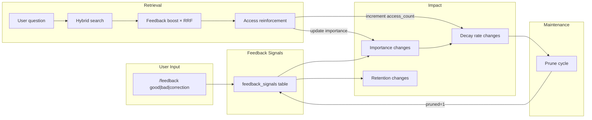
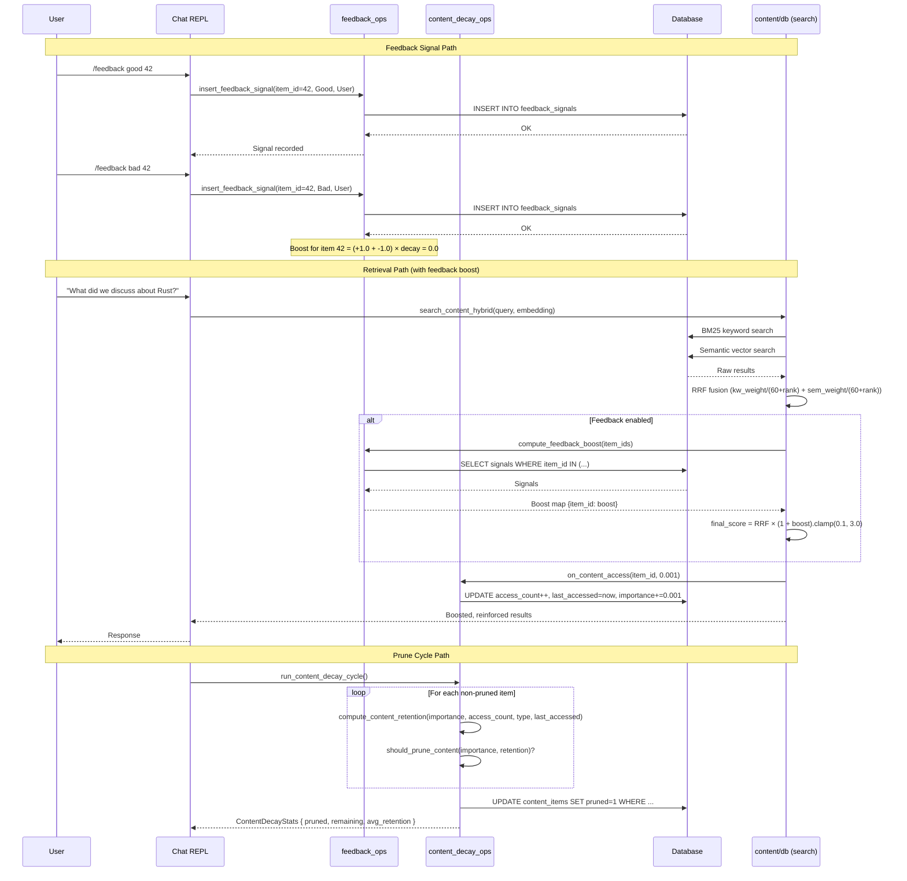

# Feedback Infrastructure Architecture

This document describes the architecture and design decisions of the feedback, content decay, and feedback-to-retrieval pipeline.

## Overview

The feedback infrastructure is a self-contained subsystem that connects explicit user signals to content relevance, enabling Sprachspiel to learn from interactions over time. It has three interconnected concerns:

1. **Feedback signals** — User and LLM feedback on content quality (good/bad/correction)
2. **Content decay** — Ebbinghaus-inspired forgetting for content items
3. **Feedback-to-retrieval pipeline** — Applying feedback boost to search ranking

Together, these form a closed loop: feedback adjusts importance, decay manages retention, and retrieval amplifies content that has accumulated positive feedback.

## The Feedback Loop



The loop works in two directions:

**Feedback path:** User gives `/feedback good|bad|correction` → signal stored in `feedback_signals` → importance is adjusted → retention score changes → prune cycle may soft-delete low-retention items.

**Retrieval path:** User asks a question → hybrid search retrieves candidate items → feedback boost multiplies RRF score → retrieved content gets `on_content_access()` called → access_count incremented → importance boosted by a small amount (0.001) → item becomes more resilient to future pruning.

## Data Model

### `feedback_signals` Table

```sql
CREATE TABLE IF NOT EXISTS feedback_signals (
    id INTEGER PRIMARY KEY AUTOINCREMENT,
    item_id INTEGER NOT NULL,                        -- References content_items.id
    session_id TEXT,                                 -- Session where feedback was given
    signal_type TEXT NOT NULL CHECK(signal_type IN ('good', 'bad', 'correction')),
    base_value REAL NOT NULL,                        -- Good=+1.0, Bad=-1.0, Correction=+1.0
    correction_text TEXT,                             -- Only for Correction signals
    source TEXT NOT NULL DEFAULT 'user' CHECK(source IN ('user', 'llm')),
    created_at INTEGER NOT NULL,                     -- Unix timestamp
    FOREIGN KEY (item_id) REFERENCES content_items(id) ON DELETE CASCADE
);
```

| Column | Type | Description |
|--------|------|-------------|
| `id` | `INTEGER PK` | Auto-incrementing row ID |
| `item_id` | `INTEGER NOT NULL` | Target `content_items.id`. Phase 1: messages only (ADR-003). |
| `session_id` | `TEXT` | Session context where feedback was given. Optional. |
| `signal_type` | `TEXT NOT NULL` | One of `good`, `bad`, `correction`. Enforced by CHECK constraint. |
| `base_value` | `REAL NOT NULL` | Signal magnitude: +1.0 for Good/Correction, -1.0 for Bad (ADR-005). |
| `correction_text` | `TEXT` | Free-text correction. Only populated when `signal_type = 'correction'`. |
| `source` | `TEXT NOT NULL` | Who gave the feedback: `user` (weight 1.0) or `llm` (weight 0.3, ADR-004). |
| `created_at` | `INTEGER NOT NULL` | Unix timestamp. Used for exponential decay computation. |

### Indexes

```sql
CREATE INDEX idx_feedback_signals_item_id ON feedback_signals(item_id);
CREATE INDEX idx_feedback_signals_session_id ON feedback_signals(session_id);
CREATE INDEX idx_feedback_signals_created_at ON feedback_signals(created_at);
```

### `content_items` Decay Fields

The feedback system activates formerly ghost fields on `content_items`:

| Field | Type | Default | Description |
|-------|------|---------|-------------|
| `importance` | `REAL` | 0.5 | Importance score (0.0–1.0). Adjusted by feedback and access. |
| `access_count` | `INTEGER` | 0 | Number of times the item has been retrieved. |
| `decay_score` | `REAL` | 1.0 | Current retention score (0.0–1.0). Set by decay cycle. |
| `last_accessed` | `INTEGER` | *creation timestamp* | Unix timestamp of last retrieval. |
| `pruned` | `INTEGER` | 0 | Soft-delete flag (0 = active, 1 = pruned). |

## Feedback Signal Types and Decay

### Signal Types

Each feedback signal has a type, base value, and half-life that controls how quickly its influence fades over time:

| Signal | Base Value | Half-Life | Rationale |
|--------|-----------|-----------|-----------|
| Good | +1.0 | 30 days | Positive reinforcement decays slowly |
| Bad | -1.0 | 7 days | Negative signal decays fast — people learn from mistakes |
| Correction | +1.0 | 14 days | Corrections are medium-lived; value is in the text, not weight |

### Source Weights

| Source | Weight | Rationale |
|--------|--------|-----------|
| User | 1.0 | Direct human feedback is the gold standard |
| LLM | 0.3 | LLM self-feedback is discounted to counter overconfidence bias (ADR-004) |

### Decay Formula

The weight of a single feedback signal decays exponentially over time:

$$
W(t) = \text{base\_value} \times 2^{-\text{days\_since} / \text{half\_life}} \times \text{source\_weight}
$$

Where:
- `base_value` — +1.0 for Good/Correction, -1.0 for Bad
- `days_since` — Days elapsed since the signal was created
- `half_life` — Signal-type-specific half-life (see table above)
- `source_weight` — 1.0 for User, 0.3 for LLM

**Examples:**

| Signal | Age | Source | Computation | Weight |
|--------|-----|--------|------------|--------|
| Good | 0 days | User | 1.0 × 2^0 × 1.0 | **1.0** |
| Good | 30 days | User | 1.0 × 2^(-1) × 1.0 | **0.5** |
| Bad | 7 days | User | -1.0 × 2^(-1) × 1.0 | **-0.5** |
| Correction | 14 days | LLM | 1.0 × 2^(-1) × 0.3 | **0.15** |
| Good | 60 days | User | 1.0 × 2^(-2) × 1.0 | **0.25** |

### Accumulation with First-Stage Clamp

For each content item, all feedback signals' decayed weights are summed, then clamped to prevent runaway accumulation:

$$
\text{Boost}(item) = \sum W_i(t) \quad \text{clamped to } [-2.0, +2.0]
$$

This is the **first-stage clamp**. The range ±2.0 means that even 5 fresh Good signals from a user (raw sum = 5.0) still only produce a boost of +2.0.

## Content Decay (Ebbinghaus)

Content items have a **retention score** that decreases over time, following the Ebbinghaus forgetting curve. This mirrors the existing facts system (`src/facts/decay.rs`) with content-type-specific half-lives.

### Retention Formula

$$
R = 2^{-\text{days\_since} / \text{half\_life}} \times (1.0 + \text{importance} \times 0.5) \times (1.0 + 0.1 \times \log_2(\max(\text{access\_count}, 1)))
$$

Where:
- `days_since` — Days since `last_accessed`
- `half_life` — Content-type-specific (see below)
- `importance` — Importance score (0.0–1.0)
- `access_count` — Number of times the item was retrieved

The formula has three multiplicative factors:

| Factor | Formula | Effect |
|--------|---------|--------|
| Decay | `2^(-days_since / half_life)` | Starts at 1.0, halves every half-life period |
| Importance multiplier | `(1.0 + importance × 0.5)` | Range [1.0, 1.5]. Important items decay slower. |
| Access multiplier | `(1.0 + 0.1 × log2(max(access_count, 1)))` | Frequently accessed items decay slower. Diminishing returns via log2. |

### Half-Lives by Content Type

| Content Type | Half-Life | Rationale |
|-------------|-----------|-----------|
| `message` | 90 days | Conversational context is more ephemeral but still long-lived |
| `note` | 60 days | Personal notes are shorter-lived than documents |
| `document` | 120 days | Imported reference material has the longest retention |

### Prune Threshold

Items are soft-deleted (pruned) when **both** conditions are met:

```
pruned = 1   WHEN   retention < 0.05  AND  importance < 0.8
```

Items with `importance >= 0.8` are **never pruned** — they may have low retention but the user explicitly marked them as important. The `pruned` column is a soft-delete flag; the row remains in the database for conversation chain integrity (preserving `previous_item_id` references).

### Retention Examples

| Content | Age | Importance | Access Count | Retention |
|---------|-----|-----------|--------------|-----------|
| Message | 0 days | 0.5 | 0 | 1.0 × 1.25 × 1.0 = **1.25** → clamped to **1.0** |
| Message | 90 days | 0.5 | 0 | 0.5 × 1.25 × 1.0 = **0.625** |
| Note | 60 days | 0.5 | 0 | 0.5 × 1.25 × 1.0 = **0.625** |
| Document | 120 days | 0.5 | 0 | 0.5 × 1.25 × 1.0 = **0.625** |
| Message | 365 days | 0.3 | 0 | ~0.06 × 1.15 × 1.0 ≈ **0.069** |
| Message | 365 days | 0.3 | 10 | ~0.06 × 1.15 × 1.33 ≈ **0.092** |
| Message | 365 days | 0.9 | 0 | ~0.06 × 1.45 × 1.0 ≈ **0.087** (not pruned: importance ≥ 0.8) |

## Feedback → Search Integration

The feedback boost is applied as a **post-RRF multiplier**, after the standard Reciprocal Rank Fusion combines keyword and semantic search results.

### Standard RRF (Without Feedback)

$$
\text{RRF\_score} = \frac{\text{kw\_weight}}{60 + \text{rank\_kw}} + \frac{\text{sem\_weight}}{60 + \text{rank\_sem}}
$$

Where `k = 60` is the RRF constant.

### After Feedback Boost

$$
\text{final\_score} = \text{RRF\_score} \times \text{clamp}(1.0 + \text{boost},\ 0.1,\ 3.0)
$$

Where `boost` is the accumulated, clamped feedback signal for the item.

### Two-Stage Clamping

The system applies clamping at two stages to prevent score distortion:

1. **First stage (per-item boost):**

   $$
   \text{Boost}(item) = \sum W_i(t) \quad \text{clamped to } [-2.0, +2.0]
   $$

   This prevents a single item from accumulating unlimited feedback influence.

2. **Second stage (RRF multiplier):**

   $$
   \text{clamp}(1.0 + \text{boost},\ 0.1,\ 3.0)
   $$

   - The lower bound of 0.1 means even strongly negative feedback only suppresses an item to 10% of its RRF score — it cannot eliminate results entirely (ADR-006).
   - The upper bound of 3.0 means strongly positive feedback can amplify an item to at most 3× its RRF score.

### Boost Examples

| Accumulated Boost | Multiplier | Effect |
|------------------|------------|--------|
| +2.0 (maximum) | 3.0 | Item's RRF score is tripled |
| +1.0 | 2.0 | Item's RRF score is doubled |
| +0.5 | 1.5 | Item's RRF score is boosted 50% |
| 0.0 (no feedback) | 1.0 | No change |
| -0.5 | 0.5 | Item's RRF score is halved |
| -2.0 (minimum) | 0.1 | Item is suppressed to 10% of RRF score |

### Implementation in `search_content_hybrid()`

The feedback boost is applied in `Database::search_content_hybrid()` (in `src/content/db.rs`). When `FeedbackSettings.enabled` is true:

1. Collect all item IDs from RRF results
2. Call `compute_feedback_boost()` with the current timestamp
3. Multiply each result's score by $\text{clamp}(1.0 + \text{boost},\ 0.1,\ 3.0)$
4. Re-sort results by the adjusted score

## Access Reinforcement

When content is retrieved via hybrid search, `on_content_access()` is called for each result item (when `FeedbackSettings.access_reinforcement` is enabled).

### What `on_content_access()` Does

```sql
UPDATE content_items
SET access_count = access_count + 1,
    last_accessed = unixepoch('now'),
    importance = MIN(1.0, importance + ?)
WHERE id = ?
```

Three effects:

| Field | Change | Purpose |
|-------|--------|---------|
| `access_count` | +1 | Tracks retrieval frequency for the access multiplier in retention |
| `last_accessed` | Set to now | Resets the decay timer, making the item "fresh" again |
| `importance` | +0.001 (configurable) | Small reinforcement; clamped at 1.0 maximum |

The `importance` boost is tiny (0.001 = 0.1%) because it compounds over time: an item retrieved 100 times gets +0.1 importance, which is a meaningful but not overwhelming change. The `access_count` has a larger effect through the log2 multiplier in the retention formula.

### Why RRF and Access Reinforcement Don't Double-Count

RRF boost affects **immediate ranking** (the scores used to present results to the user right now). Access reinforcement affects **future retention** (whether an item survives pruning and how quickly it decays). They are separate signals operating on different time scales:

- **RRF boost:** "This item has good feedback, rank it higher now."
- **Access reinforcement:** "This item was useful, make it decay slower in the future."

## Configuration

The `[feedback]` section in `config.toml` controls all feedback behavior:

```toml
[feedback]
# Whether the feedback system is enabled.
# When enabled, RRF boost and LLM feedback tools are active.
# The /feedback command always works regardless of this setting.
enabled = true

# Whether implicit (non-explicit) feedback signals are captured.
# Reserved for Phase 2 — currently stored but not used in scoring.
implicit_capture = true

# Weight of LLM-provided feedback relative to explicit user feedback.
# Range: 0.0–1.0. LLM self-feedback is discounted (ADR-004).
llm_feedback_weight = 0.3

# Half-life (in days) for decay of positively-rated content.
# Higher = good memories decay slower.
decay_half_life_good = 30.0

# Half-life (in days) for decay of negatively-rated content.
# Lower = bad memories decay faster.
decay_half_life_bad = 7.0

# Half-life (in days) for decay of corrections.
# Between good and bad — corrections age at a moderate rate.
decay_half_life_correction = 14.0

# Whether to apply time-based decay to content relevance scores.
content_decay = true

# Whether to apply a small reinforcement boost each time content is accessed.
access_reinforcement = true

# Per-access reinforcement boost amount.
# Applied each time content is retrieved, not per 10 accesses.
access_reinforcement_boost = 0.001

# Threshold below which content is pruned.
# Content with retention below this and importance below 0.8 is soft-deleted.
content_prune_threshold = 0.05
```

| Field | Type | Default | Description |
|-------|------|---------|-------------|
| `enabled` | `bool` | `true` | Master switch for RRF boost and LLM feedback tools |
| `implicit_capture` | `bool` | `true` | Store implicit signals (Phase 2: not used in scoring yet) |
| `llm_feedback_weight` | `f32` | `0.3` | LLM feedback weight relative to user (ADR-004) |
| `decay_half_life_good` | `f32` | `30.0` | Good signal half-life in days |
| `decay_half_life_bad` | `f32` | `7.0` | Bad signal half-life in days |
| `decay_half_life_correction` | `f32` | `14.0` | Correction signal half-life in days |
| `content_decay` | `bool` | `true` | Enable Ebbinghaus decay on content items (ADR-008) |
| `access_reinforcement` | `bool` | `true` | Enable `on_content_access()` on retrieval (ADR-009) |
| `access_reinforcement_boost` | `f32` | `0.001` | Importance increment per access, clamped at 1.0 |
| `content_prune_threshold` | `f32` | `0.05` | Retention threshold for pruning (items below are candidates) |

## Module Architecture

The feedback infrastructure is organized across two module trees:

### `src/feedback/` — Feedback Signals

```
src/feedback/
├── mod.rs        # Module root, re-exports
├── types.rs      # FeedbackSignalType, FeedbackSource, FeedbackSignal
├── decay.rs      # Canonical decay computation (single point of calculation)
│                 #   decayed_weight_raw() — W(t) = base × 2^(-d/h) × source (i64 timestamps)
│                 #   decayed_weight() — DateTime wrapper for Phase 2
│                 #   compute_total_boost() — ΣW_i clamped to ±MAX_FEEDBACK_BOOST
│                 #   Constants: HALF_LIFE_GOOD/BAD/CORRECTION, MAX_FEEDBACK_BOOST
└── prompt.rs     # Boost map and display formatting (Phase 2)
                  #   compute_feedback_boost_map() — DB query + decay for item IDs
                  #   build_feedback_section() — /context stats display
                  #   build_decay_section() — /context decay stats display
```

### `src/content/` and `src/db/` — Content Decay

```
src/content/
├── decay.rs      # Pure decay/retention logic
│                 #   compute_content_retention() — R formula
│                 #   should_prune_content() — retention < 0.05 AND importance < 0.8
│                 #   Constants: HALF_LIFE_MESSAGE/NOTE/DOCUMENT, MIN_CONTENT_RETENTION
├── types.rs      # ContentType, ContentScope, ContentSource, ContentItem, Note
├── document.rs   # Document, FileType, detect_file_type
├── db.rs         # CRUD, search, RRF + feedback boost integration
└── mod.rs        # Module root

src/db/
├── feedback_ops.rs     # Insert, query, boost computation
│                      #   insert_feedback_signal() — validates content_type='message'
│                      #   get_feedback_signals_for_item()
│                      #   compute_feedback_boost() — delegates to decayed_weight_raw()
├── content_decay_ops.rs # Decay cycle and access tracking
│                      #   on_content_access() — increment + update + importance boost
│                      #   run_content_decay_cycle() — iterate items, prune low retention
│                      #   get_content_decay_stats() — /context overview
└── schema.rs          # SQL DDL for feedback_signals, content_items v10+ columns
```

### Data Flow



## Architecture Decision Records

The following ADRs from `IMPLEMENTATION.md` govern the feedback system:

| ADR | Decision | Rationale |
|-----|----------|-----------|
| ADR-001 | Feedback is harness-only (no fine-tuning) | No GPU, no training pipeline. RAG/ICL/BoN are valid inference-time methods (Wu et al. 2025, Long et al. 2026). |
| ADR-002 | Decay formula: `2^(-t/half_life)` | Aligns with existing facts system. Easier to reason about than `exp(-t/h)` — at one half-life, weight is exactly 0.5. |
| ADR-003 | Messages-only scope in Phase 1 | `feedback_signals.item_id` references `content_items.id` but only messages are feedback-eligible. Notes and documents will be eligible in a future phase. |
| ADR-004 | LLM self-feedback = 30% weight | Self-approval bias defense. Wu et al. (2025): self-verification consistently beaten by majority voting. Long et al. (2026): verification steps rarely change outcomes — predominantly confirmatory rechecks (arXiv:2602.03485). |
| ADR-005 | Good=+1.0, Bad=-1.0, Correction=+1.0 | Binary-like symmetric signals. Drori et al. (2025): strict 0/1 verification via Lean proofs and code execution (arXiv:2502.09955). Granularity comes from temporal decay, not base_value. Correction value is in metadata text, not numerical weight. |
| ADR-006 | Score clamping: `.clamp(0.1, 3.0)` | Original `.max(-0.9).min(2.0)` allowed negative final scores (bug: `1.0 + (-2.0) = -1.0`). New clamp: min 0.1 (max 90% suppression), max 3.0 (3× amplification). |
| ADR-008 | Content Decay Activation | Ghost fields on `content_items` activated: `decay_score`, `access_count`, `last_accessed` now functional with Ebbinghaus decay. Content-type half-lives differ. Feedback adjusts importance. |
| ADR-009 | Retrieval Reinforces Retention | `on_content_access()` called on retrieval. Increments `access_count`, updates `last_accessed`. RRF boost and `access_count` are separate signals on different time scales — not double-counting. |

## Phase Status

### Phase 1 — Implemented

The following components are shipped and active:

| Component | Status | Files |
|-----------|--------|-------|
| `/feedback` command | ✅ Shipped | `src/chat/command_handlers.rs` |
| `feedback_signals` schema | ✅ Shipped | `src/db/schema.rs` (v10 migration) |
| Signal types & source weights | ✅ Shipped | `src/feedback/types.rs` |
| Decay computation (pure) | ✅ Shipped | `src/feedback/decay.rs` |
| Boost map computation (DB) | ✅ Shipped | `src/feedback/prompt.rs`, `src/db/feedback_ops.rs` |
| RRF + feedback boost integration | ✅ Shipped | `src/content/db.rs` (`search_content_hybrid`) |
| Content retention formula | ✅ Shipped | `src/content/decay.rs` |
| Content prune cycle | ✅ Shipped | `src/db/content_decay_ops.rs` (`run_content_decay_cycle`) |
| Access reinforcement | ✅ Shipped | `src/db/content_decay_ops.rs` (`on_content_access`) |
| `/context` display (decay stats) | ✅ Shipped | `src/db/content_decay_ops.rs` (`get_content_decay_stats`) |
| Config `[feedback]` section | ✅ Shipped | `src/settings.rs` |

### Phase 2 — Reserved (Not Yet Wired)

The following functions are implemented and tested but marked `#[allow(dead_code)]` and not yet connected to production:

| Function | Purpose | Expected Use |
|----------|---------|-------------|
| `compute_feedback_boost_map()` | DB-aware boost computation using `Database` type | Will replace direct `feedback_ops::compute_feedback_boost` calls |
| `build_feedback_section()` | Format feedback stats for `/context` | Will replace inline formatting in `command_handlers.rs` |
| `build_decay_section()` | Format decay stats for `/context` | Will replace inline formatting in `command_handlers.rs` |
| `decayed_weight()` | DateTime wrapper for single-signal decay weight | Wrapper around `decayed_weight_raw()` for Phase 2 struct-based use |
| `compute_total_boost()` | Accumulate + clamp signals for an item | Used by `compute_feedback_boost_map()` |

**Note:** `decayed_weight_raw()` (the canonical decay formula) is already used in Phase 1 production by `db::feedback_ops::compute_feedback_boost()`. The `decayed_weight()` wrapper above adds `DateTime<Utc>` convenience for Phase 2 struct-based callers.

## See Also

- [Architecture](./architecture.md) — Overall system architecture
- [Memory Architecture](./memory-architecture.md) — Factual memory system (related decay patterns)
- [Roadmap](./roadmap.md) — Feature roadmap
- [Implementation Directive](./implementation-directive.md) — Original implementation plan
- `IMPLEMENTATION.md` — ADR table and phase details