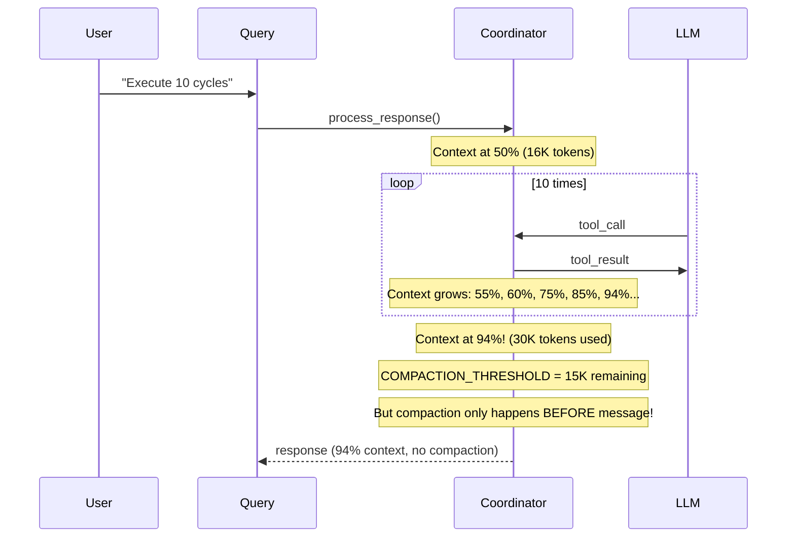
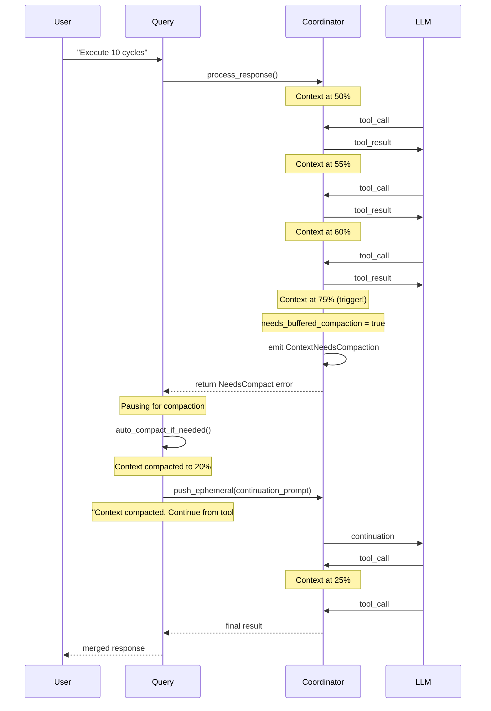

# Inter-Tool Compaction Design

**Status:** IMPLEMENTED  
**Issue:** Context overflow during multi-tool execution  
**Related:** Issue #43, PR #45

## Problem Statement

### Current Behavior

When the LLM executes multiple tools in a single response (e.g., "emit lipsum → calc → emit lipsum → calc..."), the context grows atomically without any compaction opportunities:



### Root Cause

1. **`needs_buffered_compaction()` is called BEFORE each user message**, not during tool execution
2. **`needs_inter_tool_compaction()` only emits a warning**, doesn't trigger compaction
3. **Context grows atomically during multi-tool response** with no intervention point
4. **Result**: Context reaches 94%+ with no auto-compaction

### Observed Behavior

```
Test with 32K context window:
- User sends message (context at 5K)
- LLM executes 10 tools in sequence
- Context grows to 30K used (94%)
- Inter-tool warning appears but doesn't compact
- User must manually call /compact
```

## Proposed Solution: Inter-Tool Compaction via Continuation

### Architecture

When context reaches critical level during tool execution:

1. **Detect** - Inter-tool check identifies `needs_compaction` condition
2. **Pause** - Stop processing more tools, return `CoordinatorError::NeedsCompact`
3. **Compact** - Upper level calls `auto_compact_if_needed()`
4. **Resume** - Send continuation prompt to LLM, continue from interrupted point



---

## Implementation Plan

### Phase 1: Error Type and Event (30 min)

**File:** `src/chat/custom_coordinator.rs`

```rust
/// Error type for coordinator operations
#[derive(Debug)]
pub enum CoordinatorError {
    /// Context needs compaction before continuing
    ContextNeedsCompact {
        tokens_used: usize,
        context_window: usize,
        tools_executed: Vec<String>,
    },
    /// Other errors
    ToolError(String),
    // ...
}

/// Event emitted during response processing
#[derive(Debug, Clone)]
pub enum ChatEvent {
    ToolCall { name: String, params: Value },
    ToolResult { name: String, result: String },
    ContextNearLimit { tool_name: String, tokens_used: usize, context_window: usize },
    ContextTruncated { tool_name: String, original_tokens: usize, new_tokens: usize, context_window: usize },
    ContextNeedsCompaction { tokens_used: usize, context_window: usize, tools_executed: Vec<String> },
}
```

### Phase 2: Context Check Modification (30 min)

**File:** `src/chat/custom_coordinator.rs`

```rust
/// Result of context check after tool execution
struct ContextCheckResult {
    result: String,
    is_near_limit: bool,
    was_truncated: bool,
    tokens_used: usize,
    needs_compaction: bool,  // NEW: signals compaction needed
}

fn check_and_handle_context_overflow(&self, tool_name: &str, result: String) -> ContextCheckResult {
    // ... token calculation ...
    
    // Emergency: truncate result
    if is_emergency_context(...) {
        return ContextCheckResult { 
            result: truncated,
            is_near_limit: true,
            was_truncated: true,
            tokens_used: total_after_add,
            needs_compaction: false,  // Already handled by truncation
        };
    }
    
    // Inter-tool: check if compaction needed
    let remaining = context_window.saturating_sub(total_after_add);
    if remaining < COMPACTION_BUFFER {
        // Signal that compaction is needed
        return ContextCheckResult {
            result,
            is_near_limit: true,
            was_truncated: false,
            tokens_used: total_after_add,
            needs_compaction: true,  // NEW
        };
    }
    
    // Normal operation
    ContextCheckResult {
        result,
        is_near_limit: needs_inter_tool_compaction(...),
        was_truncated: false,
        tokens_used: total_after_add,
        needs_compaction: false,
    }
}
```

### Phase 3: Tool Execution Loop Modification (1h)

**File:** `src/chat/custom_coordinator.rs`

```rust
pub async fn process_response(&mut self, response: ChatMessageResponse) -> Result<...> {
    // ... parse tool calls ...
    
    let mut tools_executed = Vec::new();
    let mut needs_compaction = false;
    
    for tool_call in &tool_calls {
        let tool_name = &tool_call.function.name;
        let result = self.execute_tool(tool_call).await;
        
        // Check context after each tool
        let check = self.check_and_handle_context_overflow(tool_name, result);
        
        if check.needs_compaction {
            // STOP processing - emit event and return
            self.events.push(ChatEvent::ContextNeedsCompaction {
                tokens_used: check.tokens_used,
                context_window: self.context_window.unwrap_or(0),
                tools_executed: tools_executed.clone(),
            });
            
            // Add the current result to history before stopping
            self.history.push(ChatMessage::tool(check.result));
            
            // Return error to signal compaction needed
            return Err(CoordinatorError::ContextNeedsCompact {
                tokens_used: check.tokens_used,
                context_window: self.context_window.unwrap_or(0),
                tools_executed: tools_executed.clone(),
            });
        }
        
        // Normal operation - add result to history
        self.history.push(ChatMessage::tool(check.result));
        tools_executed.push(tool_name.clone());
        
        if check.was_truncated {
            self.events.push(ChatEvent::ContextTruncated { ... });
        } else if check.is_near_limit {
            self.events.push(ChatEvent::ContextNearLimit { ... });
        }
    }
    
    // ... continue with response ...
}
```

### Phase 4: Upper Level Handler (1h)

**File:** `src/chat/continuation.rs`

```rust
/// Handle context needs compaction during tool execution
pub async fn handle_inter_tool_compaction(
    state: &mut ReplState,
    tools_executed: &[String],
    context_window: usize,
) -> AppResult<()> {
    // 1. Show indication to user
    eprintln!(
        "\x1B[33m⏳ Context limit reached (executed {} tools). Compacting...\x1B[0m",
        tools_executed.len()
    );
    
    // 2. Compact context
    let system_prompt = build_pre_tool_prompt(state);
    auto_compact_if_needed(
        &state.ollama,
        &state.model_config,
        &mut state.session,
        &state.settings,
        state.agents_md.as_deref(),
        &system_prompt,
        context_window,
        state.use_debug,
    ).await;
    
    // 3. Log compacted tools
    if state.use_debug {
        log_debug(&format!(
            "Inter-tool compaction: {} tools executed before pause",
            tools_executed.len()
        ));
    }
    
    Ok(())
}

/// Build continuation prompt for inter-tool compaction
pub fn build_inter_tool_compaction_prompt(tools_executed: &[String]) -> String {
    if tools_executed.is_empty() {
        return CONTINUATION_PROMPT_INTER_TOOL.to_string();
    }
    
    format!(
        "{}\n\nTools already executed: {}.",
        CONTINUATION_PROMPT_INTER_TOOL,
        tools_executed.join(", ")
    )
}
```

**File:** `src/prompts/base.rs`

```rust
/// Inter-tool compaction continuation prompt
pub const CONTINUATION_PROMPT_INTER_TOOL: &str = r#"Context was compacted during multi-tool execution.

Continue if you have next steps, or stop and ask for clarification if you are unsure how to proceed.

Remember:
- Previous tool results are preserved in the conversation summary
- You can reference results from tools executed before compaction
- Continue from where you left off, or summarize results if complete"#;
```

### Phase 5: Integration in send_message (1h)

**File:** `src/chat/core.rs` or `src/chat/continuation.rs`

```rust
// In send_message() after coordinator.chat():
match result {
    Ok(response) => {
        // ... handle normal response ...
    }
    Err(CoordinatorError::ContextNeedsCompact { tokens_used, context_window, tools_executed }) => {
        // Handle inter-tool compaction
        handle_inter_tool_compaction(&mut state, &tools_executed, context_window).await?;
        
        // Build continuation prompt
        let continuation_prompt = build_inter_tool_compaction_prompt(&tools_executed);
        
        // Push ephemeral and continue
        coordinator.push_ephemeral(ChatMessage::user(continuation_prompt));
        
        // Process continuation
        let continuation_response = coordinator.chat().await?;
        
        // Merge results
        // ...
    }
    Err(e) => return Err(e.into()),
}
```

---

## Edge Cases

### 1. Multiple Compaction Cycles

If context fills again during continuation after compaction:

```rust
// Limit to 3 compaction cycles per message
let mut compaction_count = 0;
const MAX_COMPACTION_CYCLES: usize = 3;

loop {
    match coordinator.chat().await {
        Err(CoordinatorError::ContextNeedsCompact { .. }) if compaction_count < MAX_COMPACTION_CYCLES => {
            compaction_count += 1;
            // Compact and continue
        }
        Err(CoordinatorError::ContextNeedsCompact { .. }) => {
            eprintln!("Maximum compaction cycles reached. Please continue manually.");
            break;
        }
        Ok(response) => {
            // Normal completion
            break;
        }
        Err(e) => return Err(e.into()),
    }
}
```

### 2. Tool Results Already in History

When compaction happens, tool results 1-3 are already in history. The compaction will:
- Preserve last N messages (including recent tool results)
- Summarize older messages
- The continuation prompt reminds LLM which tools were executed

### 3. Empty Tool Execution List

If compaction is needed before ANY tools execute:

```rust
if tools_executed.is_empty() {
    // No tools were executed, just compact and retry the whole response
    auto_compact_if_needed(...).await;
    // Retry original request
    let response = coordinator.chat().await?;
}
```

---

## Testing Plan

### Unit Tests

```rust
#[test]
fn test_needs_compaction_threshold() {
    // Context at 50K remaining (32K context, 32K used, 50K remaining)
    // Should NOT trigger compaction
    let result = check_and_handle_context_overflow(...);
    assert!(!result.needs_compaction);
    
    // Context at 10K remaining (below COMPACTION_BUFFER of 15K)
    // Should trigger compaction
    let result = check_and_handle_context_overflow(...);
    assert!(result.needs_compaction);
}

#[test]
fn test_tool_execution_stop_on_compaction() {
    // Execute 3 tools, 4th triggers compaction
    // Result: tools_executed.len() == 3
    // Event: ContextNeedsCompaction emitted
}

#[test]
fn test_continuation_after_compaction() {
    // After compaction, continuation prompt sent
    // LLM continues from where it stopped
}
```

### Integration Tests

```rust
#[test]
fn test_multi_tool_compaction_flow() {
    // Setup context near limit
    // Send message that triggers 10 tool calls
    // Verify:
    // 1. Tools execute until compaction threshold
    // 2. Compaction happens
    // 3. Continuation prompt sent
    // 4. Remaining tools execute
    // 5. All results merged correctly
}
```

### Manual Testing

```bash
# Use test model with 16K context
/model test-compact

# Send message that generates many tool calls
"Execute 20 cycles of: emit 3 paragraphs of lorem ipsum, then calculate random number"

# Expected:
# 1. First few cycles execute normally
# 2. Context fills to ~15K remaining
# 3. Inter-tool compaction triggers
# 4. "Pausing for context compaction" message
# 5. Continuation after compaction
# 6. Remaining cycles complete
```

---

## Risks and Mitigations

### Risk 1: LLM "forgets" context after compaction

**Mitigation**: Continuation prompt explicitly lists tools executed:
```
Tools already executed: read_file, calculate, write_file.
Continue if you have next steps...
```

### Risk 2: Partial tool results confusing LLM

**Mitigation**: Tool results are preserved in history (last N messages), and summarized in older messages.

### Risk 3: Multiple compactions in one response

**Mitigation**: Limit to 3 compaction cycles per message, then ask user to continue manually.

### Risk 4: User confusion about interruptions

**Mitigation**: Clear console messages:
```
⏳ Context limit reached (3 tools executed). Compacting...
[auto-compacted: 10 messages summarized]
[Continuation complete]
```

---

## Implementation Checklist

| Phase | Task | Status |
|-------|------|--------|
| 1 | Add `CoordinatorError::ContextNeedsCompact` | ✅ DONE |
| 1 | Add `ChatEvent::ContextNeedsCompaction` | ✅ DONE |
| 2 | Add `needs_compaction` to `ContextCheckResult` | ✅ DONE |
| 2 | Modify `check_and_handle_context_overflow()` | ✅ DONE |
| 3 | Modify `process_response()` to stop on compaction needed | ✅ DONE |
| 4 | Add `OverflowHandleResult` enum | ✅ DONE |
| 4 | Add `handle_inter_tool_compaction_error()` | ✅ DONE |
| 4 | Add `build_inter_tool_compaction_prompt()` | ✅ DONE |
| 4 | Add `CONTINUATION_PROMPT_INTER_TOOL` constant | ✅ DONE |
| 5 | Integrate automatic continuation in `handle_user_message()` | ✅ DONE |
| 5 | Add MAX_COMPACTION_CYCLES limit (3) | ✅ DONE |
| Test | Unit tests for parsing functions | ✅ DONE |
| Test | Unit tests for context check flag | ⏳ Optional |
| Test | Integration test for multi-tool flow | ⏳ Manual testing |
| Test | Observability metrics logging | ✅ DONE |
| Docs | Update architecture.md | ✅ DONE |
| Docs | Update CHANGELOG | ✅ DONE |

---

## References

- [Context Overflow Implementation](./context-overflow-design.md) - Current implementation
- [Context Anatomy](./context-anatomy.md) - How context is structured
- [Continuation Handling](./context-continuity.md) - Existing continuation system
- Issue #43 - Context overflow during multi-tool execution
- PR #45 - Buffer-based compaction triggers