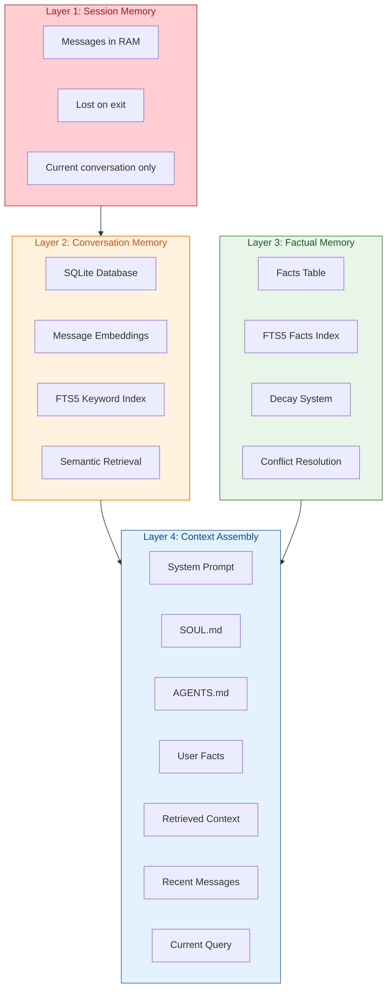
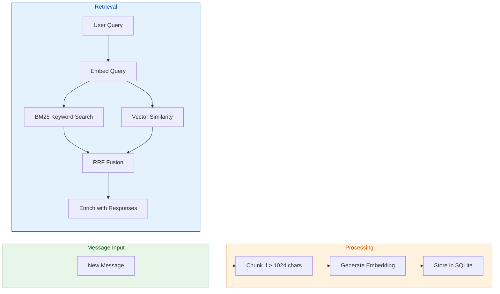
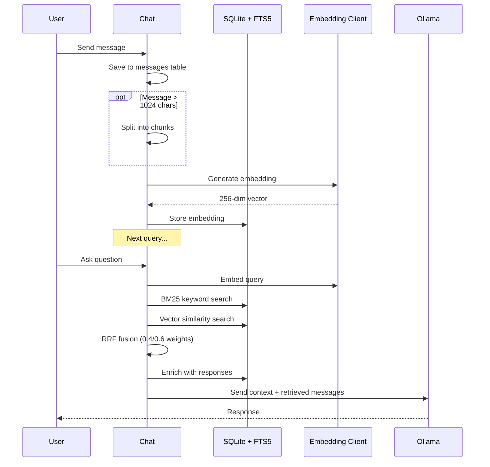
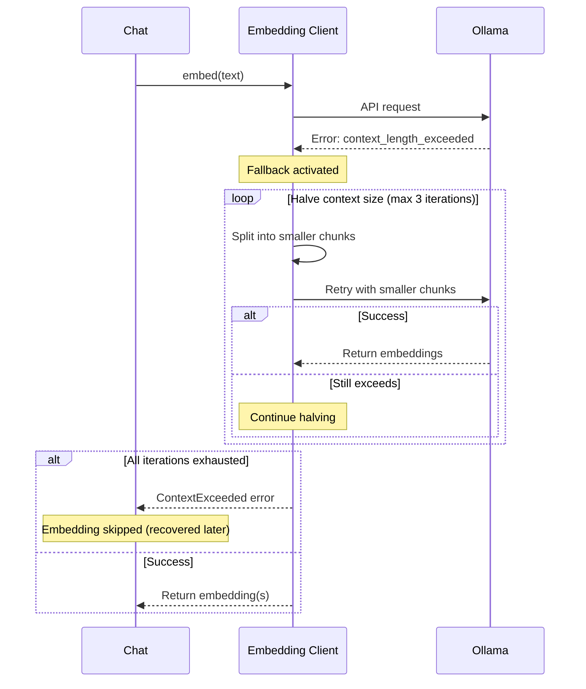
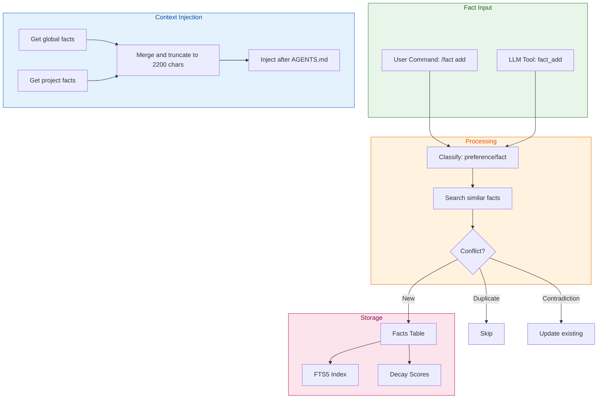
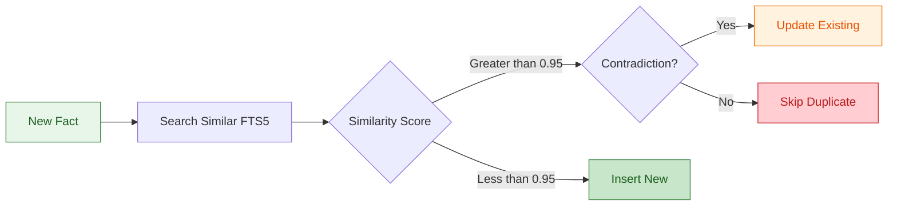
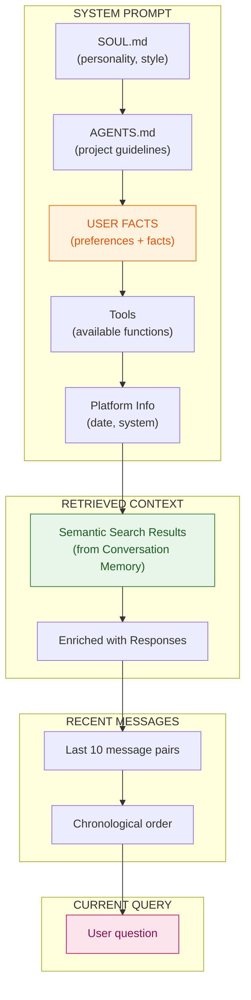

# Memory Architecture

**Status:** Active  
**Version:** v0.37.1  
**Updated:** 2026-03-21

This document provides a unified view of Ask-AI's memory systems and how they compose the LLM context.

---

## Overview

Ask-AI has four layers of memory that work together to provide context-aware responses:

1. **Session Memory** — Volatile, in-memory messages for the current conversation
2. **Conversation Memory** — Persistent conversation history with semantic retrieval
3. **Factual Memory** — Long-term storage of user preferences and project facts
4. **Context Assembly** — How all layers combine into the LLM prompt

---

## Memory Layers



---

## Layer 1: Session Memory

**What it stores:** Messages from the current conversation session.

**Characteristics:**
- Stored in RAM only
- Lost when session ends (unless using `/save`)
- Not searchable across sessions

**Lifecycle:**
```
User sends message → Add to session → Display to user → End session → Lost
```

**Commands:**
- `/save [name]` — Persist session to named storage
- `/load <name>` — Load a saved session
- `/clear` — Clear session messages
- `/forget` — Delete session from database

---

## Layer 2: Conversation Memory

**What it stores:** All conversation messages with embeddings for semantic search.

**Characteristics:**
- Persistent SQLite database (`~/.local/share/ask-ai/embeddings.db`)
- Full-text search via FTS5
- Vector embeddings for semantic similarity
- Hybrid retrieval (BM25 + Vector + RRF)

**Architecture:**



**Key Tables:**

| Table | Purpose |
|-------|---------|
| `conversations` | Session metadata (project, model, timestamps) |
| `messages` | Message content and metadata |
| `messages_fts` | FTS5 full-text search index |
| `message_embeddings` | Vector embeddings (short messages) |
| `chunk_embeddings` | Vector embeddings (long message chunks) |

**Retrieval Flow:**



### Embedding Fallback (v0.37.1+)

When embedding generation fails due to context overflow, the system automatically retries with smaller chunks:



**Fallback progression:**
- 512 tokens (default context for nomic-embed-text-v2-moe)
- 256 tokens (first halving)
- 128 tokens (second halving)
- 64 tokens (third halving, minimum)

**Implementation:**
- `embed_with_fallback(text, max_iterations)` in `client.rs`
- Uses `DynamicChunkConfig::halved()` for progressive size reduction
- Called from `session.rs`, `regenerate.rs`, `recovery.rs`, `command_handlers.rs`

**Commands:**
- `/search <query>` — Search conversation history
- `/context` — Show token usage
- `/compact` — Summarize old messages
- `/reindex` — Rebuild embeddings

**Research Foundation:**

This design is based on ["Lost in the Middle: How Language Models Use Long Contexts"](https://arxiv.org/abs/2307.03172) — relevant information should be at the beginning or end of context, never in the middle.

---

## Layer 3: Factual Memory

**What it stores:** Extracted facts and user preferences that persist across sessions.

**Characteristics:**
- SQLite + FTS5 keyword search (no embeddings needed)
- Automatic classification (preference vs fact)
- Ebbinghaus decay curve for automatic pruning
- Conflict resolution for duplicate/contradictory facts
- Two scopes: `global` and `project`

**Architecture:**



**Categories:**

| Category | Description | Half-Life | Examples |
|----------|-------------|-----------|----------|
| `preference` | User likes/dislikes | 180 days | "I prefer Portuguese", "I like concise responses" |
| `fact` | Objective information | 30 days | "Database is SQLite", "API on port 8080" |

**Decay System:**

Based on the [Ebbinghaus forgetting curve](https://en.wikipedia.org/wiki/Forgetting_curve), facts decay over time:

```
Retention = e^(-t / half_life)

- Preferences: 180-day half-life (remembered longer)
- Facts: 30-day half-life (refreshed more often)
- Access reinforcement: Each access bumps retention
- High-importance preferences: Never pruned
```

**Scopes:**

| Scope | Description | Storage |
|-------|-------------|---------|
| `global` | Applies to all projects | `project_id = NULL` |
| `project` | Specific to current project | `project_id = <git remote or folder name>` |

**Conflict Resolution:**



**User Commands:**

| Command | Shortcut | Description |
|---------|----------|-------------|
| `/fact add <text> [--global]` | `/fa` | Add a fact |
| `/fact list [--global]` | `/fl` | List stored facts |
| `/fact search <query>` | `/fs` | Search facts |
| `/fact remove <id>` | `/fr` | Remove a fact |
| `/fact prune` | `/fp` | Run decay manually |

**LLM Tools:**

| Tool | Description |
|------|-------------|
| `fact_add(content, category?, scope?)` | Store a fact (auto-classified) |
| `fact_search(query, category?, scope?, limit?)` | Search facts |
| `fact_remove(id)` | Remove a fact by ID |

---

## Layer 4: Context Assembly

**How all layers combine into the LLM prompt:**



**Order (Research-Based):**

Based on ["Lost in the Middle"](https://arxiv.org/abs/2307.03172) and Anthropic's recommendations:

| Position | Section | Why |
|----------|---------|-----|
| 1 | System Prompt (SOUL + AGENTS + Facts) | Best recall at beginning |
| 2 | Retrieved Context | High relevance, near beginning |
| 3 | Compacted Summary (if any) | Medium priority, never in middle |
| 4 | Recent Messages | Recent context, near end |
| 5 | Current Query | Best comprehension at very end |

**Token Budget:**

| Section | Tokens | Priority |
|---------|--------|----------|
| System Prompt | 500-2000 | Critical |
| User Facts | ~2200 max | High |
| Retrieved Context | 1000-5000 | High |
| Compacted Summary | 500-1000 | Medium |
| Recent Messages | 2000-5000 | High |
| Current Query | Variable | Critical |

**User Facts Format:**

Injected after AGENTS.md:

```
## User Facts

### Preferences
- prefiro respostas em português
- gosto de respostas curtas

### Facts
- o projeto usa SQLite para armazenamento
- a API está na porta 8080
```

**Limits:**
- Per-fact limit: 500 characters (hard limit, rejected at insert)
- Total facts limit: 2200 characters (soft limit, truncated)

---

## When to Use Each System

| Use Case | System | Command/Tool |
|----------|--------|--------------|
| Remember what user said in current session | Session Memory | Automatic |
| Find past discussions about a topic | Conversation Memory | `/search <query>` |
| Remember user preference across sessions | Factual Memory | `/fact add "I prefer..."` |
| Remember project configuration | Factual Memory | `fact_add(scope="project")` |
| AI learns something about user | Factual Memory | `fact_add` (LLM tool) |
| Provide project guidelines | AGENTS.md | Manual file edit |

**Comparison:**

| Feature | Session Memory | Conversation Memory | Factual Memory | AGENTS.md |
|---------|----------------|---------------------|----------------|-----------|
| Scope | Current session | All sessions | Global/Project | Project only |
| Persistence | RAM | SQLite | SQLite | File |
| Search | No | Semantic + Keyword | Keyword | No |
| Decay | No | Compaction | Ebbinghaus | Manual |
| LLM Access | No | Retrieval | Tools | Prompt |

---

## References

- [Ebbinghaus Forgetting Curve](https://en.wikipedia.org/wiki/Forgetting_curve) — The basis for fact decay
- [Lost in the Middle](https://arxiv.org/abs/2307.03172) — Why context ordering matters
- [Anthropic Prompt Engineering](https://docs.anthropic.com/claude/docs/prompt-engineering) — Context ordering best practices

---

## See Also

- [Factual Memory System](./factual-memory-system.md) — Detailed implementation
- [Context Anatomy](./context-anatomy.md) — Context composition details
- [Architecture](./architecture.md) — Overall system architecture