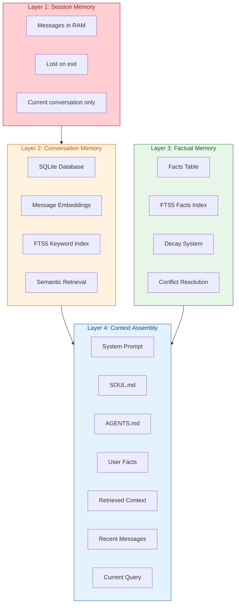
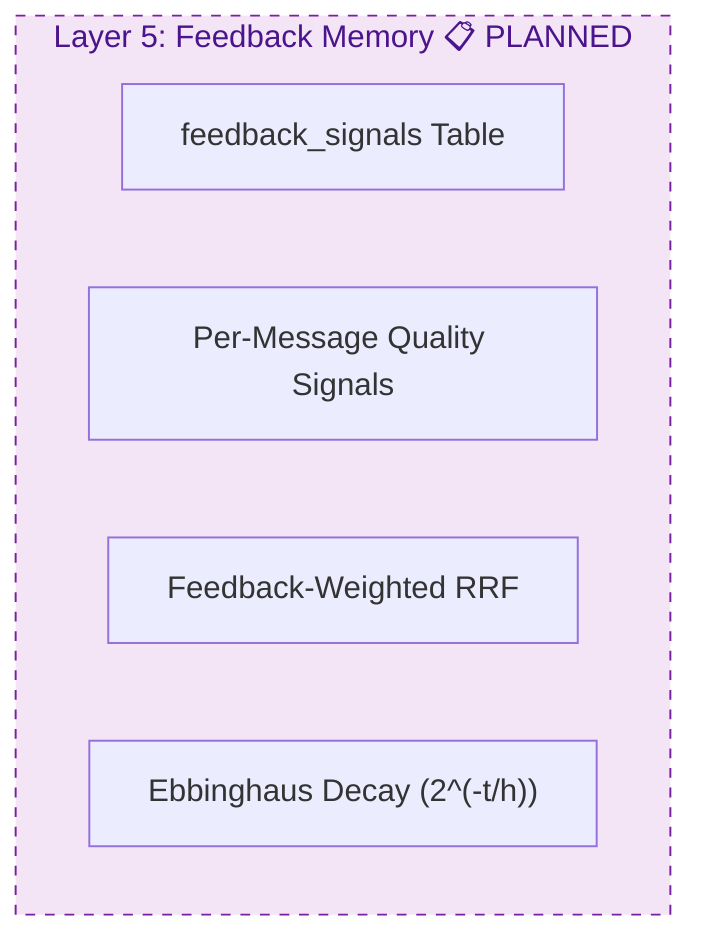
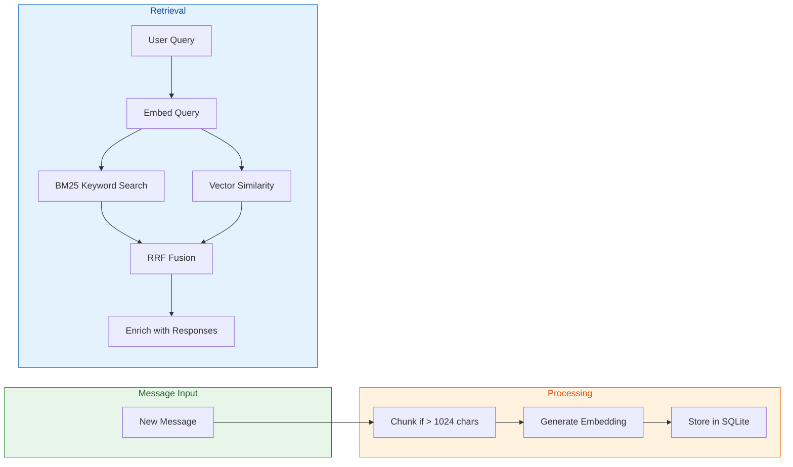
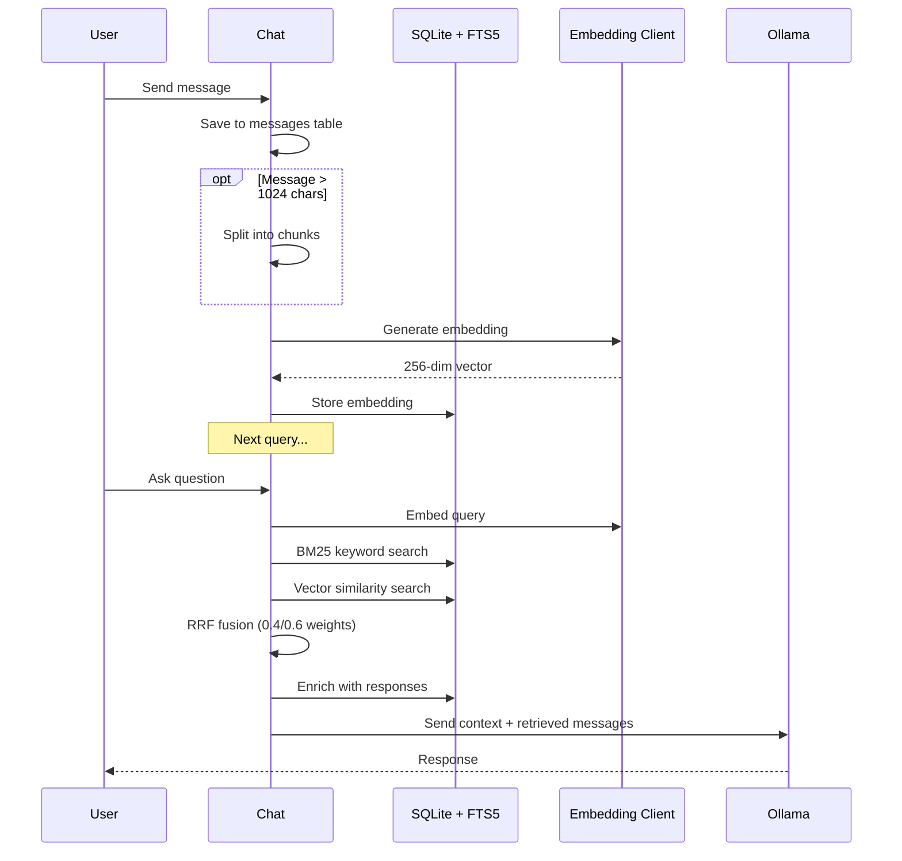
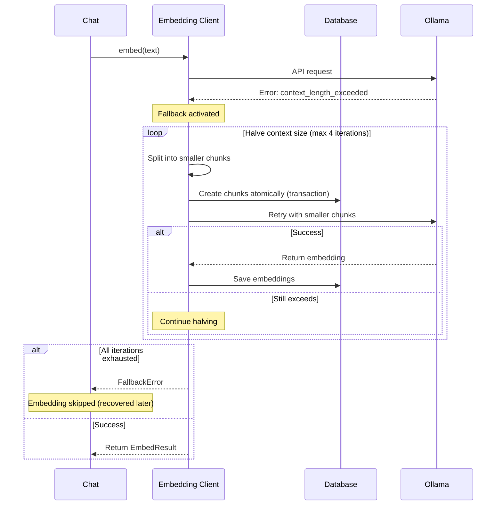
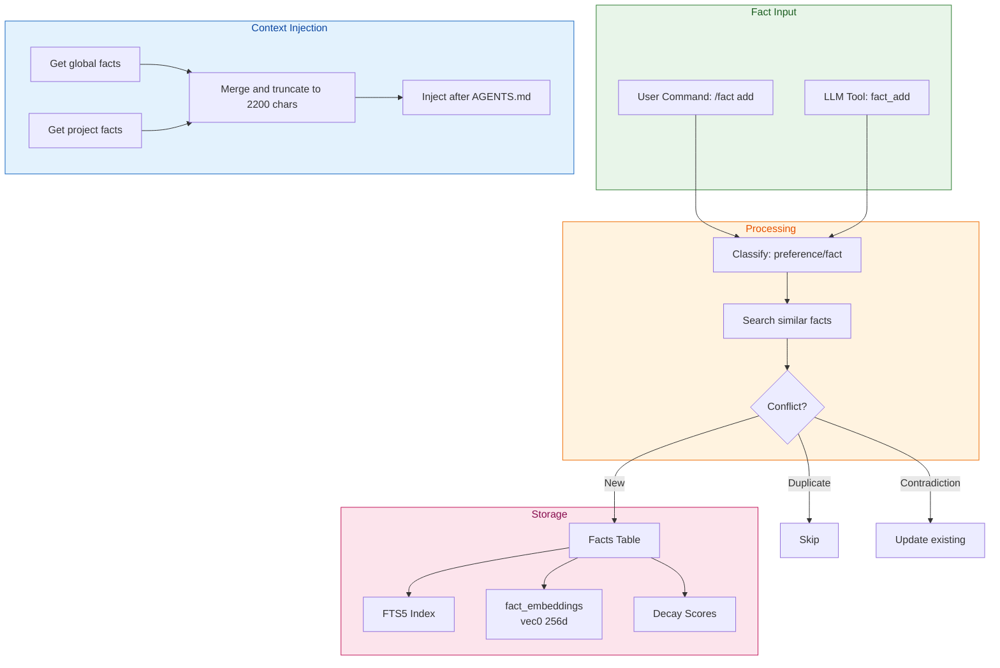
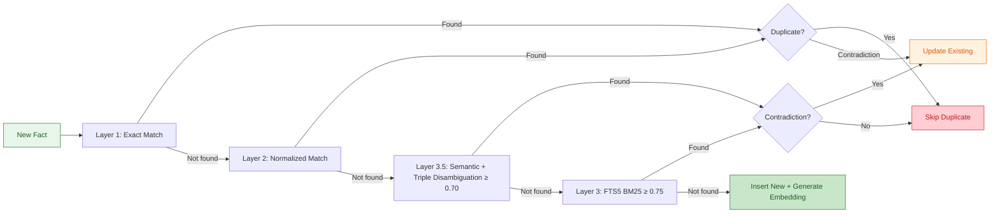
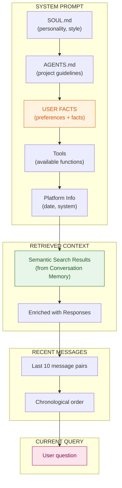
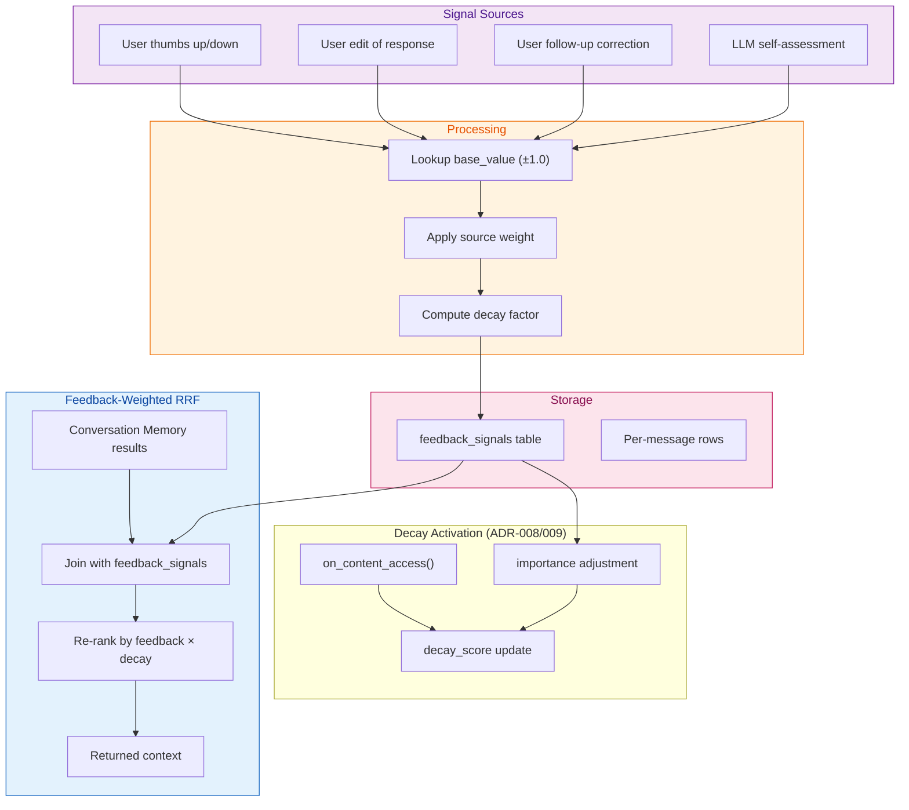

# Memory Architecture

**Status:** Active  
**Version:** v0.42.0-dev  
**Updated:** 2026-04-19

This document provides a unified view of Ask-AI's memory systems and how they compose the LLM context.

---

## Overview

Ask-AI has four active layers of memory plus one planned layer that work together to provide context-aware responses:

1. **Session Memory** — Volatile, in-memory messages for the current conversation
2. **Conversation Memory** — Persistent conversation history with semantic retrieval
3. **Factual Memory** — Long-term storage of user preferences and project facts
4. **Context Assembly** — How all layers combine into the LLM prompt
5. **Feedback Memory** 📋 PLANNED — Per-message signal tracking for response quality weighting + feedback-driven content decay

---

## Memory Layers





---

## Layer 1: Session Memory

**What it stores:** Messages from the current conversation session.

**Characteristics:**
- Stored in RAM only
- Lost when session ends (unless using `/save`)
- Not searchable across sessions

**Lifecycle:**
```
User sends message → Add to session → Display to user → End session → Lost
```

**Commands:**
- `/save [name]` — Persist session to named storage
- `/load <name>` — Load a saved session
- `/clear` — Clear session messages
- `/forget` — Delete session from database

---

## Layer 2: Conversation Memory

**What it stores:** All conversation messages with embeddings for semantic search.

**Characteristics:**
- Persistent SQLite database (`~/.local/share/ask-ai/embeddings.db`)
- Full-text search via FTS5
- Vector embeddings for semantic similarity
- Hybrid retrieval (BM25 + Vector + RRF)

**Architecture:**



**Key Tables:**

| Table | Purpose |
|-------|---------|
| `conversations` | Session metadata (project, model, timestamps) |
| `messages` | Message content and metadata |
| `messages_fts` | FTS5 full-text search index |
| `message_embeddings` | Vector embeddings (short messages) |
| `chunk_embeddings` | Vector embeddings (long message chunks) |

**Retrieval Flow:**



### Embedding Fallback (v0.37.2+)

When embedding generation fails due to context overflow, the system automatically retries with smaller chunks and creates new chunks atomically:



**Fallback progression:**
- 512 tokens (default context for nomic-embed-text-v2-moe)
- 256 tokens (first halving)
- 128 tokens (second halving)
- 64 tokens (third halving)
- 32 tokens (fourth halving, minimum)

**Implementation:**
- `embed_chunk_with_fallback(ctx, db, client, context_length, division_count)` in `fallback.rs`
- `embed_item_with_fallback(ctx, db, client, context_length)` for items without chunks
- Uses `DynamicChunkConfig::new(context_length / 2)` for progressive halving
- Atomic transactions for chunk creation
- Protection limits: MAX_FALLBACK_DIVISIONS=4, MAX_CHUNKS_PER_ITEM=64, MIN_CHUNK_TOKENS=32

**Commands:**
- `/search <query>` — Search conversation history
- `/context` — Show token usage
- `/compact` — Summarize old messages
- `/reindex` — Rebuild embeddings

**Research Foundation:**

This design is based on ["Lost in the Middle: How Language Models Use Long Contexts"](https://arxiv.org/abs/2307.03172) — relevant information should be at the beginning or end of context, never in the middle.

---

## Layer 3: Factual Memory

**What it stores:** Extracted facts and user preferences that persist across sessions.

**Characteristics:**
- SQLite + FTS5 keyword search + fact_embeddings vec0 (256d nomic-embed-text-v2-moe, distance_metric=cosine)
- Automatic classification (preference vs fact)
- Ebbinghaus decay curve for automatic pruning
- 6-layer conflict resolution for duplicate/contradictory facts
- Two scopes: `global` and `project`
- All content stored in third person per ADR-E4 ("User prefers X", never "I prefer X")
- Eager embedding generation (serialized via `Semaphore(1)`, 30s timeout)

**Architecture:**



**Categories:**

| Category | Description | Half-Life | Examples |
|----------|-------------|-----------|----------|
| `preference` | User likes/dislikes | 180 days | "User prefers Portuguese", "User likes concise responses" |
| `fact` | Objective information | 30 days | "User's name is Lucas", "Project uses SQLite" |

> **ADR-E4:** All facts are stored in third person ("User prefers X", "User's name is X"), never first person. Applied by `normalize_to_storage_format()` at storage time. PT noun translation is DEFERRED to issue #106 — "Eu prefiro respostas curtas" → "User prefers respostas curtas" (noun preserved).

**Decay System:**

Based on the [Ebbinghaus forgetting curve](https://en.wikipedia.org/wiki/Forgetting_curve), facts decay over time:

```
Retention = e^(-t / half_life)

- Preferences: 180-day half-life (remembered longer)
- Facts: 30-day half-life (refreshed more often)
- Access reinforcement: Each access bumps retention
- High-importance preferences: Never pruned
```

**Scopes:**

| Scope | Description | Storage |
|-------|-------------|---------|
| `global` | Applies to all projects | `project_id = NULL` |
| `project` | Specific to current project | `project_id = <git remote or folder name>` |

**Embedding-Based Semantic Dedup (Layer 3.5):**

When FTS5 doesn't find a conflict and the candidate is a `Category::Preference` fact, Layer 3.5 generates an embedding and searches `fact_embeddings` via `search_facts_semantic()` (cosine ≥ 0.70):
- **Cosine similarity ≥ 0.70** → semantic match found (candidate for contradiction or duplicate)
- **Contradiction detected** (e.g., "prefer dark mode" vs "prefer light mode") → **Update** (replace old)
- **Duplicate, no contradiction** (e.g., "prefer dark mode" vs "like dark mode") → **Skip**
- **No similar fact found** → **Add** (insert new fact)

Triple-based disambiguation classifies predicates as **exclusive** (`prefers`, `name is`, `works at`) — always contradictory — or **accumulative** (`likes`, `loves`, `enjoys`) — contradictory only when objects share word overlap > 0.3. Polarity flips (`likes` → `hates`) always contradict.

Embeddings are generated eagerly at insert time via `EmbeddingClient::embed()` serialized through `Semaphore(1)` with a 30-second timeout. If Ollama is unavailable, `has_embedding = 0` and startup recovery catches up.

**Startup Verification:** `verify_and_dedup_facts()` performs O(n²) pair-wise cosine comparison on all facts with embeddings (threshold ≥ 0.90), catching any duplicates that slipped through insert-time checks.

**Conflict Resolution (6-Layer Dedup):**



**Layers:**
1. **Exact match** — case-insensitive, trimmed comparison
2. **Normalized match** — `normalize_for_comparison()` strips pronouns/subjects, third-person normalization (ADR-E4)
3. **Layer 3.5: Semantic embedding + triple disambiguation** — cosine ≥ 0.70; exclusive predicates always contradict, accumulative predicates contradict only with word overlap > 0.3, polarity flips always contradict
4. **FTS5 BM25** — keyword search, threshold 0.75
5. **Startup verification** — O(n²) pairwise cosine ≥ 0.90
6. **Global-wins-project** — Global fact replaces conflicting Project fact

**User Commands:**

| Command | Shortcut | Description |
|---------|----------|-------------|
| `/fact add <text> [--global]` | `/fa` | Add a fact |
| `/fact list [--global]` | `/fl` | List stored facts |
| `/fact search <query>` | `/fs` | Search facts |
| `/fact remove <id>` | `/fr` | Remove a fact |
| `/fact prune` | `/fp` | Run decay manually |

**LLM Tools:**

| Tool | Description |
|------|-------------|
| `fact_add(content, category?, scope?)` | Store a fact (auto-classified) |
| `fact_search(query, category?, scope?, limit?)` | Search facts |
| `fact_remove(id)` | Remove a fact by ID |

---

## Layer 4: Context Assembly

**How all layers combine into the LLM prompt:**



**Order (Research-Based):**

Based on ["Lost in the Middle"](https://arxiv.org/abs/2307.03172) and Anthropic's recommendations:

| Position | Section | Why |
|----------|---------|-----|
| 1 | System Prompt (SOUL + AGENTS + Facts) | Best recall at beginning |
| 2 | Retrieved Context | High relevance, near beginning |
| 3 | Compacted Summary (if any) | Medium priority, never in middle |
| 4 | Recent Messages | Recent context, near end |
| 5 | Current Query | Best comprehension at very end |

**Token Budget:**

| Section | Tokens | Priority |
|---------|--------|----------|
| System Prompt | 500-2000 | Critical |
| User Facts | ~2200 max | High |
| Retrieved Context | 1000-5000 | High |
| Compacted Summary | 500-1000 | Medium |
| Recent Messages | 2000-5000 | High |
| Current Query | Variable | Critical |

**User Facts Format:**

Injected after AGENTS.md:

```
## User Facts

### Preferences
- prefiro respostas em português
- gosto de respostas curtas

### Facts
- o projeto usa SQLite para armazenamento
- a API está na porta 8080
```

**Limits:**
- Per-fact limit: 500 characters (hard limit, rejected at insert)
- Total facts limit: 2200 characters (soft limit, truncated)

---

## Layer 5: Feedback Memory 📋 PLANNED

> **Status:** Not yet implemented. This section documents the planned design for the feedback memory layer, which will add per-message quality signal tracking and feedback-weighted retrieval.

**What it stores:** Per-message feedback signals (explicit and implicit) that indicate response quality, usefulness, and correctness. These signals weight future retrieval so higher-quality past responses are preferred.

**Characteristics:**
- SQLite `feedback_signals` table storing per-message quality scores
- Metadata-only layer (no embeddings or full-text search needed)
- Feedback-weighted RRF retrieval: conversation memory search results are re-ranked by feedback signal strength
- Ebbinghaus decay (`2^(-t/h)`) — same formula as Factual Memory (ADR decision for consistency)
- Per-message scope: each signal applies to exactly one message
- **Content Decay Activation (ADR-008)**: `content_items` ghost fields (`decay_score`, `access_count`, `last_accessed`) activated with Ebbinghaus decay — same formula as Factual Memory
- **Feedback→Importance Loop**: Good feedback raises `importance` (+0.05), bad feedback lowers it (-0.1), creating a feedback-driven forgetting speed control
- **Retrieval Reinforcement (ADR-009)**: Every retrieval increments `access_count` and updates `last_accessed`, making frequently-retrieved items decay slower
- **Content-type half-lives**: Messages = 90 days, Notes = 60 days, Documents = 120 days
- **Soft-delete (ADR-008)**: Low-retention items are flagged `pruned = 1` (not hard-deleted), preserving `previous_item_id` conversation chains
- **Pruning**: Items below `MIN_CONTENT_RETENTION` (0.05) are soft-deleted by `run_content_decay_cycle()`, except items with `importance >= 0.8` (never pruned)

**Planned Architecture:**



**Decay System — Shared with Factual Memory:**

Feedback Memory uses the same Ebbinghaus-inspired decay as Factual Memory. This is an **ADR (Architecture Decision Record)** decision:

> **ADR: Feedback and Factual Memory share the Ebbinghaus decay formula `2^(-t/h)`**
>
> Both layers model memory retention over time using the same exponential decay. This ensures consistent behavior: a feedback signal and a fact with the same half-life decay at identical rates, simplifying reasoning about cross-layer retention and pruning schedules.

```
Retention = 2^(-t / half_life)

- Feedback half-life: TBD (likely 30 days, matching factual facts)
- Access reinforcement: Each re-reference of a signaled message bumps retention
- Pruning: Signals below threshold removed during standard prune cycle
```

**Content Decay System (NEW — ADR-008/009):**

Feedback Memory now also drives content item decay. This is a significant extension: previously, `content_items` (messages, notes, documents) never decayed — their `decay_score`, `access_count`, and `last_accessed` fields were populated but never updated.

> **Important (P1 fix)**: Content pruning uses **soft-delete** (`pruned = 1`), NOT hard-delete. This preserves `previous_item_id` conversation chains. A `pruned INTEGER DEFAULT 0` column is added in the v10 migration. All search and context queries filter `WHERE pruned = 0`.

**Content Decay Model:**
```
Retention = 2^(-t / content_half_life) × importance_mult × access_mult

- Messages: 90-day half-life
- Notes: 60-day half-life  
- Documents: 120-day half-life
- access_mult: 1 + 0.1 × log2(access_count) (same as facts)
- importance_mult: 1 + 0.5 × importance (same as facts)
```

**Feedback → Importance → Decay Speed:**

| Feedback | importance change | Decay effect |
|----------|------------------|-------------|
| Good (+1.0) | +0.05 | Slower decay, survives longer |
| Bad (-1.0) | -0.1 | Faster decay, pruned sooner |
| Correction (+1.0) | None | No decay speed change |

**Retrieval Reinforcement (ADR-009):**

Every time `search_content_hybrid()` returns an item:
1. `access_count += 1`
2. `last_accessed = now()`
3. Tiny importance boost: `+0.001` per retrieval

This means frequently-retrieved content retains longer — a natural "use it or lose it" mechanism that mirrors how the facts system works.

**Source Weight Discount:**

Feedback signals from different sources carry different weights:

| Source type | Weight factor | Rationale |
|--------|--------|-----------|
| User (explicit `/feedback good/bad`) | 1.0× | Direct, intentional signal — ground truth |
| LLM (`feedback_submit()` tool) | 0.3× | Self-feedback discounted — LLMs tend toward overconfidence (ADR-004, Wu+Chan 2025) |

> **Note:** User implicit feedback (continuation signals, requery detection, session abandonment) is deferred to Phase 2. The 3-source model (`user_explicit`, `user_implicit`, `llm_self`) is the Phase 2 target — Phase 1 implements `user` and `llm` only.

> This distinguishes Feedback Memory from Factual Memory: **Facts have no source discount** (all fact sources are weighted equally), while **Feedback signals apply a 0.3× discount for LLM self-feedback** (ADR-004) to counteract model overconfidence bias.

**Planned Table Schema (aligned with directive and v2-plan):**

```sql
CREATE TABLE IF NOT EXISTS feedback_signals (
    id            INTEGER PRIMARY KEY AUTOINCREMENT,
    item_id       INTEGER NOT NULL,                         -- FK to content_items (messages only in Phase 1)
    session_id    TEXT,                                     -- Session context (nullable — metadata only)
    signal_type   TEXT NOT NULL CHECK(signal_type IN ('good', 'bad', 'correction')),
    base_value    REAL NOT NULL,                           -- Good=+1.0, Bad=-1.0, Correction=+1.0 (ADR-005)
    correction_text TEXT,                                  -- For directive signals
    source        TEXT NOT NULL DEFAULT 'user' CHECK(source IN ('user', 'llm')),
    created_at    INTEGER NOT NULL,
    FOREIGN KEY (item_id) REFERENCES content_items(id) ON DELETE CASCADE
);
CREATE INDEX IF NOT EXISTS idx_feedback_item ON feedback_signals(item_id);
CREATE INDEX IF NOT EXISTS idx_feedback_type ON feedback_signals(signal_type);
CREATE INDEX IF NOT EXISTS idx_feedback_created ON feedback_signals(created_at DESC);
```

> **Schema diverges from earlier drafts:** The original schema used `message_id REFERENCES messages(id)`,
> `signal REAL CHECK 0..1`, and `source IN ('user_explicit', 'user_implicit', 'llm_self')`. These
> were corrected to align with ADR-003 (content_items, not messages), ADR-005 (Bad=-1.0, not 0..1 range),
> and Phase 1 scope (2 sources, not 3).

**Relationship to Existing Layers:**

- **Layer 2 (Conversation Memory):** Feedback Memory joins on `message_id` to re-rank RRF results. It does not replace or duplicate conversation storage. Feedback Memory now also **activates content decay** — `content_items` that were previously immortal (`decay_score = 1.0` forever) now decay via Ebbinghaus curve. Feedback adjusts `importance` which controls decay speed. This means Feedback Memory directly shapes what content is **forgotten**, not just what is **retrieved**.
- **Layer 3 (Factual Memory):** Shares the same decay formula (`2^(-t/h)`) by ADR. Factual Memory has no source discount; Feedback Memory applies a 0.3× LLM self-feedback discount.
- **Layer 4 (Context Assembly):** Feedback-weighted results replace unweighted results in the "Retrieved Context" section of the assembled prompt.

**Research Basis:**

See [UNIFIED_VISION.md](../../../../testfiles/research/ask-ai-rlvr-docs/article/UNIFIED_VISION.md) for the research foundation behind feedback signals and feedback-weighted retrieval.

---

## When to Use Each System

| Use Case | System | Command/Tool |
|----------|--------|--------------|
| Remember what user said in current session | Session Memory | Automatic |
| Find past discussions about a topic | Conversation Memory | `/search <query>` |
| Remember user preference across sessions | Factual Memory | `/fact add "I prefer..."` |
| Remember project configuration | Factual Memory | `fact_add(scope="project")` |
| AI learns something about user | Factual Memory | `fact_add` (LLM tool) |
| Provide project guidelines | AGENTS.md | Manual file edit |

**Comparison:**

| Feature | Session Memory | Conversation Memory | Factual Memory | AGENTS.md | Feedback Memory 📋 |
|---------|----------------|---------------------|----------------|-----------|---------------------|
| Scope | Current session | All sessions | Global/Project | Project only | Per-message |
| Persistence | RAM | SQLite | SQLite | File | SQLite |
| Search | No | Semantic + Keyword | Keyword | No | None (metadata-only) |
| Decay | No | Compaction | Ebbinghaus | Manual | Ebbinghaus (2^(-t/h)) + Content Decay (soft-delete) |
| LLM Access | No | Retrieval | Tools | Prompt | Reranking |

---

## References

- [Ebbinghaus Forgetting Curve](https://en.wikipedia.org/wiki/Forgetting_curve) — The basis for fact decay
- [Lost in the Middle](https://arxiv.org/abs/2307.03172) — Why context ordering matters
- [Anthropic Prompt Engineering](https://docs.anthropic.com/claude/docs/prompt-engineering) — Context ordering best practices
- [UNIFIED_VISION.md](../../../../testfiles/research/ask-ai-rlvr-docs/article/UNIFIED_VISION.md) — Research basis for Feedback Memory layer design

---

## See Also

- [Factual Memory System](./factual-memory-system.md) — Detailed implementation
- [Context Anatomy](./context-anatomy.md) — Context composition details
- [Architecture](./architecture.md) — Overall system architecture