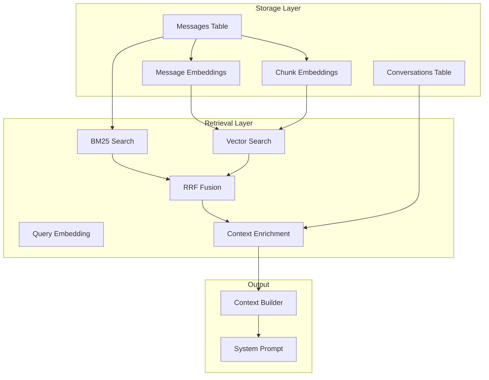
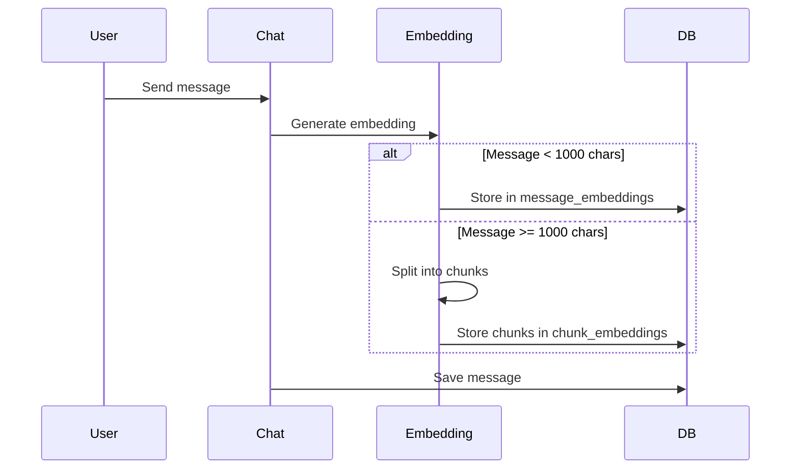
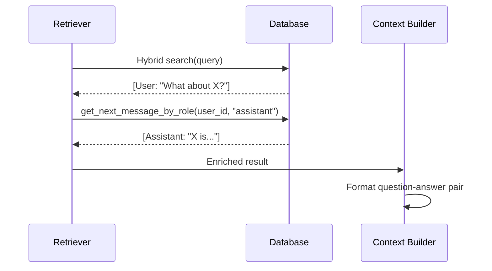
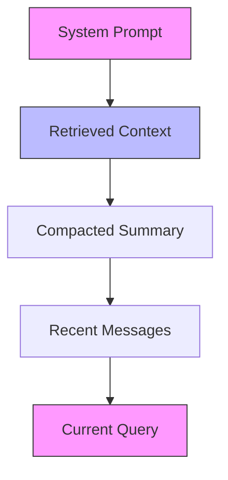
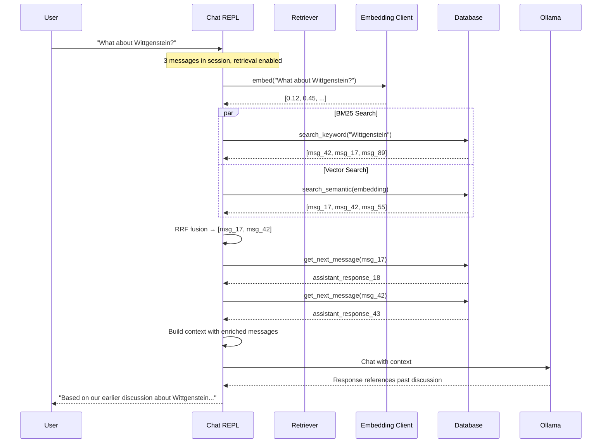

# Retrieval System Design

**Status:** ⚠️ LEGACY  
**Archived:** 2026-03-15  
**Replaced by:** [Memory Architecture](./memory-architecture.md)

> This document has been superseded. The retrieval system is now documented as part of **Layer 2: Conversation Memory** in the unified [Memory Architecture](./memory-architecture.md) document.

---

**Original Topic:** Conversation Memory (Retrieval)

---

## Overview

Ask-AI uses a hybrid retrieval system (BM25 + Semantic + RRF) to find relevant messages from conversation history. This allows the LLM to reference past discussions when answering new questions.

## Architecture



## Components

### 1. Database Schema

```sql
-- Conversations (sessions)
CREATE TABLE conversations (
    id TEXT PRIMARY KEY,
    project_id TEXT,
    model_id TEXT,
    created_at INTEGER
);

-- Messages
CREATE TABLE messages (
    id INTEGER PRIMARY KEY,
    conversation_id TEXT,
    role TEXT,
    content TEXT,
    timestamp INTEGER
);

-- Full-text search index
CREATE VIRTUAL TABLE messages_fts USING fts5(content, messages);

-- Embeddings (short messages)
CREATE TABLE message_embeddings (
    message_id INTEGER PRIMARY KEY,
    conversation_id TEXT,
    embedding BLOB
);

-- Embeddings (long message chunks)
CREATE TABLE chunk_embeddings (
    chunk_id INTEGER PRIMARY KEY,
    message_id INTEGER,
    conversation_id TEXT,
    embedding BLOB
);
```

### 2. Embedding Generation

Messages are embedded using Ollama's embedding API:



### 3. Hybrid Search

#### BM25 (Keyword Search)

```sql
-- Fast full-text search
SELECT m.id, m.content, bm25(messages_fts) as score
FROM messages_fts fts
JOIN messages m ON fts.rowid = m.id
WHERE messages_fts MATCH ?
ORDER BY score ASC
LIMIT ?;
```

**Strengths:**
- Exact phrase matching
- Fast for short queries
- No embedding needed

**Weaknesses:**
- Misses synonyms
- No semantic understanding

#### Semantic (Vector Search)

```sql
-- KNN search with sqlite-vec
SELECT message_id, distance
FROM message_embeddings
WHERE embedding MATCH ? AND k = ?
ORDER BY distance;
```

**Strengths:**
- Captures meaning
- Handles synonyms
- Cross-lingual potential

**Weaknesses:**
- Requires embedding generation
- Misses exact phrases

#### Reciprocal Rank Fusion (RRF)

Combines BM25 and semantic scores:

```
RRF_score(d) = Σ 1 / (k + rank_i(d))  where k = 60
```

```rust
fn reciprocal_rank_fusion(
    keyword_results: Vec<(i64, f32)>,
    semantic_results: Vec<(i64, f32)>,
    k: f32,
) -> Vec<i64> {
    // Higher rank = lower position in results
    // RRF gives equal weight regardless of score scale
}
```

### 4. Context Enrichment

After retrieval, user messages are enriched with their assistant responses:



**Why enrich?**
- Short questions have concentrated similarity (high scores)
- Long responses have dispersed similarity (low scores)
- Enriching ensures complete information reaches the LLM

## Retrieval Triggers

### Chat Mode

```rust
pub fn should_retrieve(session: &ChatSession, db: Option<&Database>) -> bool {
    // Normal: enough messages, retrieval enabled
    config.enabled && session.messages.len() >= config.min_messages
    
    // Forced: session empty but DB has messages (e.g., after /clear)
    || force_retrieve(session, db)
}
```

### Query Mode (v0.25.0+)

```rust
// Always retrieve if DB available (no persistence)
pub async fn build_query_context(
    project_id: Option<&str>,
    db: Option<&Database>,
    // ...
) -> ContextResult {
    // Search across all sessions in project
    db.search_hybrid(query, &embedding, None, project_id, limit, ...)
}
```

## Context Composition

### Order (Lost-in-the-Middle Mitigation)

Research shows LLMs forget information in the middle of context. Important content should be at beginning or end:



**Implementation:**
1. System prompt first (highest retention)
2. Retrieved messages (after system, not middle)
3. Recent conversation history
4. Current query last (highest retention)

### Token Budget

```rust
// Rough token estimation
fn estimate_tokens(text: &str) -> usize {
    (text.split_whitespace().count() as f32 / 0.75).ceil() as usize
}

// Context budget (example for 128K model)
const MAX_CONTEXT: usize = 128000;
const SYSTEM_PROMPT: usize = 2000;
const TOOL_DEFINITIONS: usize = 5000;
const RETRIEVED_MESSAGES: usize = 5000; // 5 messages * ~1000 tokens
const RECENT_HISTORY: usize = 10000;    // Last 10 messages
const RESPONSE_BUFFER: usize = 4000;

// Total: 21K tokens for context, rest available for model
```

## Message Chunking

Long messages are split for embedding:

```rust
const MAX_CHUNK_CHARS: usize = 1000;

fn chunk_message(content: &str) -> Vec<String> {
    // Split at sentence boundaries
    // Ensure UTF-8 safety
    // Each chunk stored separately
}
```

## Performance Considerations

### Database Size

| Messages | DB Size (approx) |
|----------|-----------------|
| 100 | ~1 MB |
| 1000 | ~10 MB |
| 10000 | ~100 MB |

### Retrieval Speed

| Operation | Time (approx) |
|-----------|---------------|
| Embedding generation | ~50ms |
| BM25 search | ~5ms |
| Vector search | ~10ms |
| Enrichment | ~5ms |
| **Total** | **~70ms** |

### Optimization Tips

1. **Limit retrieved messages** - Default 5 is usually enough
2. **Use project isolation** - Searches only relevant conversations
3. **Compact old sessions** - Reduces DB size
4. **Batch embedding updates** - During compaction, not per-message

## Configuration

### RetrievalConfig

```toml
[retrieval]
enabled = true
relevant_count = 5      # Max retrieved messages
recent_count = 10       # Recent messages to include
keyword_weight = 0.4   # BM25 weight in RRF
semantic_weight = 0.6   # Vector weight in RRF
min_messages = 3        # Min messages before retrieval
```

## Example Flow



## See Also

- [Architecture](./architecture.md) - Overall system design
- [Chat Mode Design](./chat-mode-design.md) - Interactive sessions
- [Roadmap](./roadmap.md) - Future improvements