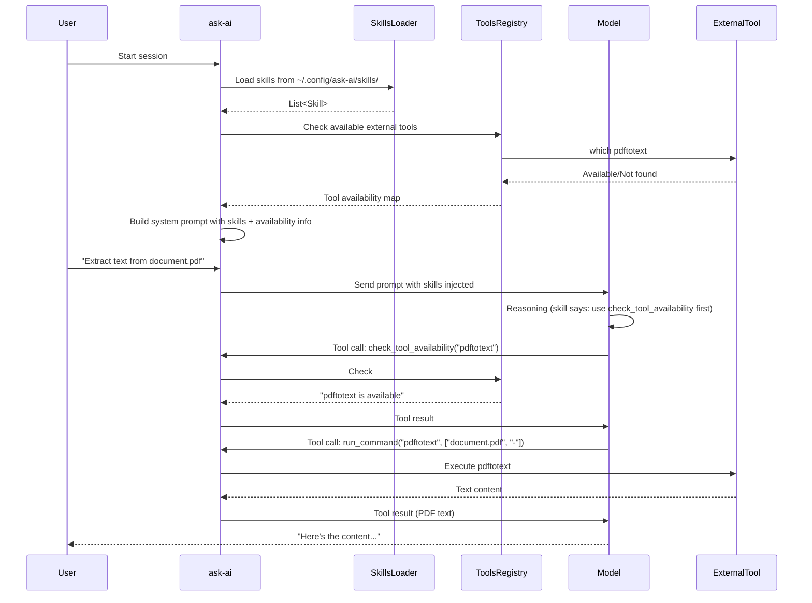

# Skills System Design

**Status:** Planning  
**Created:** 2026-03-09  
**Priority:** HIGH  
**Depends on:** CLI Tools Infrastructure

## Overview

This document describes the design for a **Skills System** that allows defining AI behavior and tool usage patterns in Markdown files, without requiring code changes for new capabilities.

## Problem Statement

### Current Limitations

1. **Tools are hardcoded**: Every tool requires Rust code with `#[ollama_rs::function]` macro
2. **Tool behavior is fixed**: LLM receives tool descriptions but no guidance on *when* or *how* to use them
3. **External tools impossible**: Using CLI tools like `pdftotext`, `tesseract` requires code changes
4. **Binary size**: Rust crates for PDF/image processing add 2-10MB to binary

### Desired Capabilities

1. **Runtime-editable instructions**: Users can modify behavior via Markdown files
2. **External tool integration**: Use CLI tools (pdftotext, tesseract, etc.) without recompiling
3. **Fallback behavior**: Graceful degradation when tools are unavailable
4. **Compact binary**: External tools don't increase binary size

## Research Summary

### Skills/Prompt Systems in Other Tools

| Tool | Format | Location | Purpose |
|------|--------|----------|---------|
| **Claude Code** | Markdown + YAML frontmatter | `.claude/skills/**/*.md` | Instructions + tool definitions + hooks |
| **Cursor** | Markdown | `.cursorrules` | Project-level instructions |
| **Aider** | Markdown | `CONVENTIONS.md` | Coding conventions |
| **OpenAI Custom GPTs** | JSON Schema (web UI) | Web interface | Instructions + actions |

### Key Findings

1. **Skills are instructions for the model**: All systems treat skills as prompt extensions, not executable code
2. **Tools still require code**: No framework supports defining tools purely from data files
3. **Dynamic schema loading**: OpenAI allows JSON schemas, but execution still requires code
4. **MCP (Model Context Protocol)**: Emerging standard for dynamic tool discovery, but still requires server implementation

### Conclusion

**Skills = Instructions (Markdown)**
**Tools = Executable Code (Rust)**

The skill system should:
- Load Markdown files with instructions
- Inject instructions into system prompt
- Teach the model how to use available tools
- NOT define new tools (those remain in Rust code)

## Architecture

### Component Overview

```
┌─────────────────────────────────────────────────────────────────┐
│                         ask-ai                                  │
├─────────────────────────────────────────────────────────────────┤
│                                                                 │
│  ┌─────────────────────┐     ┌────────────────────────────────┐│
│  │  Skills (Markdown)  │     │  Tools (Rust Code)             ││
│  │                     │     │                                ││
│  │  ~/.config/ask-ai/  │     │  src/tools/*.rs                ││
│  │  skills/             │     │                                ││
│  │    pdf-processing.md│     │  check_tool_availability()     ││
│  │    ocr-images.md    │     │  run_command()                 ││
│  │    code-review.md   │     │  import_text_file()            ││
│  │                     │     │  create_note()                 ││
│  │  ↑ Instructions     │     │                                ││
│  │  for model          │     │  ↑ Code execution              ││
│  └──────────┬──────────┘     └────────────────────────────────┘│
│             │                              ▲                   │
│             │ Injected into                │ Invoked by        │
│             │ system prompt                │ model decision    │
│             ▼                              │                   │
│  ┌─────────────────────────────────────────────────────────────┤│
│  │                    Prompt Builder                           ││
│  │                                                             ││
│  │  System Prompt = Base Prompt + AGENTS.md + Skills + ...   ││
│  └─────────────────────────────────────────────────────────────┤│
│                                                                 │
│  ┌─────────────────────────────────────────────────────────────┤│
│  │                    External Tools Config                    ││
│  │                                                             ││
│  │  ~/.config/ask-ai/tools.toml                                ││
│  │                                                             ││
│  │  [pdftotext]                                                ││
│  │  enabled = true                                             ││
│  │  timeout = 30                                               ││
│  └─────────────────────────────────────────────────────────────┘│
└─────────────────────────────────────────────────────────────────┘
```

### Data Flow



## Components

### 1. Skills Loader (`src/skills/`)

**Purpose:** Load and parse Markdown skill files at runtime.

**File Structure:**
```
src/skills/
├── mod.rs           # Public API
├── loader.rs        # File loading and parsing
├── types.rs         # Skill struct definitions
└── builtin/         # Built-in skills (compiled into binary)
    ├── pdf-processing.md
    └── ocr-images.md
```

**Types:**
```rust
/// A skill loaded from a Markdown file
pub struct Skill {
    /// Skill name (from filename or frontmatter)
    pub name: String,
    /// Human-readable description
    pub description: String,
    /// Whether it can be invoked by user command
    pub user_invocable: bool,
    /// Invocation command (e.g., "/pdf")
    pub invocation: Option<String>,
    /// The skill content (Markdown instructions)
    pub content: String,
    /// Source: builtin, user, project
    pub source: SkillSource,
}

pub enum SkillSource {
    /// Compiled into binary
    Builtin,
    /// ~/.config/ask-ai/skills/
    User,
    /// .ask-ai/skills/ (project-level)
    Project,
}

/// Skills configuration
pub struct SkillsConfig {
    /// Directories to search for skills
    pub search_paths: Vec<PathBuf>,
    /// Whether to load builtin skills
    pub load_builtins: bool,
}
```

**Loading Algorithm:**
```rust
impl SkillsLoader {
    /// Load all skills from configured paths
    pub fn load_all(config: &SkillsConfig) -> Vec<Skill> {
        let mut skills = Vec::new();
        
        // 1. Load builtin skills (compiled into binary)
        if config.load_builtins {
            skills.extend(Self::load_builtins());
        }
        
        // 2. Load user skills (global)
        let user_skills_dir = dirs::config_dir()
            .join("ask-ai")
            .join("skills");
        skills.extend(Self::load_from_dir(&user_skills_dir));
        
        // 3. Load project skills (local)
        let project_skills_dir = std::env::current_dir()
            .join(".ask-ai")
            .join("skills");
        skills.extend(Self::load_from_dir(&project_skills_dir));
        
        // 4. Deduplicate by name (project overrides user, user overrides builtin)
        Self::deduplicate(skills)
    }
    
    /// Load a single skill file
    fn load_file(path: &Path) -> Result<Skill, Error> {
        let content = std::fs::read_to_string(path)?;
        let (frontmatter, body) = Self::parse_frontmatter(&content)?;
        
        Ok(Skill {
            name: frontmatter.name
                .or_else(|| path.file_stem()?.to_string lossy().into()),
            description: frontmatter.description.unwrap_or_default(),
            user_invocable: frontmatter.user_invocable.unwrap_or(true),
            invocation: frontmatter.invocation,
            content: body.to_string(),
            source: Self::determine_source(path),
        })
    }
}
```

### 2. Skills Format (Markdown)

**Simple Format (No Frontmatter):**
```markdown
# ~/.config/ask-ai/skills/pdf-processing.md

When asked to process PDF files:

1. **Check tool availability** using `check_tool_availability`:
   - `pdftotext` (text extraction)
   - `pdfinfo` (metadata)
   - `pdftoppm` (PDF to image conversion)
   - `tesseract` (OCR)

2. **For text-based PDFs**:
   - Use `run_command` to execute `pdftotext <file> -`
   - Parse the text output
   - If extraction fails, check if file is scanned PDF

3. **For scanned PDFs**:
   - Inform user that OCR is needed
   - If `tesseract` is available, offer to convert
   - Otherwise, suggest installation

4. **Error handling**:
   - If tool not found: inform user with installation command
   - If command fails: show error message and suggest alternatives
```

**With YAML Frontmatter:**
```markdown
---
name: pdf-processing
description: Extract and process content from PDF files
invocation: /pdf
user_invocable: true
---

When asked to process PDF files:

1. **Check tool availability** first...
   (rest of instructions)
```

### 3. Tools Registry (`src/external/`)

**Purpose:** Detect and manage external CLI tools at runtime.

**File Structure:**
```
src/external/
├── mod.rs           # Public API
├── registry.rs      # Tool detection and tracking
├── executor.rs     # Command execution with timeout
├── config.rs        # tools.toml parsing
└── sandbox.rs       # Security sandboxing (future: landlock)
```

**Types:**
```rust
/// External tool configuration
pub struct ExternalTool {
    /// Tool name (e.g., "pdftotext")
    pub name: String,
    /// Binary name to search in PATH
    pub binary: String,
    /// Whether the tool is enabled
    pub enabled: bool,
    /// Execution timeout in seconds
    pub timeout: Duration,
    /// Whether to sandbox the execution
    pub sandbox: bool,
    /// Installation instructions by platform
    pub install_hint: HashMap<Platform, String>,
}

/// Registry of available external tools
pub struct ToolRegistry {
    tools: HashMap<String, ExternalTool>,
    available_cache: HashMap<String, bool>,
}

impl ToolRegistry {
    /// Create registry from config file
    pub fn from_config(path: &Path) -> Result<Self, Error> {
        // Parse tools.toml
    }
    
    /// Check if a tool is available in PATH
    pub fn is_available(&self, tool_name: &str) -> bool {
        self.available_cache.get(tool_name).copied().unwrap_or_else(|| {
            let tool = self.tools.get(tool_name)?;
            let available = which::which(&tool.binary).is_ok();
            self.available_cache.insert(tool_name.to_string(), available);
            available
        })
    }
    
    /// Get installation hint for a tool
    pub fn install_hint(&self, tool_name: &str, platform: Platform) -> Option<&str> {
        self.tools.get(tool_name)?
            .install_hint.get(&platform)
            .map(|s| s.as_str())
    }
    
    /// List all configured tools and their availability
    pub fn list_tools(&self) -> Vec<ToolInfo> {
        // Return list with availability status
    }
}
```

### 4. Command Executor (`src/external/executor.rs`)

**Purpose:** Safely execute external commands with timeout and output capture.

**Implementation:**
```rust
use std::process::{Command, Stdio};
use tokio::time::{timeout, Duration};
use which::which;

/// Execute an external command safely
pub struct CommandExecutor {
    registry: ToolRegistry,
}

impl CommandExecutor {
    /// Execute a command with timeout
    pub async fn execute(
        &self,
        tool_name: &str,
        args: &[String],
        input: Option<&str>,
    ) -> Result<CommandOutput, CommandError> {
        // 1. Check tool is enabled
        let tool = self.registry.get(tool_name)?;
        if !tool.enabled {
            return Err(CommandError::Disabled(tool_name.to_string()));
        }
        
        // 2. Check tool is available
        if !self.registry.is_available(tool_name) {
            return Err(CommandError::NotFound(tool_name.to_string()));
        }
        
        // 3. Build command
        let mut cmd = Command::new(&tool.binary);
        cmd.args(args)
            .stdin(Stdio::null())
            .stdout(Stdio::piped())
            .stderr(Stdio::piped());
        
        // 4. Execute with timeout
        let output = timeout(tool.timeout, async {
            cmd.output()
        }).await
            .map_err(|_| CommandError::Timeout(tool_name.to_string()))?
            .map_err(|e| CommandError::Execution(e.to_string()))?;
        
        // 5. Return result
        Ok(CommandOutput {
            stdout: String::from_utf8_lossy(&output.stdout).to_string(),
            stderr: String::from_utf8_lossy(&output.stderr).to_string(),
            exit_code: output.status.code(),
            success: output.status.success(),
        })
    }
}

#[derive(Debug)]
pub enum CommandError {
    /// Tool is disabled in config
    Disabled(String),
    /// Tool binary not found in PATH
    NotFound(String),
    /// Command execution timed out
    Timeout(String),
    /// Command execution failed
    Execution(String),
}

pub struct CommandOutput {
    pub stdout: String,
    pub stderr: String,
    pub exit_code: Option<i32>,
    pub success: bool,
}
```

### 5. Tools Configuration (`tools.toml`)

**Location:** `~/.config/ask-ai/tools.toml`

**Format:**
```toml
# External Tools Configuration
# Only explicitly enabled tools can be executed via run_command

[external]
# Default timeout for all commands (in seconds)
default_timeout = 30
# Enable sandboxing (Linux landlock, future)
enable_sandbox = false

# PDF Tools
[pdftotext]
enabled = true
timeout = 30
binary = "pdftotext"
install_hint_arch = "sudo pacman -S poppler"
install_hint_debian = "sudo apt install poppler-utils"
install_hint_fedora = "sudo dnf install poppler-utils"

[pdfinfo]
enabled = true
timeout = 5
binary = "pdfinfo"

[pdftoppm]
enabled = true
timeout = 60
binary = "pdftoppm"
sandbox = true  # Image processing potentially dangerous

# OCR Tools
[tesseract]
enabled = true
timeout = 120
binary = "tesseract"
install_hint_arch = "sudo pacman -S tesseract"
install_hint_debian = "sudo apt install tesseract-ocr"

# Image Tools
[exiftool]
enabled = true
timeout = 10
binary = "exiftool"

[imagemagick]
enabled = true
timeout = 60
binary = "magick"
sandbox = true  # ImageMagick has security history
install_hint_arch = "sudo pacman -S imagemagick"
install_hint_debian = "sudo apt install imagemagick"

# Video Tools (optional)
[ffmpeg]
enabled = false  # Disabled by default, opt-in
timeout = 300
binary = "ffmpeg"
```

### 6. New Tools (Rust Code)

**Tool: check_tool_availability**
```rust
// src/tools/tool_check.rs

/// Check if an external tool is available on this system.
///
/// Returns information about the tool's availability and installation.
///
/// # Arguments
/// * `tool` - The tool name to check (e.g., "pdftotext", "tesseract")
///
/// # Returns
/// Formatted message with availability status and installation hint.
#[ollama_rs::function]
pub async fn check_tool_availability(
    tool: String,
) -> Result<String, Box<dyn std::error::Error + Send + Sync>> {
    let registry = get_tool_registry(); // Global or injected
    
    let available = registry.is_available(&tool);
    
    if available {
        Ok(format!("✓ {} is available", tool))
    } else {
        let platform = detect_platform();
        let hint = registry.install_hint(&tool, platform)
            .unwrap_or("Install the tool manually");
        Ok(format!(
            "✗ {} is not installed. Install with: {}",
            tool, hint
        ))
    }
}
```

**Tool: run_command**
```rust
// src/tools/run_command.rs

/// Execute an external command and return the output.
///
/// SECURITY: Only whitelisted commands in tools.toml can be executed.
///
/// # Arguments
/// * `command` - The command name (must be in whitelist)
/// * `args` - List of arguments for the command
/// * `timeout_seconds` - Optional timeout (default: from config)
///
/// # Returns
/// Command output (stdout) or error message.
#[ollama_rs::function]
pub async fn run_command(
    command: String,
    args: Vec<String>,
    timeout_seconds: Option<u32>,
) -> Result<String, Box<dyn std::error::Error + Send + Sync>> {
    let executor = get_command_executor(); // Global or injected
    
    match executor.execute(&command, &args, None, timeout_seconds).await {
        Ok(output) => {
            if output.success {
                Ok(output.stdout)
            } else {
                Ok(format!(
                    "Command failed with exit code {:?}\nError: {}",
                    output.exit_code, output.stderr
                ))
            }
        }
        Err(e) => Ok(format!("Error executing command: {}", e)),
    }
}
```

### 7. Prompt Integration

**Where skills are injected:**
```rust
// src/prompts/builder.rs

impl PromptBuilder {
    pub fn build_system_prompt(&self, skills: &[Skill]) -> String {
        let mut prompt = String::new();
        
        // 1. Base prompt
        prompt.push_str(&self.base_prompt);
        prompt.push_str("\n\n");
        
        // 2. AGENTS.md content (if exists)
        if let Some(agents) = &self.agents_content {
            prompt.push_str("## Project Context\n\n");
            prompt.push_str(agents);
            prompt.push_str("\n\n");
        }
        
        // 3. Available tools info
        prompt.push_str("## Available Tools\n\n");
        prompt.push_str(&self.format_tools_info());
        prompt.push_str("\n\n");
        
        // 4. External tools availability
        prompt.push_str("## External Tools\n\n");
        prompt.push_str(&self.format_external_tools_availability());
        prompt.push_str("\n\n");
        
        // 5. Skills (NEW)
        for skill in skills {
            prompt.push_str(&format!("## Skill: {}\n\n", skill.name));
            prompt.push_str(&skill.content);
            prompt.push_str("\n\n");
        }
        
        prompt
    }
}
```

## Implementation Plan

### Phase 1: CLI Tools Infrastructure

**Estimated time:** 3-4 days

**Tasks:**
1. Create `src/external/mod.rs` and submodules
2. Implement `ToolRegistry` with `which` crate
3. Implement `CommandExecutor` with async + timeout
4. Create `tools.toml` parser
5. Add `check_tool_availability` tool
6. Add `run_command` tool
7. Write unit tests
8. Document installation instructions

**Dependencies added to Cargo.toml:**
```toml
which = "8.0"        # Command detection
shell-words = "1.1"  # Safe argument parsing (optional, for user input)
```

### Phase 2: Skills Loader

**Estimated time:** 2-3 days

**Tasks:**
1. Create `src/skills/mod.rs` and submodules
2. Implement `Skill` and `SkillsLoader` types
3. Parse YAML frontmatter (optional)
4. Load builtin skills from embedded files
5. Load user skills from `~/.config/ask-ai/skills/`
6. Load project skills from `.ask-ai/skills/`
7. Integration with `PromptBuilder`
8. Write documentation for skill format

**No new dependencies (uses std fs and serde)**

### Phase 3: Built-in Skills

**Estimated time:** 1 day

**Tasks:**
1. Create `src/skills/builtin/pdf-processing.md`
2. Create `src/skills/builtin/ocr-images.md`
3. Create `src/skills/builtin/code-analysis.md` (optional)
4. Embed builtin skills in binary

### Phase 4: Integration & Testing

**Estimated time:** 2 days

**Tasks:**
1. Integration tests with external tools
2. Test fallback when tools not installed
3. Test skill loading from all sources
4. Performance benchmarks
5. Documentation updates

### Total Estimated Time: 8-10 days

## Security Considerations

### Command Execution Risks

1. **Arbitrary Command Execution**: `run_command` could execute dangerous commands
2. **Path Traversal**: Arguments could contain `../` or absolute paths
3. **Injection**: Arguments could inject shell commands
4. **Resource Exhaustion**: Long-running commands could hang

### Mitigations

1. **Whitelist**: Only commands in `tools.toml` can be executed
2. **No Shell**: Use `std::process::Command` directly, not shell
3. **Timeout**: All commands have configurable timeouts
4. **Sandbox**: Optional `landlock`/`extrasafe` for filesystem isolation (Linux)
5. **Input Validation**: Validate arguments before execution
6. **Error Handling**: All errors returned as messages to LLM, no crashes

### Future: Landlock Integration

For Linux 5.13+ systems:

```rust
// Future implementation
pub fn execute_sandboxed(&self, tool: &ExternalTool, args: &[String]) -> Result<Output> {
    // Use landlock crate to restrict filesystem access
    // Only allow reading from allowed paths
    // No write access outside sandbox
}
```

## Testing Strategy

### Unit Tests

```rust
#[cfg(test)]
mod tests {
    use super::*;
    
    #[test]
    fn test_skill_loading() {
        let skill = SkillsLoader::load_file(Path::new("test_skills/pdf.md")).unwrap();
        assert_eq!(skill.name, "pdf-processing");
    }
    
    #[test]
    fn test_tool_registry() {
        let registry = ToolRegistry::from_config(Path::new("tools.toml")).unwrap();
        assert!(registry.is_configured("pdftotext"));
    }
    
    #[test]
    fn test_command_executor_disabled() {
        let registry = ToolRegistry::new();
        let executor = CommandExecutor::new(registry);
        let result = executor.execute("malicious_tool", &[]).await;
        assert!(matches!(result, Err(CommandError::Disabled))));
    }
}
```

### Integration Tests

```rust
#[tokio::test]
async fn test_pdftotext_integration() {
    if !which::which("pdftotext").is_ok() {
        return; // Skip if tool not installed
    }
    
    let executor = CommandExecutor::new(ToolRegistry::default());
    let result = executor.execute("pdftotext", &["test.pdf", "-"]).await.unwrap();
    
    assert!(result.success);
    assert!(!result.stdout.is_empty());
}
```

## Examples

### Example 1: PDF Processing

**Skill (`pdf-processing.md`):**
```markdown
When asked to process PDF files:

1. Check if `pdftotext` is available using `check_tool_availability`.
2. If available, use `run_command` to extract text:
   - Command: `pdftotext`
   - Args: `["<filename>", "-"]`
   - The `-` argument outputs to stdout
3. If tool not available, inform user how to install.
```

**Model behavior:**
```
User: Extract text from document.pdf

Model: [Thinking: pdf-processing skill says check availability first]
       [Calls check_tool_availability("pdftotext")]
       
Result: "✗ pdftotext is not installed. Install with: sudo apt install poppler-utils"

Model: I don't have pdftotext installed. You can install it with:
       sudo apt install poppler-utils
       Would you like me to help you install it?
```

### Example 2: OCR with Image

**Skill (`ocr-images.md`):**
```markdown
When asked to extract text from images:

1. Check if `tesseract` is available.
2. If available, use `run_command`:
   - Command: `tesseract`
   - Args: `["<image_path>", "stdout"]`
3. For multiple languages, specify `-l` argument.
```

**Model behavior:**
```
User: Read the text in this image: screenshot.png

Model: [Thinking: ocr-images skill applies]
       [Calls check_tool_availability("tesseract")]
       [Calls run_command("tesseract", ["screenshot.png", "stdout"])]
       
Result: "Hello World\nThis is sample text"

Model: The image contains the following text:
       Hello World
       This is sample text
```

## File Locations

| File | Purpose |
|------|---------|
| `~/.config/ask-ai/tools.toml` | External tools configuration |
| `~/.config/ask-ai/skills/*.md` | User-defined skills |
| `.ask-ai/skills/*.md` | Project-specific skills |
| `src/skills/builtin/*.md` | Built-in skills (embedded in binary) |

## Configuration Files

### tools.toml

Full specification:

```toml
[external]
# Global settings
default_timeout = 30
enable_sandbox = false

# Per-tool configuration
[<tool_name>]
enabled = true | false
timeout = <seconds>
binary = "<binary_name>"
sandbox = true | false
install_hint_arch = "<arch linux command>"
install_hint_debian = "<debian/ubuntu command>"
install_hint_fedora = "<fedora command>"
install_hint_termux = "<termux command>"
```

### Skill File Format

Markdown with optional YAML frontmatter:

```markdown
---
name: skill-name
description: What this skill does
invocation: /command
user_invocable: true | false
---

Instructions for the model...

1. First step
2. Second step
...
```

## Migration from Current System

### No Breaking Changes

- Existing tools continue to work unchanged
- Skills are opt-in (loaded if files exist)
- External tools require explicit configuration

### Gradual Adoption

1. **Phase 1**: Implement CLI tools infrastructure, no skills yet
2. **Phase 2**: Add skills system, with built-in examples
3. **Phase 3**: Users can add custom skills
4. **Phase 4**: Document import uses skills for PDF handling

## See Also

- [Roadmap](./roadmap.md) - Overall project plan
- [Architecture](./architecture.md) - System architecture
- [CLI Tools Research](./cli-tools-research.md) - Research on external tools