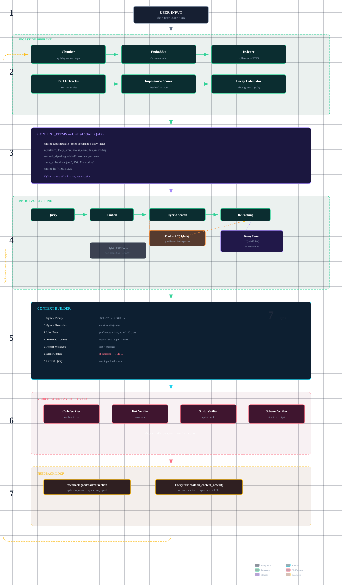
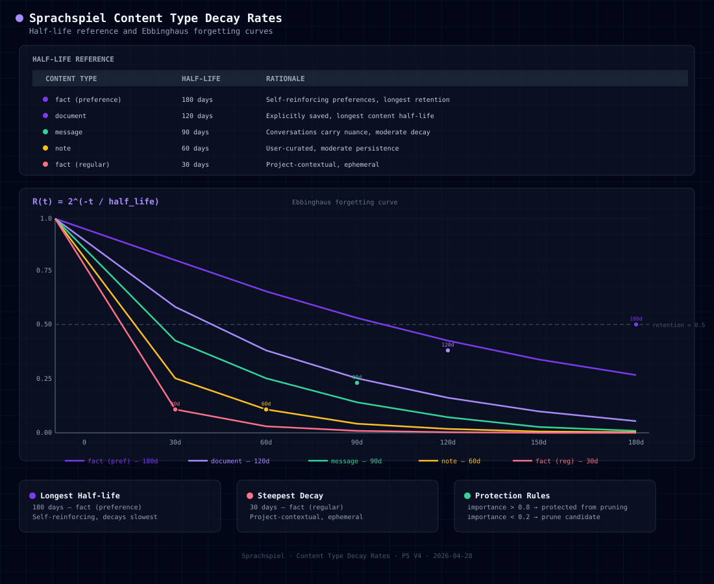
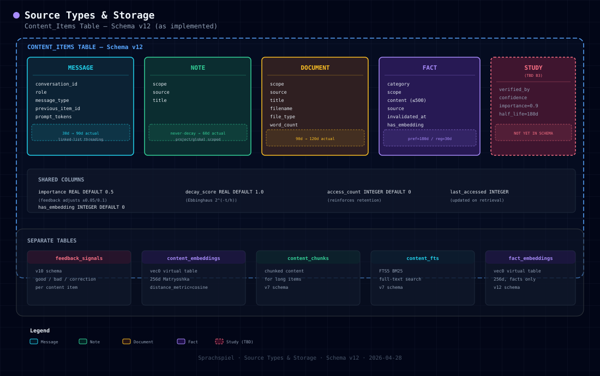
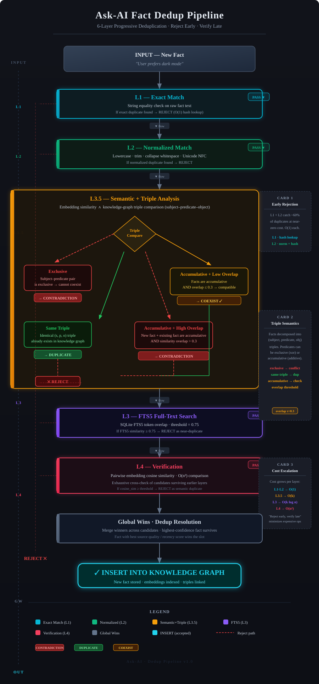
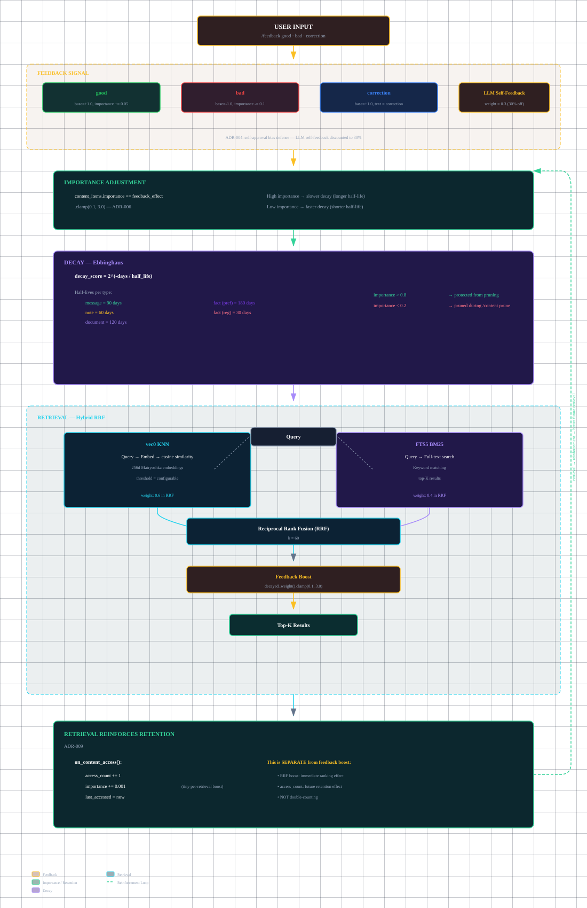
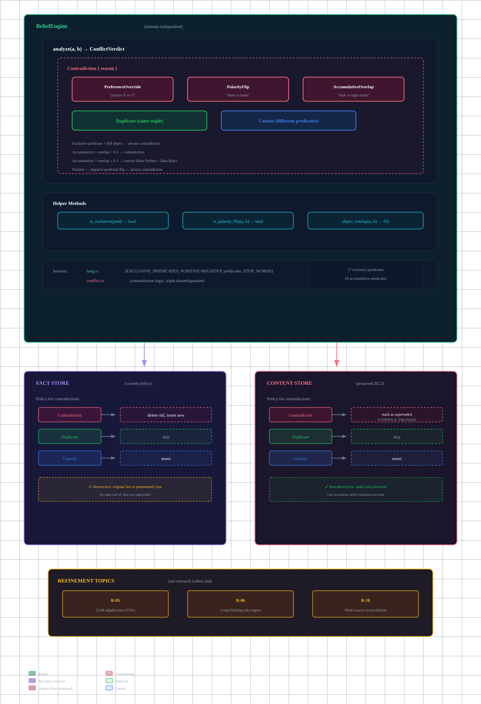
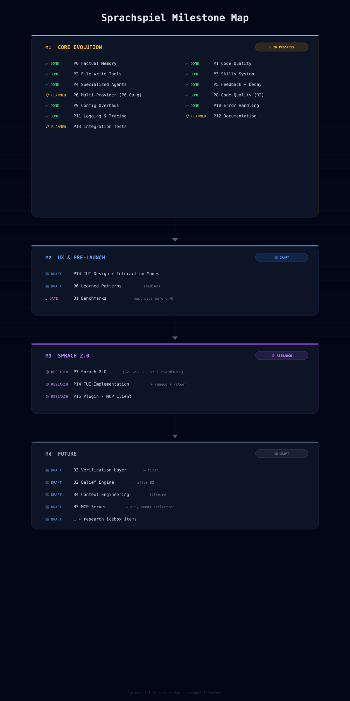

# Unified Vision: Ask-AI Architecture Reconciliation

**Status:** Reference document (reconciled with actual implementation)
**Original Date:** 2026-03-13 (Portuguese, original in external research notes)
**Reconciled Date:** 2026-04-28

> This document consolidates the original "Visão Unificada" with the actual
> implementation decisions. Sections marked with ✅ have been implemented (possibly
> differently from the original proposal); sections marked with ❌ are pending
> and tracked as draft priorities in IMPLEMENTATION.md.

---

## 1. The Central Problem

### 1.1 Current State

| Component | Original Vision | Actual Implementation | Status |
|-----------|----------------|----------------------|--------|
| Persistent chat | ✅ SQLite complete | Same — `content_items` table with `content_type='message'` | ✅ Match |
| Semantic search | ✅ BM25 + Vector + RRF | Same — hybrid retrieval with RRF fusion | ✅ Match |
| Tools (28+) | ✅ Feature flags | Same — now 50+ tools in 14 categories | ✅ Match |
| Context management | ✅ Auto compaction | Same — 4-tier percentage-based thresholds | ✅ Match |
| Project-aware | ✅ AGENTS.md injection | Same | ✅ Match |
| Document import | ❌ Planned | ✅ Implemented as P3 (v0.39.0) — `content_type='document'` in `content_items` | ✅ Diverged |
| Notes system | ❌ Planned | ✅ Implemented as P4 priority — `content_type='note'` in `content_items` | ✅ Diverged |
| Study sessions | ❌ **NEW** | ❌ Pending — tracked as Draft B3 | ❌ Pending |
| Memory with cross-session | ❌ Critical gap | ✅ Factual Memory (P0) + Feedback (P5) + Content Decay (P5) | ✅ Diverged |
| Feedback-driven decay | ❌ Not in original | ✅ Implemented (P5 V4) — Ebbinghaus curves with feedback signals | ✅ Beyond original |
| Retrieval-reinforced retention | ❌ Not in original | ✅ Implemented (P5 V4) — `on_content_access()` reinforces retention | ✅ Beyond original |

### 1.2 Reconciled Conflicts

**Notes System (planned) vs. Memory System (needed)**

Both unified under `content_items` with `content_type` enum. Notes are user-created items with 60-day half-life — not "never decay" as originally proposed. See P4 in IMPLEMENTATION.md.

**Document Import (planned) vs. Study Sessions (new)**

Document Import ✅ DONE (P3). Study Sessions share chunking/embedding infrastructure but add a verification layer. Tracked as Draft B3.

**"Forget" vs. Decay Temporal**

Decay implemented, not delete. Ebbinghaus formula `2^(-t/half_life)` with per-type half-lives: messages=90d, notes=60d, documents=120d, facts=30/180d. `prune` command offers manual override. See P5 in IMPLEMENTATION.md and feedback-architecture.md.

**Skills System vs. AGENTS.md vs. Study Templates**

Complementary, not conflicting. Skills = behavioral instructions (markdown). AGENTS.md = project context (injected automatically). Study Templates = pending (Draft B3).

---

## 2. Unified Knowledge Store — As Implemented

The original proposal used a `knowledge_items` table. The actual implementation uses `content_items`:

```sql
-- ACTUAL SCHEMA (v12, simplified)
CREATE TABLE content_items (
    id INTEGER PRIMARY KEY AUTOINCREMENT,
    content_type TEXT NOT NULL CHECK(content_type IN ('message', 'note', 'document')),
    
    -- Message fields (nullable)
    conversation_id TEXT,
    role TEXT CHECK(role IN ('user', 'assistant', 'system', 'tool')),
    message_type TEXT DEFAULT 'normal',
    previous_item_id INTEGER REFERENCES content_items(id),
    prompt_tokens INTEGER,
    
    -- Note/Document fields (nullable)
    scope TEXT CHECK(scope IN ('project', 'global')),
    source TEXT CHECK(source IN ('user', 'llm')),
    title TEXT,
    
    -- Common fields
    content TEXT NOT NULL,
    importance REAL DEFAULT 0.5,          -- from P5 feedback system
    decay_score REAL DEFAULT 1.0,         -- from P5 Ebbinghaus decay
    access_count INTEGER DEFAULT 0,        -- from P5 retrieval-reinforced retention
    last_accessed INTEGER,                 -- from P5
    created_at INTEGER NOT NULL,
    updated_at INTEGER NOT NULL,
    project_id TEXT,
    has_embedding INTEGER DEFAULT 0,

    -- Document-specific (v8)
    filename TEXT,
    file_type TEXT,
    word_count INTEGER
);
```

**Key differences from original `knowledge_items`:**

| Aspect | Original `knowledge_items` | Actual `content_items` |
|--------|---------------------------|----------------------|
| Table name | `knowledge_items` | `content_items` |
| `source_type` enum | msg/note/doc/study/extract | message/note/document (study pending as B3) |
| `importance` | Single field, 0.0-1.0 | Same, but driven by feedback signals (good +0.05, bad -0.1) |
| `feedback_score` | Accumulated from feedback | Replaced by `importance` adjustments — feedback modifies importance directly |
| `decay_score` | Not in original | Added in P5 — Ebbinghaus `2^(-t/half_life)` |
| `access_count` | Not in original | Added in P5 — retrieval reinforces retention |
| Decay formula | `importance * access_count * POW(0.95, days)` | `2^(-t/half_life)` with per-type half-lives |
| Note decay | "Never (user control)" | 60 days (Ebbinghaus, but user can always re-access to reinforce) |
| Document decay | 90 days | 120 days (longer, since documents are explicitly saved) |

---

## 3. Reconciled Features

### 3.1 What Was COMBINED (as proposed)

| Original Feature | Proposed Partner | Action | Status |
|-----------------|------------------|--------|--------|
| Notes System | Memory System | **Combined** — notes ARE memory items with `content_type='note'` | ✅ Done |
| Document Import | Knowledge Ingest | **Combined** — documents ARE memory items with `content_type='document'` | ✅ Done |
| Feedback System | Decay Temporal | **Integrated** — feedback adjusts decay speed via importance | ✅ Done (P5 V4) |
| AGENTS.md | Context Injection | **Kept separate** — AGENTS.md is project context, not memory | ✅ Working well |

### 3.2 What Was SEPARATED (as proposed)

| Feature | Reason to Keep Separate | Status |
|---------|------------------------|--------|
| Verification Layer | Independent of knowledge — about output quality | ❌ Pending → Draft B3 |
| System Reminders | Operational, doesn't affect persistence | ❌ Pending → Draft B6.1 |
| Skills System | Instructional, not data | ✅ Done (P3) |

### 3.3 What Was ADDED (beyond original)

| Feature | Description | Status |
|---------|-------------|--------|
| Feedback-driven decay | `2^(-t/h)` with feedback adjusting importance → decay speed | ✅ Done (P5) |
| Content-type half-lives | messages=90d, notes=60d, documents=120d, facts=30/180d | ✅ Done (P5) |
| Retrieval-reinforced retention | `on_content_access()` increments `access_count` and boosts importance | ✅ Done (P5) |
| Fact contradiction engine | 6-layer dedup pipeline with heuristic triple-based detection | ✅ Done (P6.1/P6.7) |
| Unified content storage | `content_items` table for messages, notes, documents | ✅ Done (schema v7+) |

---

## 4. Unified Phases — Reconciled

### Phase 1: Unified Knowledge Store → ✅ DONE

Original proposal → Actual implementation:
- Schema migration: ✅ Done (`content_items` table, schema v7→v12)
- Decay calculator: ✅ Done (Ebbinghaus `2^(-t/h)` in `content/decay.rs` and `facts/decay.rs`)
- Memory injection in context: ✅ Done (`remember()` tool, hybrid search)
- Feedback system basic: ✅ Done (P5 V4 — `/feedback good/bad/correction`)

### Phase 2: Document Import → ✅ DONE

- Chunking infrastructure: ✅ Done (dynamic chunk sizing, `content_chunks` table)
- Document sources: ✅ Done (TXT, MD, ORG builtin; PDF, EPUB via skills)
- Import commands: ✅ Done (`/doc import`, `/doc list`, `/doc show`, `/doc delete`)
- Source attribution: ✅ Done (`filename`, `file_type`, `word_count` columns)

### Phase 3: Notes System → ✅ DONE

- Note commands: ✅ Done (`/note add/list/show/edit/delete`)
- Note storage: ✅ Done (`content_type='note'`, scope project/global)
- Note retrieval: ✅ Done (hybrid search includes notes, `remember()` discovers notes)

### Phase 4: Verification Layer → ❌ PENDING (Draft B3)

- Status: Tracked as Draft B3 in IMPLEMENTATION.md
- `study` source type: Planned for `content_items` with `content_type='study'`
- Verifier trait: Planned (CodeVerifier, CrossModelVerifier, StudyVerifier)
- Verified knowledge boost: Planned (importance 0.9, 180d half-life)

### Phase 5: Advanced Features → PARTIALLY DONE

| Feature | Original Plan | Actual Status |
|---------|---------------|---------------|
| System Reminders | ReminderTrigger enum + templates | ❌ Pending → Draft B6.1 |
| Auto-extraction | Extract facts from conversations | ✅ Done (P6.1 — `fact_add` auto-extraction) |
| Learned Patterns | Detect usage patterns, adapt prompts | ❌ Pending → Draft B6.2 |
| Decay Management UI | `/memory stats/forget/prune` | ❌ Pending → Draft B6.3 |

---

## 5. Source Type Decay Rates — As Implemented

| Source Type | Original Half-Life | Actual Half-Life | Rationale |
|-------------|------------------|-----------------|-----------|
| `message` | 30 days | 90 days | Conversations carry nuance and context; original was too aggressive |
| `note` | Never (user control) | 60 days | User-curated but not permanent; re-access reinforces retention |
| `document` | 90 days | 120 days | Explicitly saved, longest retention |
| `fact` (preference) | Not in original | 180 days | Self-reinforcing preferences persist longer |
| `fact` (regular) | Not in original | 30 days | Project-contextual, more ephemeral |

---

## 6. Diagrams

The following diagrams illustrate the key architectural flows and data structures of Ask-AI. Each diagram is a standalone HTML file with dark-themed SVG, versioned alongside the documentation source.

### 6.1 Data Flow Architecture

End-to-end pipeline from user input through ingestion, storage, retrieval, context building, verification, and feedback loop.



### 6.2 Content Type Decay Rates

Half-life reference table and Ebbinghaus decay curves (R(t) = 2^(-t/h)) for each content type.



### 6.3 Source Types and Storage

Content_items unified schema (v12) with type-specific fields, shared columns, and auxiliary tables.



### 6.4 Dedup Pipeline

6-layer fact deduplication pipeline: Exact Match → Normalized → Semantic + Triple Disambiguation → FTS5 → Startup Verification → Global-Wins-Project.



### 6.5 Feedback-Driven Memory Lifecycle

Complete feedback loop: /feedback signals → importance adjustment → Ebbinghaus decay → hybrid RRF retrieval → retrieval reinforces retention.



### 6.6 Belief Engine Abstraction

Proposed domain-independent BeliefEngine with ConflictVerdict types (Contradiction/Duplicate/Coexist) and divergent store policies.



### 6.7 Milestone Map

Reconciled milestone progression: M1 Core Evolution → M2 UX & Pre-Launch → M3 Sprach 2.0 → M4 Future.



---

## 7. Open Questions

1. **Study source type:** Should `content_type` enum add `'study'` or should study items be notes with a `verified` flag? Decision pending B3 design.

2. **Verification vs. Feedback:** Are verified items (passed quiz) fundamentally different from good-feedback items? Current design: yes — verified gets higher starting importance (0.9 vs 0.5+0.05). But should verification decay the same way?

3. **Decay formula unification:** `facts/decay.rs` and `content/decay.rs` share structural patterns. A future refactoring could extract a shared `Decayable` trait. Tracked as a note in IMPLEMENTATION.md (P5 section).

4. **Belief Engine vs. Fact Duplicates:** The belief engine (Draft B2) will extract contradiction detection from `conflict.rs` into a domain-independent module. This is a prerequisite for content-store-level belief revision (marking superseded content).

---

*This document was originally created in Portuguese on 2026-03-13 as "Visão Unificada do Ask-AI: Confronto de Ideias e Roadmap Final". It was translated, reconciled with actual implementation decisions, and updated on 2026-04-28. Sections that diverged from the original proposal are clearly marked.*