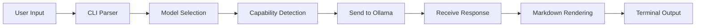

# Introduction


Ask-AI is a powerful command-line interface for interacting with Large Language Models (LLMs) through Ollama. Built in Rust for performance and reliability, it brings AI capabilities directly to your terminal with an elegant, markdown-rendered output.

## Why Ask-AI?

In a world of web-based AI interfaces, Ask-AI stands out by:

- **Keeping you in the terminal** - No context switching, no browser tabs
- **Working offline** - Uses local Ollama models when available
- **Being scriptable** - Pipe content in, pipe results out
- **Rendering beautifully** - Markdown formatting in the terminal via termimad
- **Supporting tools** - Automatically uses Pokémon, Weather, and Web Search data

## What Can You Do?

### 1. Ask Questions

Get answers from AI models with beautiful markdown formatting:

```bash
ask-ai "Explain quantum computing in simple terms"
ask-ai -m qwen3.5:4b "Generate a Python function for Fibonacci"
ask-ai -t "Solve this step by step"  # Think mode
```

### 2. Translate Text

Translate between 50+ languages with the TranslateGemma model:

```bash
ask-ai translate en:pt "Hello world"
ask-ai translate :pt "Auto-detected source language"
cat document.txt | ask-ai translate :es
```

### 3. Extract Text from Images (OCR)

Use GLM-OCR to extract text, tables, formulas, and figures:

```bash
ask-ai ocr document.png
ask-ai ocr --mode table spreadsheet.png
ask-ai ocr --formula equation.png
```

### 4. Summarize Documents

Create concise summaries with customizable styles:

```bash
ask-ai summarize "Long text here..."
ask-ai summarize --style academic research-paper.txt
ask-ai summarize --format bullets --max-length 200
```

### 5. Chain Commands

Build powerful pipelines by combining commands:

```bash
# OCR → Translate
ask-ai ocr japanese.png | ask-ai translate ja:pt

# OCR → Summarize
ask-ai ocr report.png | ask-ai summarize --style technical

# OCR → Summarize → Translate
ask-ai ocr document.png | ask-ai summarize | ask-ai translate :pt
```

## Target Users

Ask-AI is designed for:

- **Developers** who live in the terminal and want AI assistance without leaving it
- **Researchers** who need to process documents, extract text, and summarize papers
- **Translators** who need quick translations between multiple languages
- **System administrators** who need to extract information from images or documents
- **Power users** who value efficiency and prefer command-line interfaces
- **Anyone** who works with text and wants AI assistance integrated into their workflow

## Design Philosophy

Ask-AI follows these principles:

1. **Terminal-First**: Everything should work beautifully in a terminal
2. **Unix Philosophy**: Do one thing well, compose with pipes
3. **Markdown Everywhere**: Beautiful formatting without GUI overhead
4. **Zero Configuration**: Works out of the box with sensible defaults
5. **Extensible**: Easy to add new models, tools, and commands

## How It Works

Ask-AI communicates with Ollama, a local LLM server. When you run a command:

1. **Input is collected** - From arguments or stdin
2. **Model is selected** - Based on flags or defaults
3. **Capabilities are detected** - Tools enabled if model supports them
4. **Request is sent** - To your Ollama instance
5. **Response is rendered** - Beautiful markdown in the terminal



## Getting Help

- Use `ask-ai --help` for quick reference
- Use `man ask-ai` for detailed man page
- Check this documentation for comprehensive guides
- Enable debug mode with `-d` flag for troubleshooting

## Next Steps

- **[Install Ask-AI](./installation.md)** - Get it running on your system
- **[Quick Start Guide](./quickstart.md)** - Your first 5 minutes with Ask-AI
- **[Commands Reference](./commands/README.md)** - Detailed command documentation
